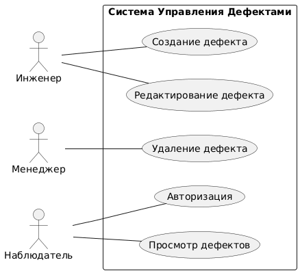
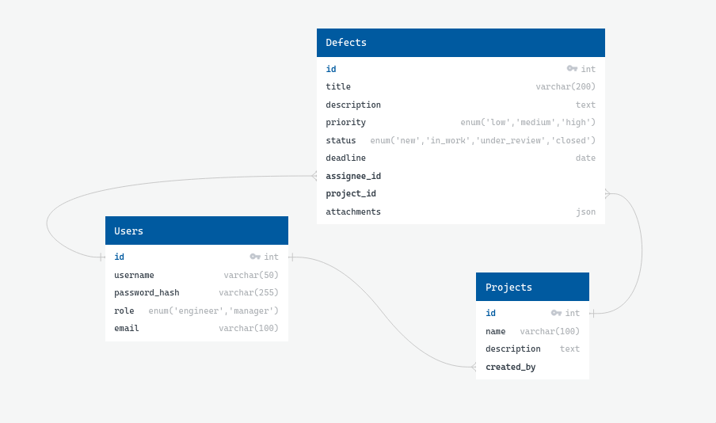

# Технический отчёт по работе с строительными объектами – ООО «СистемаКонтроля»
### Ефремов Алексей Игоревич ЭФБО-10-23
## 1. Анализ

На первом этапе был проведен анализ предметной области. Были зафиксированы бизнес-цели, определены роли пользователей и описаны типовые сценарии.

### Функциональные требования (FR)

1.  **Регистрация и аутентификация:** Пользователи могут создавать учетные записи и входить в систему.
2.  **Разграничение прав доступа:** Система поддерживает три роли: `ИНЖЕНЕР`, `МЕНЕДЖЕР`, `НАБЛЮДАТЕЛЬ`.
3.  **Управление дефектами:** Пользователи (в зависимости от роли) могут создавать, просматривать, редактировать и удалять дефекты.
4.  **Атрибуты дефекта:** Каждый дефект имеет заголовок, описание, приоритет, статус и назначенного исполнителя.
5.  **Управление статусами дефектов:** Реализован жизненный цикл дефекта (`Новая`, `В работе`, `На проверке`, `Закрыта/Отменена`).
6.  **Назначение исполнителей:** Возможность назначать дефекты конкретным пользователям.
### Нефункциональные требования (NFR)

1.  **Производительность:** Время отклика страницы не должно превышать 1 секунду при 50 активных пользователях. (Требование к окружению и инфраструктуре, не покрыто в рамках MVP).
2.  **Надежность:** Предусмотреть возможность резервного копирования БД раз в сутки. (Задача для администратора базы данных).
3.  **Безопасность:**
    *   Пароли хранятся в хешированном виде с использованием `bcrypt`.
    *   Реализована защита от SQL-инъекций через параметризованные запросы в `pg`.
    *   Базовая защита от XSS обеспечена использованием React.
    *   Настроен CORS для ограничения доменов.
    *   Аутентификация на основе JWT токенов обеспечивает защиту от CSRF для API, так как требует передачи токена в заголовках.
4.  **Интерфейс:** Интерфейс на русском языке, адаптивный под ПК и планшеты (с использованием Bootstrap).
5.  **Совместимость:** Система совместима с последними версиями браузеров Chrome, Firefox и Edge.

### Роли пользователей

*   **Инженер (ENGINEER):** Может создавать, редактировать и просматривать дефекты. Не может удалять.
*   **Менеджер (MANAGER):** Обладает всеми правами инженера, а также может удалять дефекты.
*   **Наблюдатель (OBSERVER):** Может только просматривать дефекты, не может вносить изменения.

### User Stories

*   **Как Инженер, я хочу** создавать новые дефекты, чтобы фиксировать проблемы на объекте.
*   **Как Инженер, я хочу** изменять статус дефекта, чтобы отражать прогресс работы.
*   **Как Менеджер, я хочу** просматривать все дефекты, чтобы контролировать общую ситуацию.
*   **Как Менеджер, я хочу** удалять дублирующиеся или неактуальные дефекты, чтобы поддерживать порядок.
*   **Как Наблюдатель, я хочу** просматривать список дефектов и их статусы, чтобы быть в курсе дел без возможности что-то сломать.

### Диаграммы Use Case

---

## 2. Проектирование

### Архитектурная схема

Приложение построено по архитектуре **Клиент-Сервер (SPA)**.

*   **Клиент (Frontend):**
    *   **Фреймворк:** React.js
    *   **Сборщик:** Vite
    *   **Язык:** TypeScript
    *   **Стилизация:** Bootstrap
    *   **Взаимодействие с сервером:** Axios
    *   **Описание:** Клиентское приложение, работающее в браузере. Отвечает за отрисовку интерфейса, взаимодействие с пользователем и отправку запросов на сервер через REST API.

*   **Сервер (Backend):**
    *   **Среда выполнения:** Node.js
    *   **Фреймворк:** Express.js
    *   **Язык:** TypeScript
    *   **Взаимодействие с БД:** `pg` (node-postgres)
    *   **Описание:** Серверное приложение, предоставляющее REST API для клиента. Отвечает за бизнес-логику, аутентификацию, авторизацию и взаимодействие с базой данных.

*   **База данных (Database):**
    *   **СУБД:** PostgreSQL
    *   **Описание:** Хранит все данные приложения, включая пользователей и дефекты.

### ER-диаграмма

---

## 3. Разработка

Все ключевые модули (`Users/Auth`, `Defects`), необходимые для базовой работы системы, реализованы. Код находится в репозитории, система запускается локально с помощью `npm run dev`. Инструкции по запуску предоставлены в файле `guide.md`.

---

## 4. Безопасность

*   **Разграничение доступа по ролям:** Реализовано на сервере с помощью JWT-токенов и middleware-проверок. Каждому защищенному эндпоинту предшествует проверка токена и, при необходимости, роли пользователя. Подробнее описано в `roles.md`.
*   **Защита от SQL-инъекций:** Использование параметризованных запросов через библиотеку `pg` полностью исключает риск SQL-инъекций.
*   **Защита от XSS:** React по умолчанию экранирует данные, выводимые в JSX, что обеспечивает базовую защиту от XSS-атак.
*   **CORS:** Настроен на сервере для разрешения запросов только от фронтенд-приложения.

---

## 5. Тестирование

Написано 5 интеграционных тестов для backend с использованием **Jest** и **Supertest**. Тесты покрывают ключевые сценарии работы приложения:

1.  **Проверка запуска сервера:** `GET /` возвращает статус 200.
2.  **Проверка защиты роутов:** `GET /api/defects` без токена возвращает статус 401.
3.  **Проверка авторизации:** `GET /api/defects` с валидным токеном возвращает статус 200.
4.  **Проверка создания дефекта:** `POST /api/defects` с валидным токеном и данными успешно создает дефект.
5.  **Проверка смены роли:** `PUT /api/users/role` с валидным токеном успешно меняет роль пользователя.

Инструкции по запуску тестов находятся в файле `temp_test_instructions.md`.
