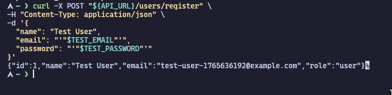
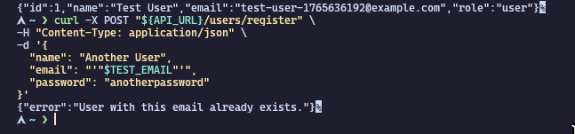
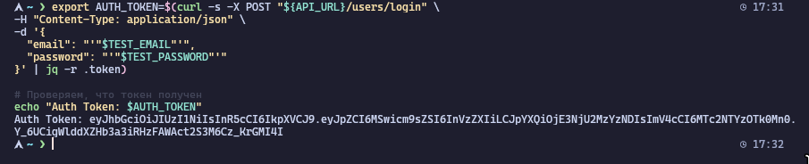
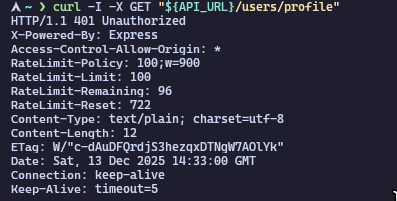
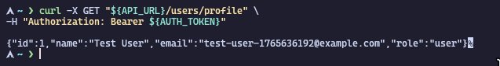
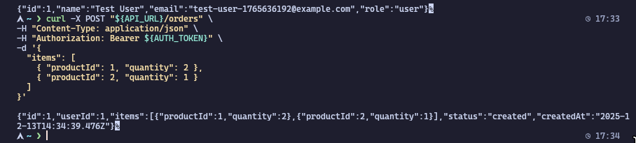
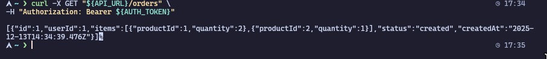
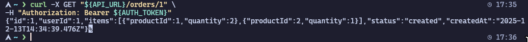

# Отчёт по заданию микросервисная структура по управлению задачами – ООО «СистемаКонтроля» по работе с строительными объектами
### Ефремов Алексей Игоревич ЭФБО-10-23

## 1. Анализ и постановка задачи

Начальный проект состоял из трёх отдельных Node.js приложений (`api_gateway`, `service_users`, `service_orders`), запускаемых через `docker-compose`. Приложения имели базовую функциональность, но не соответствовали требованиям безопасности, надёжности и удобства поддержки.

**Цель работы:** Цель разработки — собрать рабочий бэкенд с тремя компонентами, привести микросервисы и API-шлюз к единому стандарту качества кода, повысить надежность, наблюдаемость и безопасность

## 2. Разработка и реализация

В ходе работы были выполнены следующие ключевые доработки:

1.  **Реализована JWT-аутентификация:** В `service_users` добавлены эндпоинты `/users/register` и `/users/login`. Пароли хешируются, при успешном входе выдается JWT.
2.  **Внедрен Middleware в API Gateway:** Шлюз теперь проверяет JWT для всех защищенных маршрутов и передает ID пользователя в заголовке `X-User-Id` в другие сервисы. Это централизует логику аутентификации.
3.  **Реализована авторизация в сервисах:** `service_orders` использует `X-User-Id` для проверки того, что пользователь имеет доступ только к своим заказам.
4.  **Добавлены механизмы надежности:** В шлюз встроены Circuit Breaker (`opossum`) для отказоустойчивости и Rate Limiter для защиты от DDoS-атак.
5.  **Улучшена трассировка:** Шлюз генерирует `X-Request-Id` для каждого запроса, что позволяет отслеживать его путь по системе.

## 3. Тестирование и документация

*   **Спецификация API:** Разработана спецификация в формате **OpenAPI 3.0** и сохранена в файле `docs/openapi.yml`. Она детально описывает все доступные эндпоинты, их параметры и ожидаемые ответы.
*   **Ручное тестирование:** Подготовлен файл `TESTING.md`, содержащий набор `curl` команд для пошаговой проверки всей реализованной функциональности: от регистрации до создания и получения заказа.

## 4. Результаты тестирования

Для проверки работоспособности системы были проведены ручные тесты с использованием `curl`, как описано в `TESTING.md`. Ниже приведены результаты ключевых тестов.

### 1. Регистрация пользователя
**Описание:** Создаем нового пользователя. Ожидаем ответ `201 Created` и данные пользователя.
*Команда выполнена успешно.*

### 2. Повторная регистрация
**Описание:** Пытаемся создать пользователя с тем же email. Ожидаем ответ `409 Conflict`.
*Команда выполнена успешно.*

### 3. Вход пользователя (логин)
**Описание:** Используем данные для входа. Ожидаем ответ `200 OK` и JWT токен.
*Команда выполнена успешно, токен получен.*

### 4. Доступ к защищенному маршруту без токена
**Описание:** Пытаемся получить профиль без токена. Ожидаем ответ `401 Unauthorized`.
*Команда выполнена успешно.*

### 5. Доступ к профилю с валидным токеном
**Описание:** Получаем профиль с токеном авторизации. Ожидаем ответ `200 OK` и данные профиля.
*Команда выполнена успешно.*

### 6. Создание заказа
**Описание:** Создаем новый заказ. Ожидаем ответ `201 Created` и данные заказа.
*Команда выполнена успешно.*

### 7. Получение списка заказов
**Описание:** Получаем все заказы текущего пользователя. Ожидаем `200 OK` и массив с одним заказом.
*Команда выполнена успешно.*

### 8. Получение конкретного заказа
**Описание:** Получаем созданный заказ по его ID. Ожидаем `200 OK` и данные заказа.
*Команда выполнена успешно.*

