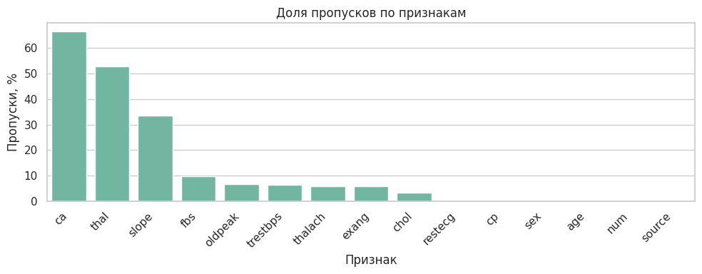
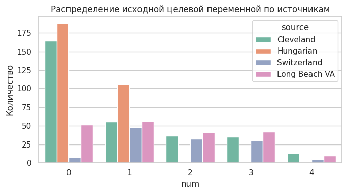
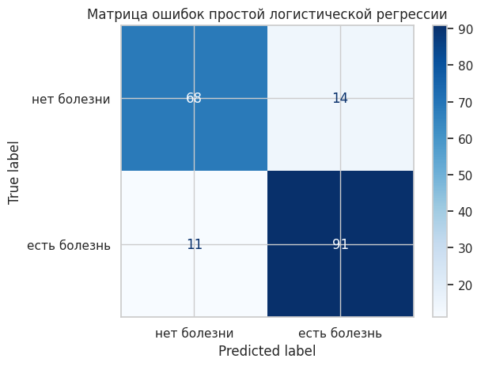
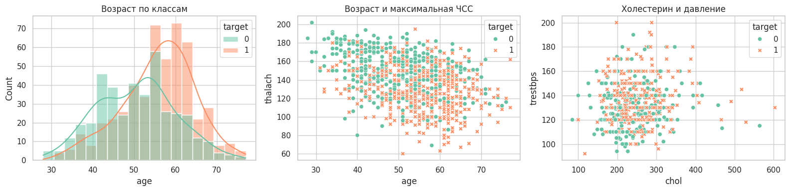
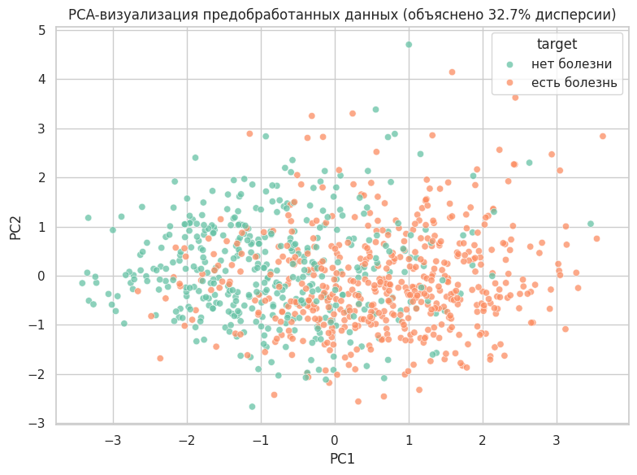
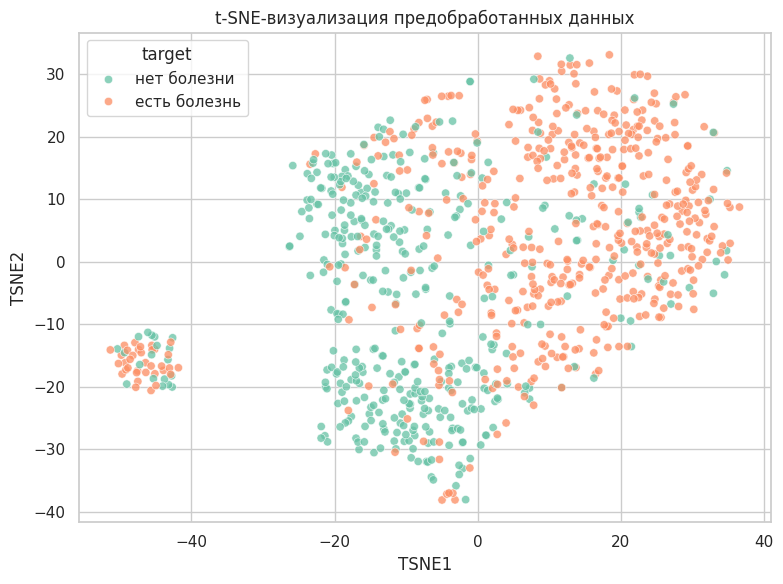

# Практическая работа №1

**Дисциплина:** Математика в программировании  
**Тема:** Предобработка данных интеллектуальных моделей  
**Предметная область:** медицинская диагностика сердечно-сосудистых заболеваний  
**Набор данных:** UCI Heart Disease  
**Преподаватель:** Холмогоров В. В.  
**Москва, 2026 г.**

## Содержание

Введение  
1. Теоретическая часть  
1.1. Описание набора данных  
1.2. Постановка задачи классификации  
1.3. Методы предобработки данных  
1.4. Аугментация табличных данных  
1.5. Методы визуализации и понижения размерности  
1.6. Метрики качества классификации  
2. Практическая часть  
2.1. Основные компоненты программной реализации  
2.2. Загрузка и первичный анализ данных  
2.3. Реализованная предобработка  
2.4. Проверка пригодности данных на модели  
2.5. Аугментация данных  
2.6. Визуализация данных  
Заключение  
Список использованных источников  
Приложение А

## Введение

Цель работы - выполнить полный цикл предварительной обработки табличного медицинского набора данных для последующего решения задачи бинарной классификации наличия сердечно-сосудистого заболевания у пациента.

В качестве прикладной задачи выбрана диагностика признаков болезни сердца по клиническим характеристикам пациента. Исходная целевая переменная набора UCI Heart Disease принимает значения от 0 до 4, где 0 означает отсутствие заболевания, а значения 1-4 соответствуют наличию заболевания различной выраженности. В данной работе эта переменная преобразована в бинарную: 0 - заболевание отсутствует, 1 - заболевание присутствует.

Актуальность работы обусловлена двумя причинами. Во-первых, сердечно-сосудистые заболевания остаются одной из наиболее значимых медицинских проблем: по данным Всемирной организации здравоохранения, они являются ведущей причиной смерти в мире, а раннее выявление риска важно для начала лечения и профилактики [1]. Во-вторых, с учебной точки зрения работа направлена на освоение базового цикла подготовки данных: анализа качества, обработки пропусков, кодирования категориальных признаков, стандартизации, аугментации и визуального анализа.

Для решения задачи используются методы Python: `pandas` и `NumPy` для обработки таблиц, `seaborn` и `matplotlib` для визуализации, `scikit-learn` для построения конвейера предобработки, стандартизации, one-hot encoding, PCA, t-SNE и проверки результата на логистической регрессии. Выбор этих инструментов обусловлен тем, что они являются стандартными средствами анализа табличных данных и машинного обучения в Python [3-8].

Работа состоит из введения, теоретической части, практической части, заключения, списка источников и приложения с основным программным кодом. В теоретической части описаны набор данных, термины и методы предобработки. В практической части приведены результаты загрузки, анализа качества данных, предобработки, аугментации, визуализации и проверки подготовленной матрицы признаков на простой модели.

## 1. Теоретическая часть

### 1.1. Описание набора данных

В работе используется набор данных **UCI Heart Disease**, размещённый в репозитории машинного обучения UCI [2]. Набор относится к области Health and Medicine и предназначен для задач классификации. В исходном описании указано, что база содержит данные из четырёх медицинских учреждений: Cleveland Clinic Foundation, Hungarian Institute of Cardiology, V.A. Medical Center Long Beach и University Hospital Zurich.

Полная версия содержит 76 атрибутов, однако в опубликованных экспериментах обычно применяется подмножество из 14 основных признаков [2]. В данной работе используются файлы `processed.cleveland.data`, `processed.hungarian.data`, `processed.switzerland.data` и `processed.va.data`, так как они приведены к общей 14-признаковой схеме.

| Параметр | Значение |
|---|---|
| Предметная область | Медицинская диагностика сердечно-сосудистых заболеваний |
| Тип данных | Табличные медицинские данные |
| Количество строк после объединения | 920 |
| Количество строк после удаления дубликатов | 918 |
| Количество исходных признаков | 13 входных признаков и целевая переменная `num` |
| Тип задачи | Бинарная классификация |
| Целевая переменная | `target`: 0 - болезни нет, 1 - болезнь есть |

Используемые признаки:

| Признак | Описание |
|---|---|
| `age` | возраст |
| `sex` | пол |
| `cp` | тип боли в груди |
| `trestbps` | давление в покое |
| `chol` | холестерин |
| `fbs` | сахар натощак выше 120 mg/dl |
| `restecg` | результат ЭКГ в покое |
| `thalach` | максимальная достигнутая частота сердечных сокращений |
| `exang` | стенокардия при нагрузке |
| `oldpeak` | депрессия ST |
| `slope` | наклон сегмента ST |
| `ca` | число крупных сосудов |
| `thal` | результат thal-теста |
| `num` | исходная целевая переменная |

### 1.2. Постановка задачи классификации

Классификация - это задача машинного обучения, в которой объекту требуется назначить один из заранее известных классов. В данной работе решается бинарная классификация, поскольку классов два: отсутствие заболевания и наличие заболевания.

Исходная переменная `num` содержит значения 0, 1, 2, 3, 4. Для диагностической постановки она преобразуется следующим образом:

```text
target = 0, если num = 0
target = 1, если num > 0
```

Такой подход соответствует описанию UCI: в экспериментах с этим набором часто различают отсутствие заболевания, обозначенное значением 0, и наличие заболевания, обозначенное значениями 1-4 [2].

### 1.3. Методы предобработки данных

Предобработка данных - это набор действий, направленных на приведение исходного набора к виду, пригодному для анализа и обучения модели. В работе применяются очистка данных, обработка пропусков, удаление признака с большой долей пропусков, создание индикаторов пропусков, стандартизация и кодирование категориальных признаков.

#### 1.3.1. Очистка данных

Дубликат - это строка, полностью совпадающая с другой строкой набора данных. Дубликаты могут искажать статистику и завышать влияние отдельных наблюдений. В работе дубликаты удаляются методом `drop_duplicates()`.

Пропуск - это отсутствующее значение признака. В исходных файлах UCI пропуски обозначены символом вопроса. При загрузке данных этот символ преобразуется в `NaN`. Также в работе выявлены скрытые пропуски: значения `chol = 0` и `trestbps = 0`, которые медицински неправдоподобны и поэтому заменяются на `NaN`.

#### 1.3.2. Импутация пропущенных значений

Импутация - это заполнение пропущенных значений. В scikit-learn для этого используется `SimpleImputer`, который заменяет пропуски статистикой по столбцу, например средним, медианой или самым частым значением [3].

Для числовых признаков используется медиана. Медиана - это значение, которое делит упорядоченный набор пополам. Она менее чувствительна к выбросам, чем среднее арифметическое. Для категориальных признаков используется мода, то есть наиболее часто встречающаяся категория.

#### 1.3.3. Стандартизация

Стандартизация приводит числовые признаки к сопоставимому масштабу. В scikit-learn `StandardScaler` рассчитывает стандартизированное значение по формуле [4]:

```text
z = (x - u) / s
```

где `x` - исходное значение признака, `u` - среднее значение признака на обучающих данных, `s` - стандартное отклонение признака, `z` - стандартизированное значение.

Стандартное отклонение показывает типичный разброс значений относительно среднего. Для генеральной совокупности оно вычисляется по формуле:

```text
σ = √((1 / N) · Σ(xᵢ - μ)²)
```

где `σ` - стандартное отклонение, `N` - число объектов, `xᵢ` - отдельное значение, `μ` - среднее значение, `Σ` - знак суммирования.

#### 1.3.4. One-hot encoding

One-hot encoding - это способ преобразования категориального признака в набор бинарных столбцов. Например, признак `cp` с четырьмя типами боли в груди преобразуется в несколько столбцов вида `cp_1.0`, `cp_2.0`, `cp_3.0`, `cp_4.0`. В scikit-learn для этого используется `OneHotEncoder` [5].

Этот метод нужен потому, что коды категорий нельзя трактовать как обычные числа. Если оставить категорию в виде числа, модель может ошибочно считать, что категория 4 больше категории 2 в количественном смысле.

#### 1.3.5. Pipeline и ColumnTransformer

`Pipeline` - это последовательность преобразований, выполняемых над данными. `ColumnTransformer` позволяет применять разные преобразования к разным группам столбцов. В данной работе числовые признаки проходят импутацию и стандартизацию, категориальные - импутацию и one-hot encoding, а индикаторы пропусков передаются без изменений.

### 1.4. Аугментация табличных данных

Аугментация данных - это искусственное увеличение набора данных. В этой работе она нужна не для замены реальных медицинских наблюдений, а для демонстрации учебного приёма балансировки классов. У нас класс `0` оказался меньше класса `1`, поэтому дополнительные строки создавались только для класса `0`.

Использованный подход можно описать проще: мы берём реальные строки меньшего класса, копируем часть из них случайным образом, а затем чуть-чуть изменяем числовые признаки. То есть новые строки не придумываются с нуля, а получаются как близкие варианты уже существующих пациентов.

Сэмплирование - это случайный выбор строк из таблицы. Сэмплирование с возвращением означает, что одна и та же строка после выбора остаётся доступной и может быть выбрана снова. Это нужно, когда требуется получить фиксированное число дополнительных строк. В нашем случае классу `0` не хватало 98 объектов до размера класса `1`, поэтому из строк класса `0` случайно выбирались 98 базовых строк. Некоторые исходные строки могли попасть в выбор несколько раз.

После выбора базовых строк к числовым признакам добавляется небольшой случайный шум. Шум добавляется только к числовым признакам, потому что возраст, давление, холестерин, максимальная ЧСС и `oldpeak` можно немного изменить без потери смысла. К категориальным признакам шум не добавляется: нельзя получить, например, "тип боли 2.3" или "пол 0.7".

Шум берётся из нормального распределения. На практике это значит, что чаще всего добавляются маленькие изменения, а большие изменения возникают редко. Масштаб шума равен 3% от стандартного отклонения признака внутри класса:

```text
noise_scale = 0.03 · std
```

где `std` - стандартное отклонение признака. Если признак в реальных данных сильно разбросан, допустимое изменение тоже немного больше. Если признак почти не меняется, шум получается маленьким.

После добавления шума значения ограничиваются по 1% и 99% квантилям. В данном контексте квантиль используется как граница нормального диапазона по реальным данным. Например, 1% квантиль - это значение, ниже которого находится только около 1% наблюдений, а 99% квантиль - значение, выше которого находится около 1% наблюдений. Если после добавления шума значение оказалось ниже нижней границы, оно заменяется на нижнюю границу. Если оказалось выше верхней, оно заменяется на верхнюю. Это нужно, чтобы случайный шум не создал медицински неправдоподобные значения.

### 1.5. Методы визуализации и понижения размерности

Визуализация данных применяется для разведочного анализа: она помогает увидеть распределения признаков, пересечение классов, выбросы и возможную структуру данных.

Гистограмма показывает распределение одного числового признака по интервалам. В работе она используется для анализа возраста пациентов по классам. Диаграмма рассеяния показывает связь между двумя числовыми признаками; каждая точка соответствует одному пациенту.

PCA (Principal Component Analysis, метод главных компонент) - линейный метод понижения размерности. Он проецирует данные в пространство меньшей размерности, сохраняя как можно большую долю дисперсии [6]. В работе PCA используется для отображения многомерной матрицы признаков на плоскости.

t-SNE (t-Distributed Stochastic Neighbor Embedding) - нелинейный метод визуализации многомерных данных. Он старается сохранить локальную близость объектов: если пациенты были похожи в исходном пространстве признаков, они должны оказаться рядом на двумерном графике [7]. t-SNE полезен для поиска локальных групп и областей смешения классов.

### 1.6. Метрики качества классификации

Хотя основная цель работы - предобработка, в практической части выполняется проверка подготовленных данных на логистической регрессии. Для оценки используются стандартные метрики `classification_report` из scikit-learn [8].

Accuracy - доля правильных ответов среди всех объектов:

```text
Accuracy = (TP + TN) / (TP + TN + FP + FN)
```

Precision показывает, какая доля объектов, предсказанных как положительные, действительно является положительной:

```text
Precision = TP / (TP + FP)
```

Recall показывает, какую долю реальных положительных объектов модель нашла:

```text
Recall = TP / (TP + FN)
```

F1-score - гармоническое среднее precision и recall:

```text
F1 = 2 · Precision · Recall / (Precision + Recall)
```

Здесь `TP` - верно предсказанные положительные объекты, `TN` - верно предсказанные отрицательные объекты, `FP` - ложноположительные ошибки, `FN` - ложноотрицательные ошибки.

## 2. Практическая часть

### 2.1. Основные компоненты программной реализации

Основной код реализации приведён в приложении А. В таблице ниже указаны программные сущности, которые реализуют интеллектуальную часть работы.

| Компонент | Назначение | Источник |
|---|---|---|
| `pandas.read_csv` | Загрузка processed-файлов UCI Heart Disease и преобразование символа `?` в `NaN` | Библиотека pandas |
| `drop_duplicates` | Удаление полных дубликатов | Библиотека pandas |
| `SimpleImputer` | Заполнение пропусков медианой и модой | scikit-learn [3] |
| `StandardScaler` | Стандартизация числовых признаков | scikit-learn [4] |
| `OneHotEncoder` | Кодирование категориальных признаков | scikit-learn [5] |
| `ColumnTransformer` | Единый конвейер обработки разных типов признаков | scikit-learn |
| `make_statistical_augmentation` | Авторская функция статистической аугментации табличных данных | Реализовано в работе |
| `PCA` | Линейное понижение размерности для визуализации | scikit-learn [6] |
| `TSNE` | Нелинейная визуализация локальной структуры данных | scikit-learn [7] |
| `LogisticRegression` | Проверочная модель бинарной классификации | scikit-learn |

### 2.2. Загрузка и первичный анализ данных

В практической части были объединены четыре processed-файла. После объединения набор содержал 920 строк и 15 колонок, включая добавленную колонку `source`, указывающую источник записи.

| Источник | Количество строк |
|---|---:|
| Cleveland | 303 |
| Hungarian | 294 |
| Long Beach VA | 200 |
| Switzerland | 123 |

На этапе анализа качества данных были рассчитаны пропуски по признакам. Наибольшая доля пропусков обнаружена в признаках `ca` и `thal`.

| Признак | Количество пропусков | Доля пропусков, % |
|---|---:|---:|
| `ca` | 611 | 66.41 |
| `thal` | 486 | 52.83 |
| `slope` | 309 | 33.59 |
| `fbs` | 90 | 9.78 |
| `oldpeak` | 62 | 6.74 |
| `trestbps` | 59 | 6.41 |
| `thalach` | 55 | 5.98 |
| `exang` | 55 | 5.98 |
| `chol` | 30 | 3.26 |
| `restecg` | 2 | 0.22 |



Также было найдено 2 полных дубликата. При проверке подозрительных значений выявлено 172 нулевых значения `chol` и 1 нулевое значение `trestbps`. Для этих медицинских признаков ноль является физически неправдоподобным значением, поэтому такие значения были обработаны как скрытые пропуски.

Исходная целевая переменная `num` распределена следующим образом: 411 объектов имеют значение 0, 265 - значение 1, 109 - значение 2, 107 - значение 3 и 28 - значение 4.



### 2.3. Реализованная предобработка

Предобработка выполнялась в следующей последовательности: удаление дубликатов, бинаризация целевой переменной, обработка скрытых пропусков, удаление признака `ca`, создание индикаторов пропусков, импутация, стандартизация и one-hot encoding.

Признак `ca` был удалён, так как доля пропусков после обработки скрытых пропусков превысила 60%. Признак `thal` был сохранён, несмотря на большую долю пропусков, поскольку он является диагностически значимым категориальным признаком и не превысил выбранный порог удаления.

Для признаков с пропусками были добавлены индикаторы вида `trestbps_was_missing`, `chol_was_missing`, `fbs_was_missing`, `restecg_was_missing`, `thalach_was_missing`, `exang_was_missing`, `oldpeak_was_missing`, `slope_was_missing` и `thal_was_missing`. Эти признаки сохраняют информацию о том, что значение было восстановлено, а не наблюдалось напрямую.

После предобработки итоговая матрица признаков `X_prepared` содержит 918 строк и 33 признака. С учётом служебных колонок `target`, `severity_num` и `source` сохранённый файл `heart_disease_preprocessed.csv` имеет размер 918 строк и 36 колонок.

| Показатель | Значение |
|---|---|
| Строк после удаления дубликатов | 918 |
| Класс 0 после бинаризации | 410 |
| Класс 1 после бинаризации | 508 |
| Признак, удалённый по доле пропусков | `ca` |
| Количество признаков после one-hot encoding | 33 |
| Итоговый файл | `heart_disease_preprocessed.csv` |

### 2.4. Проверка пригодности данных на модели

Для проверки того, что предобработанные данные пригодны для машинного обучения, была обучена логистическая регрессия. Данные были разделены на обучающую и тестовую выборки в отношении 80% к 20%, с сохранением пропорций классов через `stratify=y`.

| Класс | Precision | Recall | F1-score | Support |
|---|---:|---:|---:|---:|
| Нет болезни | 0.86 | 0.83 | 0.84 | 82 |
| Есть болезнь | 0.87 | 0.89 | 0.88 | 102 |
| Accuracy |  |  | 0.86 | 184 |



Матрица ошибок показывает, что из 82 объектов класса «нет болезни» модель правильно определила 68, а 14 ошибочно отнесла к классу «есть болезнь». Из 102 объектов класса «есть болезнь» модель правильно определила 91, а 11 ошибочно отнесла к классу «нет болезни».

Полученный результат показывает три вещи. Во-первых, предобработка выполнена технически корректно: в данных нет необработанных строковых категорий, пропусков и несовместимых типов, из-за которых модель не смогла бы обучиться. Во-вторых, признаки действительно содержат информацию о целевой переменной, потому что accuracy 0.86 заметно выше случайного угадывания для двух классов. В-третьих, модель лучше находит класс «есть болезнь»: recall для этого класса равен 0.89, то есть модель обнаружила 89% пациентов с заболеванием из тестовой выборки.

Ошибки тоже объяснимы. Данные медицинские, признаки классов частично пересекаются: пациент без болезни может быть пожилым или иметь высокое давление, а пациент с болезнью может иметь не все выраженные признаки риска. Поэтому идеального разделения нет. Логистическая регрессия строит линейную границу, а реальные медицинские зависимости могут быть сложнее. В этой лабораторной модель используется не как финальное диагностическое решение, а как проверка того, что подготовленный набор уже можно передавать в алгоритмы машинного обучения.

### 2.5. Аугментация данных

Для демонстрации аугментации была реализована функция `make_statistical_augmentation`. Она не создаёт полностью новых пациентов, а берёт реальные строки меньшего класса и делает на их основе близкие копии. Числовые признаки в этих копиях немного изменяются, а категориальные признаки остаются такими же, как в выбранной исходной строке.

В исходных предобработанных данных меньшим классом является класс 0: 410 объектов против 508 объектов класса 1. Поэтому было создано 98 дополнительных объектов класса 0. После аугментации оба класса содержат по 508 объектов.

| `target` | Исходные объекты | Аугментированные объекты | Итого |
|---|---:|---:|---:|
| 0 | 410 | 98 | 508 |
| 1 | 508 | 0 | 508 |
| Всего | 918 | 98 | 1016 |

Сэмплирование здесь работает как выбор 98 строк из класса `0`. Так как используется выбор с возвращением, одна и та же строка может быть выбрана несколько раз. Это не является проблемой, потому что после выбора числовые значения немного меняются. Например, если была выбрана строка с определёнными значениями возраста, давления и холестерина, то в синтетической строке эти значения могут немного отличаться, но останутся близкими к исходным.

Ограничение по квантилям нужно как защита от неудачных случайных изменений. После добавления шума значение может немного выйти за обычный диапазон. Поэтому для каждого числового признака берутся нижняя и верхняя границы по реальным данным: 1% и 99% квантиль. Это не удаление данных и не отдельный метод анализа, а простое ограничение: слишком маленькое значение поднимается до нижней границы, слишком большое опускается до верхней. За счёт этого искусственные строки остаются похожими на реальные наблюдения.

Итоговый аугментированный набор сохранён в файл `heart_disease_augmented.csv`. Его размер составляет 1016 строк и 14 колонок. В результате классы стали равными по размеру, что полезно для последующего обучения моделей: алгоритм не будет чаще видеть один класс только из-за того, что он был представлен большим числом строк. При этом важно понимать ограничение: такая аугментация не добавляет новую медицинскую информацию, а только аккуратно увеличивает меньший класс на основе уже имеющихся записей.

### 2.6. Визуализация данных

В работе построены обычные графики по отдельным признакам и графики с понижением размерности.



Первый график на рисунке 4 - гистограмма возраста по классам. Она показывает, как распределены пациенты разных классов по возрасту. Если распределения классов перекрываются, возраст сам по себе не является достаточным признаком для точной классификации, но может быть полезен в сочетании с другими признаками.

Второй график - диаграмма рассеяния `age` и `thalach`. Он показывает связь возраста и максимальной частоты сердечных сокращений. Каждая точка соответствует пациенту, цвет показывает класс. Такой график позволяет оценить, есть ли области, где один класс встречается чаще другого.

Третий график - диаграмма рассеяния `chol` и `trestbps`. Он показывает совместное поведение уровня холестерина и давления в покое. Эти признаки имеют медицинский смысл как факторы риска, поэтому их совместная визуализация помогает оценить возможные области повышенного риска и наличие выбросов.

По рисунку 4 видно, что класс «есть болезнь» чаще встречается у пациентов старшего возраста: оранжевое распределение смещено вправо относительно зелёного. При этом распределения сильно пересекаются, поэтому возраст не может быть единственным правилом классификации. Это ожидаемо: болезнь сердца чаще связана с возрастом, но наличие или отсутствие болезни определяется не только им.

На графике `age` и `thalach` заметна общая тенденция: у более молодых пациентов чаще встречаются высокие значения максимальной ЧСС, а у пациентов с болезнью много точек в области более низкой `thalach`. Это объяснимо тем, что максимальная ЧСС при нагрузке может снижаться с возрастом и при проблемах сердечно-сосудистой системы. Но классы всё равно перемешаны, поэтому пара признаков `age` и `thalach` даёт только частичный сигнал.

На графике `chol` и `trestbps` классы перемешаны сильнее. Это означает, что холестерин и давление сами по себе не дают чёткой границы между пациентами с болезнью и без болезни. Причина в том, что повышенный холестерин или давление являются факторами риска, но не гарантируют наличие заболевания в конкретной записи. Кроме того, в исходном наборе были нулевые значения холестерина, которые пришлось считать скрытыми пропусками, поэтому этот признак содержит больше шума.



На рисунке 5 показана PCA-проекция данных на две главные компоненты. Каждая точка соответствует пациенту, а оси PC1 и PC2 являются новыми синтетическими координатами, построенными из исходных признаков. Первые две компоненты объясняют 32.7% дисперсии, то есть примерно треть общего разброса данных.

Такой процент объяснённой дисперсии означает, что большая часть информации остаётся в остальных компонентах. Поэтому на PCA-графике классы не разделяются полностью: зелёные и оранжевые точки заметно пересекаются. Это нормально для данного набора, потому что после one-hot encoding и добавления индикаторов пропусков у нас получилось 33 признака, и информация распределена между многими столбцами.

При этом на PCA видно частичное смещение: класс «есть болезнь» чаще расположен правее, а класс «нет болезни» чаще встречается левее. Это показывает, что в данных есть линейный сигнал, но он не абсолютный. Скорее всего, первая компонента частично отражает сочетание медицинских факторов, связанных с диагнозом: возраст, максимальную ЧСС, `oldpeak` и категориальные признаки. Поэтому PCA подтверждает вывод модели: задача решаема, но классы пересекаются.



На рисунке 6 показана t-SNE-визуализация. В отличие от PCA, t-SNE является нелинейным методом и лучше отражает локальную близость объектов. Поэтому на графике видна более выраженная группировка точек: похожие пациенты оказываются рядом.

Группировка получилась не случайно. t-SNE строился по предобработанным признакам, где есть числовые признаки, one-hot признаки категорий и индикаторы пропусков. Поэтому похожими для алгоритма становятся пациенты не только с близким возрастом или давлением, но и с похожими типами боли в груди, результатами тестов и похожим набором заполненных или отсутствовавших признаков. Так как данные объединены из четырёх медицинских источников, а источники имеют разные распределения классов и разные пропуски, часть группировки может отражать не только диагноз, но и особенности исходных поднаборов.

На t-SNE видно, что справа и сверху больше точек класса «есть болезнь», а слева и снизу больше точек класса «нет болезни». Это говорит о наличии локальных групп пациентов, где один класс встречается чаще. Но есть и смешанные зоны, где оба класса находятся рядом. Это объясняет, почему логистическая регрессия дала хороший, но не идеальный результат: в данных есть области, где классы похожи по признакам и их трудно разделить однозначно.

Отдельная компактная группа слева также не должна трактоваться как отдельный диагноз. Для t-SNE важны локальные соседства, а расстояния между далёкими группами нельзя читать буквально. Такая группа означает, что в исходном пространстве есть пациенты с очень похожим набором признаков; она может быть связана с одинаковыми категориальными значениями или похожим паттерном пропусков.

## Заключение

В ходе практической работы был подготовлен медицинский табличный набор UCI Heart Disease для задачи бинарной классификации наличия сердечного заболевания. После объединения четырёх processed-файлов было получено 920 строк. Анализ качества показал, что данные нельзя сразу подавать в модель: в них есть пропуски, 2 полных дубликата, а также скрытые пропуски в виде нулевого холестерина и нулевого давления.

В результате очистки осталось 918 строк. Признак `ca` был удалён, потому что в нём отсутствовало более 60% значений, а восстановление такого количества данных было бы ненадёжным. Для остальных признаков были выполнены заполнение пропусков, стандартизация числовых признаков и кодирование категориальных признаков. Итоговый файл `heart_disease_preprocessed.csv` содержит 918 строк и 36 колонок, включая целевую переменную, исходную степень заболевания и источник данных.

Проверка на логистической регрессии показала accuracy 0.86. Это означает, что подготовленные признаки действительно связаны с наличием заболевания и могут использоваться для дальнейшего обучения моделей. При этом результат не равен 100%, потому что классы в медицинских данных пересекаются: часть пациентов без болезни имеет риск-факторы, а часть пациентов с болезнью не имеет ярко выраженных отличий по отдельным признакам. Поэтому модель хорошо подтверждает пригодность предобработки, но не является окончательной диагностической системой.

Аугментация позволила сбалансировать классы: меньший класс `0` был увеличен с 410 до 508 объектов, и итоговый аугментированный набор содержит 1016 строк. Это полезно для дальнейших экспериментов с моделями, потому что классы становятся равными по количеству. Однако такая аугментация не создаёт новую медицинскую информацию, а только добавляет близкие варианты уже существующих записей.

Графики показали, что отдельные признаки дают частичный, но не полный сигнал. Возраст у пациентов с болезнью в среднем смещён к большим значениям, а максимальная ЧСС чаще ниже, но классы всё равно сильно пересекаются. PCA объяснил 32.7% дисперсии первыми двумя компонентами и показал частичное, но не полное разделение классов. t-SNE выявил локальные группы похожих пациентов; группировка объясняется сочетанием медицинских признаков, категориальных значений и паттернов пропусков. Визуализации согласуются с результатом модели: в данных есть полезная структура, но задача не сводится к одному простому правилу.

Таким образом, цель работы достигнута: исходные медицинские данные были очищены, преобразованы, сохранены в пригодном для машинного обучения виде, дополнены аугментированным вариантом и проанализированы с помощью модели и визуализаций.

## Список использованных источников

1. World Health Organization. Cardiovascular diseases (CVDs). URL: https://www.who.int/en/news-room/fact-sheets/detail/cardiovascular-diseases-%28cvds%29
2. UCI Machine Learning Repository. Heart Disease Dataset. URL: https://archive.ics.uci.edu/dataset/45/heart%2Bdisease
3. scikit-learn documentation. SimpleImputer. URL: https://scikit-learn.org/stable/modules/generated/sklearn.impute.SimpleImputer.html
4. scikit-learn documentation. StandardScaler. URL: https://scikit-learn.org/stable/modules/generated/sklearn.preprocessing.StandardScaler.html
5. scikit-learn documentation. OneHotEncoder. URL: https://scikit-learn.org/stable/modules/generated/sklearn.preprocessing.OneHotEncoder.html
6. scikit-learn documentation. PCA. URL: https://scikit-learn.org/stable/modules/generated/sklearn.decomposition.PCA.html
7. scikit-learn documentation. TSNE. URL: https://scikit-learn.org/stable/modules/generated/sklearn.manifold.TSNE.html
8. scikit-learn documentation. classification_report. URL: https://scikit-learn.org/stable/modules/generated/sklearn.metrics.classification_report.html

## Приложение А

Основной программный код:

```python
from pathlib import Path
import warnings

import numpy as np
import pandas as pd
import matplotlib.pyplot as plt
import seaborn as sns

from sklearn.compose import ColumnTransformer
from sklearn.decomposition import PCA
from sklearn.impute import SimpleImputer
from sklearn.linear_model import LogisticRegression
from sklearn.manifold import TSNE
from sklearn.metrics import ConfusionMatrixDisplay, classification_report
from sklearn.model_selection import train_test_split
from sklearn.pipeline import Pipeline
from sklearn.preprocessing import OneHotEncoder, StandardScaler

warnings.filterwarnings("ignore")
sns.set_theme(style="whitegrid", palette="Set2")

DATA_DIR = Path("heart+disease")

columns = [
    "age", "sex", "cp", "trestbps", "chol", "fbs", "restecg",
    "thalach", "exang", "oldpeak", "slope", "ca", "thal", "num",
]

source_files = {
    "Cleveland": "processed.cleveland.data",
    "Hungarian": "processed.hungarian.data",
    "Switzerland": "processed.switzerland.data",
    "Long Beach VA": "processed.va.data",
}

frames = []
for source, filename in source_files.items():
    part = pd.read_csv(
        DATA_DIR / filename,
        header=None,
        names=columns,
        na_values="?",
    )
    part["source"] = source
    frames.append(part)

raw = pd.concat(frames, ignore_index=True)

df = raw.copy()
df = df.drop_duplicates().reset_index(drop=True)
df["target"] = (df["num"] > 0).astype(int)

df.loc[df["chol"] == 0, "chol"] = np.nan
df.loc[df["trestbps"] == 0, "trestbps"] = np.nan

initial_features = [
    "age", "sex", "cp", "trestbps", "chol", "fbs", "restecg",
    "thalach", "exang", "oldpeak", "slope", "ca", "thal"
]

missing_rate_after_zero_fix = df[initial_features].isna().mean()
high_missing_cols = missing_rate_after_zero_fix[
    missing_rate_after_zero_fix > 0.60
].index.tolist()

model_features = [col for col in initial_features if col not in high_missing_cols]
cols_with_missing = [col for col in model_features if df[col].isna().any()]

for col in cols_with_missing:
    df[f"{col}_was_missing"] = df[col].isna().astype(int)

indicator_features = [f"{col}_was_missing" for col in cols_with_missing]

numeric_features = ["age", "trestbps", "chol", "thalach", "oldpeak"]
categorical_features = ["sex", "cp", "fbs", "restecg", "exang", "slope", "thal"]

X = df[model_features + indicator_features]
y = df["target"]

numeric_transformer = Pipeline(
    steps=[
        ("imputer", SimpleImputer(strategy="median")),
        ("scaler", StandardScaler()),
    ]
)

categorical_transformer = Pipeline(
    steps=[
        ("imputer", SimpleImputer(strategy="most_frequent")),
        ("onehot", OneHotEncoder(handle_unknown="ignore", sparse_output=False)),
    ]
)

preprocessor = ColumnTransformer(
    transformers=[
        ("num", numeric_transformer, numeric_features),
        ("cat", categorical_transformer, categorical_features),
        ("missing_flag", "passthrough", indicator_features),
    ],
    remainder="drop",
    verbose_feature_names_out=False,
)

preprocessor.set_output(transform="pandas")
X_prepared = preprocessor.fit_transform(X)

prepared = X_prepared.copy()
prepared["target"] = y.to_numpy()
prepared["severity_num"] = df["num"].to_numpy()
prepared["source"] = df["source"].to_numpy()
prepared.to_csv("heart_disease_preprocessed.csv", index=False)

X_train, X_test, y_train, y_test = train_test_split(
    X_prepared,
    y,
    test_size=0.2,
    random_state=42,
    stratify=y,
)

model = LogisticRegression(max_iter=2000, class_weight="balanced")
model.fit(X_train, y_train)
y_pred = model.predict(X_test)
print(classification_report(y_test, y_pred, target_names=["нет болезни", "есть болезнь"]))

def make_statistical_augmentation(data, target_col, numeric_cols, categorical_cols, random_state=42):
    rng = np.random.default_rng(random_state)
    base = data[numeric_cols + categorical_cols + [target_col]].copy()

    for col in numeric_cols:
        base[col] = base[col].fillna(base[col].median())
    for col in categorical_cols:
        base[col] = base[col].fillna(base[col].mode(dropna=True).iloc[0])

    counts = base[target_col].value_counts()
    majority_size = counts.max()
    augmented_parts = []

    for cls, count in counts.items():
        need = int(majority_size - count)
        if need <= 0:
            continue

        cls_rows = base[base[target_col] == cls]
        sampled = cls_rows.sample(n=need, replace=True, random_state=random_state).copy()

        for col in numeric_cols:
            std = cls_rows[col].std()
            noise_scale = 0.03 * std if pd.notna(std) and std > 0 else 0
            sampled[col] = sampled[col] + rng.normal(0, noise_scale, size=need)

            low, high = base[col].quantile([0.01, 0.99])
            sampled[col] = sampled[col].clip(low, high)

        sampled["is_augmented"] = 1
        augmented_parts.append(sampled)

    original = base.copy()
    original["is_augmented"] = 0

    if augmented_parts:
        return pd.concat([original] + augmented_parts, ignore_index=True)
    return original

augmented = make_statistical_augmentation(
    df,
    target_col="target",
    numeric_cols=numeric_features,
    categorical_cols=categorical_features,
    random_state=42,
)

augmented.to_csv("heart_disease_augmented.csv", index=False)

pca = PCA(n_components=2, random_state=42)
pca_coords = pca.fit_transform(X_prepared)

pca_for_tsne = PCA(n_components=min(30, X_prepared.shape[1]), random_state=42)
tsne_input = pca_for_tsne.fit_transform(X_prepared)

tsne = TSNE(
    n_components=2,
    perplexity=30,
    init="pca",
    learning_rate="auto",
    max_iter=1000,
    random_state=42,
)
tsne_coords = tsne.fit_transform(tsne_input)
```
