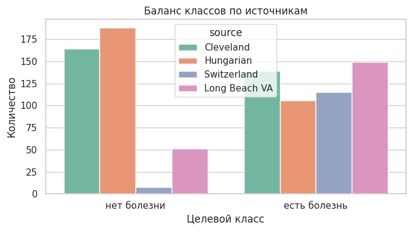
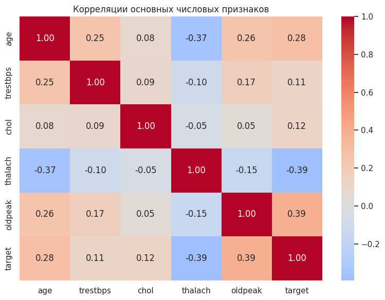
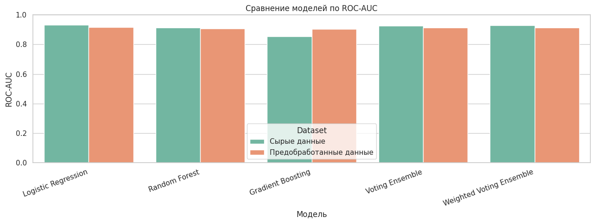

# Практическая работа №2

**Дисциплина:** Математика в программировании  
**Тема:** Дискриминативные интеллектуальные алгоритмы  
**Предметная область:** медицинская диагностика сердечно-сосудистых заболеваний  
**Набор данных:** UCI Heart Disease  
**Преподаватель:** Холмогоров В. В.  
**Москва, 2026 г.**

## Содержание

Введение  
1. Теоретическая часть  
1.1. Описание набора данных  
1.2. Постановка задачи  
1.3. Дискриминативные модели классификации  
1.4. Используемые модели  
1.5. Ансамбли моделей  
1.6. Метрики качества  
2. Практическая часть  
2.1. Основные компоненты реализации  
2.2. Загрузка и анализ данных  
2.3. Подготовка сырых и предобработанных данных  
2.4. Обучение моделей и протокол оценки  
2.5. Сравнение результатов  
2.6. Матрицы ошибок  
Заключение  
Список использованных источников  
Приложение А

## Введение

Цель работы - реализовать и сравнить несколько дискриминативных моделей для задачи бинарной классификации наличия сердечно-сосудистого заболевания у пациента по клиническим признакам.

В первой практической работе был подготовлен набор данных UCI Heart Disease: объединены четыре источника, обработаны пропуски, скрытые аномалии и категориальные признаки. Во второй практической работе используется та же предметная область, но основной акцент переносится с предобработки на обучение и сравнение моделей.

Актуальность работы связана с двумя причинами. Во-первых, сердечно-сосудистые заболевания остаются одной из ведущих причин смертности в мире, поэтому задача раннего выявления риска имеет практическое значение [1]. Во-вторых, с учебной точки зрения важно не просто обучить одну модель, а сравнить несколько подходов: линейную модель, бэггинг-модель, бустинг и ансамбль голосования.

В работе используются следующие модели:

- `Logistic Regression` как базовая линейная модель;
- `Random Forest` как бэггинг-модель на деревьях решений;
- `Gradient Boosting` как бустинговая модель;
- `Voting Ensemble` как ансамбль из трёх моделей;
- `Weighted Voting Ensemble` как ансамбль с весами, выбранными по F1 на кросс-валидации.

Также сравниваются две версии данных: условно сырые данные и предобработанные данные. Это нужно, чтобы увидеть, насколько предобработка из первой лабораторной влияет на качество классификации.

## 1. Теоретическая часть

### 1.1. Описание набора данных

В работе используется набор данных **UCI Heart Disease** [2]. Он содержит медицинские признаки пациентов и целевую переменную `num`, связанную с наличием заболевания сердца. Исходная переменная `num` принимает значения от 0 до 4:

- `0` - заболевание не выявлено;
- `1`, `2`, `3`, `4` - заболевание выявлено с разной степенью выраженности.

В этой работе задача сведена к бинарной классификации:

```text
target = 0, если num = 0
target = 1, если num > 0
```

После объединения четырёх processed-файлов получено 920 строк. После удаления полных дубликатов остаётся 918 строк.

| Источник | Количество строк | Нет болезни | Есть болезнь |
|---|---:|---:|---:|
| Cleveland | 303 | 164 | 139 |
| Hungarian | 294 | 188 | 106 |
| Long Beach VA | 200 | 51 | 149 |
| Switzerland | 123 | 8 | 115 |
| Всего | 920 | 411 | 509 |

Из таблицы видно, что источники отличаются по балансу классов. Например, в Switzerland почти все записи относятся к классу «есть болезнь», а в Hungarian больше записей класса «нет болезни». Это важно для интерпретации графиков: часть структуры данных может быть связана не только с диагнозом, но и с тем, из какого источника пришла запись.

### 1.2. Постановка задачи

Решается задача бинарной классификации: по признакам пациента нужно предсказать, есть ли признаки сердечно-сосудистого заболевания.

Входные данные - медицинские признаки:

- возраст;
- пол;
- тип боли в груди;
- давление в покое;
- холестерин;
- сахар натощак;
- результаты ЭКГ;
- максимальная частота сердечных сокращений;
- стенокардия при нагрузке;
- депрессия ST;
- наклон сегмента ST;
- число крупных сосудов;
- результат thal-теста.

Выход модели - класс:

- `0` - болезни нет;
- `1` - болезнь есть.

### 1.3. Дискриминативные модели классификации

Дискриминативная модель решает задачу различения классов. В этой работе модели не пытаются генерировать новые медицинские записи, а учатся проводить границу между двумя классами: «нет болезни» и «есть болезнь».

Проще говоря, модель получает строку таблицы с признаками пациента и возвращает один из двух ответов. Если модель поддерживает вероятности, она также может вернуть вероятность класса `1`. Эта вероятность используется для `ROC-AUC` и для мягкого голосования в ансамблях.

### 1.4. Используемые модели

#### Logistic Regression

Логистическая регрессия - базовая линейная модель классификации [3]. Она строит линейную комбинацию признаков и переводит её в вероятность класса через логистическую функцию.

В этой работе логистическая регрессия нужна как базовый ориентир. Если более сложные модели не улучшают качество относительно неё, значит в данных либо хорошо работает линейная структура, либо сложные модели переобучаются.

Главное ограничение логистической регрессии: она хорошо ловит линейные зависимости, но хуже учитывает сложные нелинейные комбинации признаков. Например, влияние возраста, типа боли, `oldpeak` и `thalach` может быть совместным, а не независимым.

#### Random Forest

Случайный лес - это ансамбль деревьев решений [4]. Каждое дерево обучается на своей случайной версии данных и признаков, а итоговый ответ получается голосованием деревьев.

Почему он здесь нужен:

- может учитывать нелинейные зависимости;
- устойчивее одного дерева, потому что усредняет много деревьев;
- часто хорошо работает на табличных данных.

Почему он не всегда лучший:

- при небольшом количестве данных может не дать большого преимущества;
- часть признаков после one-hot encoding может быть разреженной;
- если сигнал в данных частично линейный, логистическая регрессия может быть не хуже.

#### Gradient Boosting

Градиентный бустинг - это ансамбль деревьев, которые строятся последовательно [5]. Каждая новая модель пытается исправить ошибки предыдущих.

Интуитивно это работает так:

1. первая модель делает прогноз;
2. алгоритм смотрит, где она ошиблась;
3. следующая модель сильнее учитывает эти ошибки;
4. итоговый ответ получается суммой вкладов многих слабых моделей.

Бустинг может хорошо находить сложные зависимости, но чувствителен к настройкам и шуму. Если данных мало или в них много неоднозначных записей, бустинг может не стать лучшим на тестовой выборке.

### 1.5. Ансамбли моделей

Ансамбль - это объединение нескольких моделей. Идея простая: разные модели ошибаются по-разному, поэтому их объединение иногда даёт более устойчивый результат.

В работе используются два ансамбля:

- `Voting Ensemble`;
- `Weighted Voting Ensemble`.

`Voting Ensemble` использует soft-voting. Это значит, что модели голосуют не только классами, а вероятностями. Например, если три модели выдали вероятности болезни 0.70, 0.80 и 0.60, ансамбль усредняет эти вероятности и принимает итоговое решение.

`Weighted Voting Ensemble` делает то же самое, но модели получают разные веса. Веса выбираются по F1 на кросс-валидации обучающей части. Это важно: тестовая выборка не используется для выбора весов, поэтому итоговая проверка остаётся честной.

При этом взвешенное голосование не обязано всегда быть лучше обычного. Если базовые модели имеют близкое качество, дополнительный вес одной модели может немного сместить ансамбль и ухудшить баланс между precision и recall.

### 1.6. Метрики качества

Для оценки моделей используются `Accuracy`, `Precision`, `Recall`, `F1` и `ROC-AUC` [6].

`Accuracy` - доля правильных ответов:

```text
Accuracy = (TP + TN) / (TP + TN + FP + FN)
```

`Precision` показывает, насколько точны положительные предсказания:

```text
Precision = TP / (TP + FP)
```

`Recall` показывает, какую долю реальных пациентов с болезнью модель нашла:

```text
Recall = TP / (TP + FN)
```

`F1` объединяет precision и recall:

```text
F1 = 2 · Precision · Recall / (Precision + Recall)
```

`ROC-AUC` показывает, насколько хорошо модель ранжирует объекты по вероятности положительного класса. Важно: ROC-AUC может быть высоким даже тогда, когда F1 ниже. Это происходит потому, что ROC-AUC оценивает качество вероятностного ранжирования, а F1 оценивает уже готовые классы после выбора порога.

В медицинской задаче важен `Recall` для класса «есть болезнь», потому что пропустить пациента с заболеванием хуже, чем лишний раз отнести пациента к группе риска. Но смотреть только на recall тоже нельзя: если модель будет всем ставить «есть болезнь», recall будет высоким, а precision низким. Поэтому основной сравнительной метрикой в работе используется F1.

## 2. Практическая часть

### 2.1. Основные компоненты реализации

Основной код приведён в приложении А. Ключевые программные компоненты:

| Компонент | Назначение |
|---|---|
| `pandas.read_csv` | Загрузка четырёх processed-файлов UCI Heart Disease |
| `SimpleImputer` | Заполнение пропусков медианой и модой |
| `StandardScaler` | Масштабирование числовых признаков |
| `OneHotEncoder` | Кодирование категориальных признаков |
| `ColumnTransformer` | Объединение разных преобразований в один конвейер |
| `LogisticRegression` | Базовая линейная модель |
| `RandomForestClassifier` | Бэггинг-модель на деревьях |
| `GradientBoostingClassifier` | Бустинговая модель |
| `VotingClassifier` | Ансамбль голосования |
| `cross_val_score` | Оценка F1 на кросс-валидации для выбора весов |

### 2.2. Загрузка и анализ данных

После загрузки четырёх processed-файлов получено 920 строк. Целевая переменная была преобразована в бинарный `target`.



Рисунок 1 показывает, что баланс классов зависит от источника. В Cleveland и Hungarian больше пациентов без болезни, а в Switzerland и Long Beach VA больше пациентов с болезнью. Это объясняет, почему задача не совсем однородная: данные собраны из разных медицинских учреждений, и распределения классов в них отличаются.

Это важно для моделей. Если модель видит разные источники с разным балансом, она может частично учиться не только медицинским признакам, но и особенностям поднабора. Поэтому в работе используется стратифицированное разделение train/test, чтобы сохранить общий баланс классов.



На рисунке 2 показана корреляционная матрица основных числовых признаков. Самые заметные связи с целевой переменной:

- `oldpeak` и `target`: корреляция около `0.39`;
- `thalach` и `target`: корреляция около `-0.39`;
- `age` и `target`: корреляция около `0.28`.

Это означает, что пациенты с болезнью в среднем имеют больший `oldpeak`, меньшую максимальную ЧСС и больший возраст. Но корреляции не близки к `1` или `-1`, поэтому ни один числовой признак не разделяет классы идеально. Именно поэтому нужны модели, которые учитывают сразу несколько признаков.


На рисунке 3 видно три результата.

Первый график показывает возраст по классам. Класс «есть болезнь» смещён к старшему возрасту, но распределения пересекаются. Значит, возраст полезен, но не является достаточным правилом.

Второй график показывает связь возраста и максимальной ЧСС `thalach`. У пациентов с болезнью чаще встречаются более низкие значения `thalach`, особенно в старших возрастах. Это согласуется с отрицательной корреляцией `thalach` и `target`.

Третий график показывает `oldpeak` по классам. У класса «есть болезнь» медиана и разброс `oldpeak` выше. Это объясняет, почему `oldpeak` имеет одну из самых сильных корреляций с целевой переменной. При этом боксплоты тоже пересекаются, значит признак не даёт идеального разделения один сам по себе.

### 2.3. Подготовка сырых и предобработанных данных

Для сравнения были сделаны две версии данных.

**Сырые данные** - минимально подготовленная версия. В ней удаляются дубликаты, строки с пропусками и строки со скрытыми аномалиями (`chol = 0`, `trestbps = 0`). Категориальные признаки остаются числовыми кодами. После такого подхода остаётся только 299 строк.

**Предобработанные данные** - версия из первой лабораторной. В ней используются:

- удаление дубликатов;
- замена скрытых пропусков на `NaN`;
- удаление признака `ca` из-за слишком большой доли пропусков;
- добавление флагов пропусков;
- заполнение числовых признаков медианой;
- заполнение категориальных признаков модой;
- стандартизация числовых признаков;
- one-hot encoding категориальных признаков.

| Версия данных | Строки | Train | Test | Что произошло |
|---|---:|---:|---:|---|
| Сырые данные | 299 | 224 | 75 | Потеряна большая часть строк из-за удаления пропусков |
| Предобработанные данные | 918 | 688 | 230 | Сохранён почти весь очищенный набор |

Главный вывод: предобработка улучшает не только формат признаков, но и объём данных. На сырых данных модель обучается только на небольшой и более случайной части исходного набора. На предобработанных данных модель видит почти весь набор, поэтому результат становится устойчивее.

### 2.4. Обучение моделей и протокол оценки

Для обеих версий данных использовался одинаковый протокол:

1. Разделение на train/test в пропорции 75/25.
2. Стратификация по целевому классу.
3. Обучение пяти моделей.
4. Расчёт `Accuracy`, `Precision`, `Recall`, `F1`, `ROC-AUC`.
5. Для взвешенного ансамбля веса выбирались по F1 на кросс-валидации только на train-части.

Такой протокол нужен, чтобы сравнение было честным: модели проверяются на одинаковых train/test-разбиениях внутри каждой версии данных.

### 2.5. Сравнение результатов

| Данные | Модель | Accuracy | Precision | Recall | F1 | ROC-AUC |
|---|---|---:|---:|---:|---:|---:|
| Сырые данные | Logistic Regression | 0.8267 | 0.8438 | 0.7714 | 0.8060 | 0.9321 |
| Сырые данные | Weighted Voting Ensemble | 0.8133 | 0.8621 | 0.7143 | 0.7812 | 0.9279 |
| Сырые данные | Random Forest | 0.8000 | 0.8333 | 0.7143 | 0.7692 | 0.9143 |
| Сырые данные | Voting Ensemble | 0.8000 | 0.8571 | 0.6857 | 0.7619 | 0.9257 |
| Сырые данные | Gradient Boosting | 0.7733 | 0.8462 | 0.6286 | 0.7213 | 0.8557 |
| Предобработанные данные | Voting Ensemble | 0.8565 | 0.8507 | 0.8976 | 0.8736 | 0.9139 |
| Предобработанные данные | Weighted Voting Ensemble | 0.8522 | 0.8550 | 0.8819 | 0.8682 | 0.9132 |
| Предобработанные данные | Logistic Regression | 0.8478 | 0.8538 | 0.8740 | 0.8638 | 0.9179 |
| Предобработанные данные | Random Forest | 0.8435 | 0.8473 | 0.8740 | 0.8605 | 0.9064 |
| Предобработанные данные | Gradient Boosting | 0.8304 | 0.8188 | 0.8898 | 0.8528 | 0.9028 |


Рисунок 4 показывает главное: все модели на предобработанных данных имеют F1 выше, чем на сырых. Это произошло не просто из-за масштабирования или one-hot encoding, а ещё из-за того, что предобработка позволила сохранить 918 строк вместо 299. Модель получила больше обучающих примеров и более корректное представление категориальных признаков.

Лучший F1 на предобработанных данных получил `Voting Ensemble`: `0.8736`. Он немного обошёл логистическую регрессию (`0.8638`), случайный лес (`0.8605`) и градиентный бустинг (`0.8528`). Разница не огромная, но логичная: ансамбль усредняет вероятности трёх разных моделей, поэтому итоговое решение становится устойчивее.

На сырых данных лучшей оказалась логистическая регрессия с F1 `0.8060`. Это объяснимо: после удаления всех строк с пропусками осталось только 299 объектов. Для более сложных моделей этого может быть мало, и они хуже обобщают на тестовую выборку. Логистическая регрессия проще, поэтому на маленькой выборке она оказалась устойчивее.

Прирост F1 после предобработки:

| Модель | F1 на сырых данных | F1 на предобработанных данных | Прирост |
|---|---:|---:|---:|
| Logistic Regression | 0.8060 | 0.8638 | +0.0578 |
| Random Forest | 0.7692 | 0.8605 | +0.0912 |
| Gradient Boosting | 0.7213 | 0.8528 | +0.1315 |
| Voting Ensemble | 0.7619 | 0.8736 | +0.1117 |
| Weighted Voting Ensemble | 0.7812 | 0.8682 | +0.0870 |

Самый большой прирост у `Gradient Boosting`: F1 вырос на `0.1315`. Это показывает, что бустинг особенно сильно страдал на сырой версии данных, где было мало строк и категориальные признаки оставались просто числовыми кодами. После нормальной предобработки он стал работать значительно лучше.



Рисунок 5 показывает, что по ROC-AUC различия между моделями меньше, чем по F1. На сырых данных логистическая регрессия даже имеет ROC-AUC `0.9321`, выше чем на предобработанных данных. Это не противоречит основному выводу. ROC-AUC оценивает качество ранжирования вероятностей, а F1 оценивает качество итоговых классов при выбранном пороге. Кроме того, сырые данные после удаления пропусков стали маленькой и более отфильтрованной выборкой, поэтому ROC-AUC на ней может выглядеть выше, но это не значит, что такая версия данных лучше для общей задачи.

На предобработанных данных ROC-AUC всех моделей находится около `0.90-0.92`. Это хороший признак: модели в целом умеют назначать более высокие вероятности пациентам с заболеванием. Однако лучшая модель по F1 - обычный ансамбль голосования, а не модель с максимальным ROC-AUC. В этой работе F1 важнее, потому что он оценивает баланс между точностью положительных предсказаний и полнотой обнаружения болезни.

### 2.6. Матрицы ошибок

Матрицы ошибок построены для моделей на предобработанных данных, потому что эта версия использует больше строк и даёт лучший общий результат.


Матрицы ошибок показывают, как именно модели ошибаются.

| Модель | Верно: нет болезни | Ошибочно: есть болезнь | Ошибочно: нет болезни | Верно: есть болезнь |
|---|---:|---:|---:|---:|
| Logistic Regression | 84 | 19 | 16 | 111 |
| Random Forest | 83 | 20 | 16 | 111 |
| Gradient Boosting | 78 | 25 | 14 | 113 |
| Voting Ensemble | 83 | 20 | 13 | 114 |
| Weighted Voting Ensemble | 84 | 19 | 15 | 112 |

Лучший результат по F1 у `Voting Ensemble`, потому что он сделал меньше ложноотрицательных ошибок: 13 пациентов с болезнью были ошибочно отнесены к классу «нет болезни». У логистической регрессии и случайного леса таких ошибок по 16, у взвешенного ансамбля - 15. Для медицинской задачи это важно, потому что пропуск пациента с заболеванием является более опасной ошибкой.

`Gradient Boosting` нашёл 113 пациентов с болезнью из 127, то есть recall у него высокий. Но он также дал 25 ложноположительных ошибок: чаще относил пациентов без болезни к классу «есть болезнь». Поэтому его F1 ниже, чем у ансамбля голосования. Это хороший пример того, почему нельзя смотреть только на recall: модель может хорошо находить больных, но при этом слишком часто ошибочно относить здоровых к группе риска.

Обычный `Voting Ensemble` оказался лучше взвешенного. Это произошло потому, что базовые модели имеют близкое качество, и простое усреднение вероятностей дало более ровный баланс. Взвешенное голосование немного уменьшило число ложноположительных ошибок, но увеличило число ложноотрицательных. Из-за этого F1 стал ниже.

## Заключение

Во второй практической работе были обучены и сравнены пять моделей для бинарной классификации наличия сердечного заболевания: логистическая регрессия, случайный лес, градиентный бустинг, обычный ансамбль голосования и взвешенный ансамбль голосования.

Сравнение сырых и предобработанных данных показало, что предобработка из первой лабораторной действительно полезна. На сырых данных после удаления пропусков и скрытых аномалий осталось только 299 строк, поэтому модели обучались на сильно сокращённой выборке. На предобработанных данных использовалось 918 строк, категориальные признаки были закодированы корректно, а пропуски были заполнены. Из-за этого F1 вырос у всех моделей.

Лучший итоговый результат показал `Voting Ensemble` на предобработанных данных: accuracy `0.8565`, precision `0.8507`, recall `0.8976`, F1 `0.8736`, ROC-AUC `0.9139`. Это значит, что ансамбль хорошо находит пациентов с болезнью и при этом сохраняет приемлемое количество ложных срабатываний. По матрице ошибок видно, что он допустил 13 ложноотрицательных ошибок, меньше остальных моделей.

Логистическая регрессия также показала сильный результат: F1 `0.8638`. Это говорит о том, что в данных есть заметный линейный сигнал. Случайный лес дал близкий результат, но не превзошёл логистическую регрессию. Градиентный бустинг лучше находил класс «есть болезнь», но чаще ошибочно относил пациентов без болезни к положительному классу, поэтому его F1 оказался ниже.

Взвешенное голосование не улучшило обычный ансамбль. Это нормально: если базовые модели близки по качеству, дополнительные веса могут не улучшить баланс ошибок. В данном запуске обычное усреднение вероятностей оказалось более удачным.

Итоговый вывод: предобработка данных оказала больший вклад в качество, чем простое усложнение модели. Ансамбль из разных моделей дал лучший результат, но его преимущество над логистической регрессией умеренное. Это показывает, что для данного набора важно не только выбрать алгоритм, но и правильно подготовить данные.

## Список использованных источников

1. World Health Organization. Cardiovascular diseases (CVDs). URL: https://www.who.int/en/news-room/fact-sheets/detail/cardiovascular-diseases-%28cvds%29
2. UCI Machine Learning Repository. Heart Disease Dataset. URL: https://archive.ics.uci.edu/dataset/45/heart%2Bdisease
3. scikit-learn documentation. LogisticRegression. URL: https://scikit-learn.org/stable/modules/generated/sklearn.linear_model.LogisticRegression.html
4. scikit-learn documentation. RandomForestClassifier. URL: https://scikit-learn.org/stable/modules/generated/sklearn.ensemble.RandomForestClassifier.html
5. scikit-learn documentation. GradientBoostingClassifier. URL: https://scikit-learn.org/stable/modules/generated/sklearn.ensemble.GradientBoostingClassifier.html
6. scikit-learn documentation. Model evaluation: quantifying the quality of predictions. URL: https://scikit-learn.org/stable/modules/model_evaluation.html
7. scikit-learn documentation. VotingClassifier. URL: https://scikit-learn.org/stable/modules/generated/sklearn.ensemble.VotingClassifier.html

## Приложение А

Основной программный код:

```python
from pathlib import Path
import os
import warnings

import numpy as np
import pandas as pd
import matplotlib.pyplot as plt
import seaborn as sns

from sklearn.base import clone
from sklearn.compose import ColumnTransformer
from sklearn.ensemble import GradientBoostingClassifier, RandomForestClassifier, VotingClassifier
from sklearn.impute import SimpleImputer
from sklearn.linear_model import LogisticRegression
from sklearn.metrics import (
    ConfusionMatrixDisplay,
    accuracy_score,
    classification_report,
    f1_score,
    precision_score,
    recall_score,
    roc_auc_score,
)
from sklearn.model_selection import StratifiedKFold, cross_val_score, train_test_split
from sklearn.pipeline import Pipeline
from sklearn.preprocessing import OneHotEncoder, StandardScaler

warnings.filterwarnings("ignore")
sns.set_theme(style="whitegrid", palette="Set2")

RANDOM_STATE = 42
TARGET_LABELS = ["нет болезни", "есть болезнь"]

PROJECT_ROOT = Path.cwd()
while PROJECT_ROOT != PROJECT_ROOT.parent and not (PROJECT_ROOT / "lab1_gdj4").exists():
    PROJECT_ROOT = PROJECT_ROOT.parent

LAB1_DIR = PROJECT_ROOT / "lab1_gdj4"
LAB2_DIR = PROJECT_ROOT / "lab2"
DATA_DIR = LAB1_DIR / "heart+disease"

os.environ["MPLCONFIGDIR"] = str(PROJECT_ROOT / ".cache" / "mathprog_lab2" / "matplotlib")
Path(os.environ["MPLCONFIGDIR"]).mkdir(parents=True, exist_ok=True)

columns = [
    "age", "sex", "cp", "trestbps", "chol", "fbs", "restecg",
    "thalach", "exang", "oldpeak", "slope", "ca", "thal", "num",
]

source_files = {
    "Cleveland": "processed.cleveland.data",
    "Hungarian": "processed.hungarian.data",
    "Switzerland": "processed.switzerland.data",
    "Long Beach VA": "processed.va.data",
}

frames = []
for source, filename in source_files.items():
    part = pd.read_csv(DATA_DIR / filename, header=None, names=columns, na_values="?")
    part["source"] = source
    frames.append(part)

raw = pd.concat(frames, ignore_index=True)
raw["target"] = (raw["num"] > 0).astype(int)

feature_cols = [
    "age", "sex", "cp", "trestbps", "chol", "fbs", "restecg",
    "thalach", "exang", "oldpeak", "slope", "ca", "thal",
]

df = raw.drop_duplicates().reset_index(drop=True)
df["target"] = (df["num"] > 0).astype(int)
df.loc[df["chol"] == 0, "chol"] = np.nan
df.loc[df["trestbps"] == 0, "trestbps"] = np.nan

raw_model_data = df[feature_cols + ["target"]].dropna().copy()
X_raw = raw_model_data[feature_cols].astype(float)
y_raw = raw_model_data["target"].astype(int)

missing_rate = df[feature_cols].isna().mean().sort_values(ascending=False)
high_missing_cols = missing_rate[missing_rate > 0.60].index.tolist()
model_features = [col for col in feature_cols if col not in high_missing_cols]

cols_with_missing = [col for col in model_features if df[col].isna().any()]
for col in cols_with_missing:
    df[f"{col}_was_missing"] = df[col].isna().astype(int)

indicator_features = [f"{col}_was_missing" for col in cols_with_missing]
numeric_features = [col for col in ["age", "trestbps", "chol", "thalach", "oldpeak"] if col in model_features]
categorical_features = [col for col in ["sex", "cp", "fbs", "restecg", "exang", "slope", "thal"] if col in model_features]

numeric_transformer = Pipeline(
    steps=[
        ("imputer", SimpleImputer(strategy="median")),
        ("scaler", StandardScaler()),
    ]
)

categorical_transformer = Pipeline(
    steps=[
        ("imputer", SimpleImputer(strategy="most_frequent")),
        ("onehot", OneHotEncoder(handle_unknown="ignore", sparse_output=False)),
    ]
)

preprocessor = ColumnTransformer(
    transformers=[
        ("num", numeric_transformer, numeric_features),
        ("cat", categorical_transformer, categorical_features),
        ("missing_flag", "passthrough", indicator_features),
    ],
    remainder="drop",
    verbose_feature_names_out=False,
)

preprocessor.set_output(transform="pandas")
X_preprocessed = preprocessor.fit_transform(df[model_features + indicator_features])
y_preprocessed = df["target"].astype(int)

def make_base_models():
    return {
        "Logistic Regression": LogisticRegression(
            max_iter=5000,
            class_weight="balanced",
            random_state=RANDOM_STATE,
        ),
        "Random Forest": RandomForestClassifier(
            n_estimators=300,
            min_samples_leaf=2,
            class_weight="balanced",
            random_state=RANDOM_STATE,
            n_jobs=1,
        ),
        "Gradient Boosting": GradientBoostingClassifier(
            n_estimators=150,
            learning_rate=0.05,
            max_depth=3,
            random_state=RANDOM_STATE,
        ),
    }

def calculate_rank_weights(cv_f1):
    ordered = sorted(cv_f1.items(), key=lambda item: item[1])
    return {name: rank + 1 for rank, (name, _) in enumerate(ordered)}

def make_ensembles(base_models, rank_weights):
    estimators = [
        ("logreg", clone(base_models["Logistic Regression"])),
        ("rf", clone(base_models["Random Forest"])),
        ("gb", clone(base_models["Gradient Boosting"])),
    ]
    weights = [
        rank_weights["Logistic Regression"],
        rank_weights["Random Forest"],
        rank_weights["Gradient Boosting"],
    ]
    return {
        "Voting Ensemble": VotingClassifier(
            estimators=estimators,
            voting="soft",
            n_jobs=1,
        ),
        "Weighted Voting Ensemble": VotingClassifier(
            estimators=[
                ("logreg", clone(base_models["Logistic Regression"])),
                ("rf", clone(base_models["Random Forest"])),
                ("gb", clone(base_models["Gradient Boosting"])),
            ],
            voting="soft",
            weights=weights,
            n_jobs=1,
        ),
    }

def evaluate_dataset(X, y, dataset_name):
    X_train, X_test, y_train, y_test = train_test_split(
        X,
        y,
        test_size=0.25,
        random_state=RANDOM_STATE,
        stratify=y,
    )

    base_models = make_base_models()
    min_class_size = int(y_train.value_counts().min())
    n_splits = max(3, min(5, min_class_size))
    cv = StratifiedKFold(n_splits=n_splits, shuffle=True, random_state=RANDOM_STATE)

    cv_f1 = {}
    for model_name, model in base_models.items():
        scores = cross_val_score(clone(model), X_train, y_train, cv=cv, scoring="f1")
        cv_f1[model_name] = float(scores.mean())

    rank_weights = calculate_rank_weights(cv_f1)
    models = {**base_models, **make_ensembles(base_models, rank_weights)}

    rows = []
    for model_name, model in models.items():
        fitted = clone(model).fit(X_train, y_train)
        y_pred = fitted.predict(X_test)
        y_score = fitted.predict_proba(X_test)[:, 1]

        rows.append(
            {
                "Dataset": dataset_name,
                "Model": model_name,
                "Rows": len(y),
                "Train rows": len(y_train),
                "Test rows": len(y_test),
                "Accuracy": accuracy_score(y_test, y_pred),
                "Precision": precision_score(y_test, y_pred, zero_division=0),
                "Recall": recall_score(y_test, y_pred, zero_division=0),
                "F1": f1_score(y_test, y_pred, zero_division=0),
                "ROC-AUC": roc_auc_score(y_test, y_score),
            }
        )

    return pd.DataFrame(rows)

raw_results = evaluate_dataset(X_raw, y_raw, "Сырые данные")
preprocessed_results = evaluate_dataset(X_preprocessed, y_preprocessed, "Предобработанные данные")
results = pd.concat([raw_results, preprocessed_results], ignore_index=True)
results.to_csv(LAB2_DIR / "lab2_heart_disease_model_metrics.csv", index=False)
```
