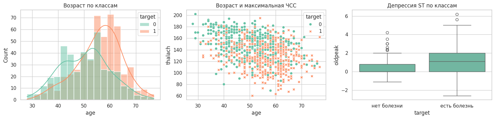
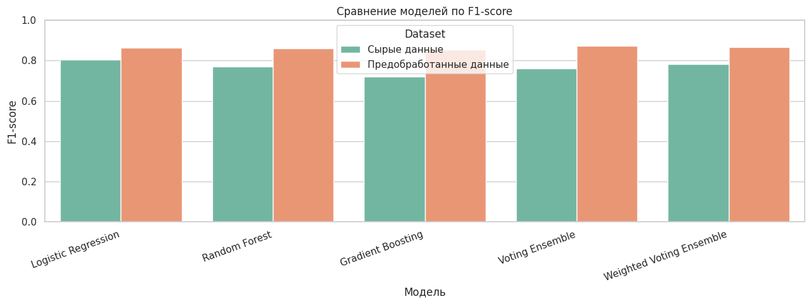
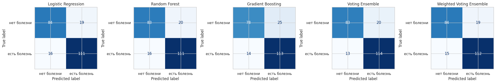

# Практическая работа №2

**Дисциплина:** Математика в программировании  
**Тема:** Дискриминативные интеллектуальные алгоритмы  
**Предметная область:** медицинская диагностика сердечно-сосудистых заболеваний  
**Набор данных:** UCI Heart Disease  
**Авторы:** Ефремов А.И., Лазарев Г.С., Никитин А.В.  
**Преподаватель:** Холмогоров В. В.  
**Москва, 2026 г.**

## Содержание

Введение  
1. Теоретическая часть  
1.1. Описание задачи и входных данных  
1.2. Дискриминативная классификация  
1.3. Логистическая регрессия  
1.4. Случайный лес  
1.5. Градиентный бустинг  
1.6. Ансамбль голосования  
1.7. Метрики качества  
2. Практическая часть  
2.1. Используемые модели и параметры  
2.2. Анализ признаков перед обучением  
2.3. Протокол обучения и оценки  
2.4. Сравнение моделей  
2.5. Матрицы ошибок  
Заключение  
Список использованных источников  
Приложение А

## Введение

Цель работы - реализовать и сравнить несколько дискриминативных моделей машинного обучения для бинарной классификации наличия сердечно-сосудистого заболевания у пациента.

В первой практической работе был подготовлен набор данных UCI Heart Disease. Во второй работе этот подготовленный набор используется как вход для моделей. Подробная предобработка здесь повторно не рассматривается, потому что она уже была основной темой первой лабораторной. Основной акцент второй работы - сравнение алгоритмов классификации и объяснение того, почему разные модели дают разные результаты.

Актуальность работы связана с тем, что сердечно-сосудистые заболевания остаются одной из ведущих причин смертности в мире [1]. С точки зрения машинного обучения задача также показательна: медицинские признаки не разделяют классы идеально, поэтому полезно сравнить простую линейную модель, модели на деревьях и ансамбли.

В работе обучаются пять вариантов:

- `Logistic Regression` - базовая линейная модель;
- `Random Forest` - бэггинг-ансамбль деревьев решений;
- `Gradient Boosting` - бустинговый ансамбль деревьев;
- `Voting Ensemble` - обычное голосование трёх моделей;
- `Weighted Voting Ensemble` - голосование с весами, выбранными по F1 на кросс-валидации.

## 1. Теоретическая часть

### 1.1. Описание задачи и входных данных

Используется набор данных **UCI Heart Disease** [2]. В нём каждая строка соответствует пациенту, а столбцы описывают медицинские признаки: возраст, пол, тип боли в груди, давление, холестерин, результаты ЭКГ, максимальную ЧСС, стенокардию при нагрузке, `oldpeak`, `slope`, `thal` и другие признаки.

Исходная целевая переменная `num` принимает значения от 0 до 4. Для второй лабораторной она переводится в бинарный вид:

```text
target = 0, если num = 0
target = 1, если num > 0
```

То есть модель должна ответить на вопрос: есть у пациента признаки болезни сердца или нет.

После подготовки из первой лабораторной используется 918 строк. Классы распределены достаточно близко: 410 объектов класса «нет болезни» и 508 объектов класса «есть болезнь». Дисбаланс есть, но он не критический.

### 1.2. Дискриминативная классификация

Дискриминативная модель не создаёт новые объекты, а учится отличать один класс от другого. В данной работе модель получает признаки пациента и возвращает:

- класс `0` - болезни нет;
- класс `1` - болезнь есть;
- для некоторых моделей также вероятность класса `1`.

Вероятность важна для двух вещей. Во-первых, по ней считается `ROC-AUC`. Во-вторых, она используется в soft-voting ансамблях, где модели голосуют не только готовыми классами, а вероятностями.

### 1.3. Логистическая регрессия

Логистическая регрессия - это базовая линейная модель классификации [3]. Она считает взвешенную сумму признаков:

```text
z = w1·x1 + w2·x2 + ... + wn·xn + b
```

где `x1...xn` - признаки пациента, `w1...wn` - веса признаков, `b` - свободный коэффициент.

Затем значение `z` переводится в вероятность через логистическую функцию:

```text
p = 1 / (1 + e^(-z))
```

Если вероятность выше выбранного порога, объект относится к классу `1`.

Почему эта модель нужна в работе:

- она простая и понятная;
- хорошо подходит как базовый уровень качества;
- показывает, насколько хорошо классы разделяются линейно.

Ограничение логистической регрессии в том, что она строит линейную границу. Если болезнь зависит от сложного сочетания признаков, например возраста, типа боли, `oldpeak` и максимальной ЧСС одновременно, линейной границы может быть недостаточно.

В коде используется:

```python
LogisticRegression(
    max_iter=5000,
    class_weight="balanced",
    random_state=42,
)
```

`max_iter=5000` нужен, чтобы алгоритму хватило итераций для сходимости. После one-hot encoding признаков становится больше, поэтому стандартного числа итераций может быть мало.

`class_weight="balanced"` означает, что модель учитывает различие в размерах классов. Класс «есть болезнь» представлен немного чаще, поэтому балансировка весов помогает не смещаться слишком сильно в сторону более частого класса.

### 1.4. Случайный лес

Случайный лес (`Random Forest`) - это ансамбль деревьев решений [4]. Одно дерево решений строит набор правил вида:

```text
если oldpeak > 1.5 и thalach < 140, то ...
```

Проблема одного дерева в том, что оно легко переобучается: может слишком точно подстроиться под обучающую выборку и хуже работать на новых данных.

Случайный лес решает это так:

1. строится много деревьев;
2. каждое дерево получает немного разную выборку данных;
3. при построении узлов деревья рассматривают не все признаки сразу, а случайные подмножества признаков;
4. итоговый ответ получается голосованием деревьев.

Такой подход называется бэггингом. Его смысл - уменьшить случайность и переобучение за счёт усреднения многих моделей.

В работе используется:

```python
RandomForestClassifier(
    n_estimators=300,
    min_samples_leaf=2,
    class_weight="balanced",
    random_state=42,
    n_jobs=1,
)
```

`n_estimators=300` означает, что строится 300 деревьев. Это не случайное число «с потолка». Если деревьев мало, например 10 или 20, результат леса может сильно зависеть от случайности. При увеличении числа деревьев предсказания становятся стабильнее. 300 деревьев - нормальный компромисс: достаточно много для устойчивости, но ещё не слишком тяжело для небольшого учебного датасета.

`min_samples_leaf=2` означает, что в конечном листе дерева должно быть минимум 2 объекта. Лист - это конечное правило дерева, где уже выдаётся прогноз. Если разрешить лист из одного объекта, дерево может запоминать отдельные строки. Минимум 2 объекта немного сглаживает дерево и снижает переобучение. Это особенно важно для медицинских данных, где есть шум и похожие пациенты из разных классов.

`class_weight="balanced"` выполняет ту же роль, что и в логистической регрессии: учитывает неравное количество объектов разных классов.

`n_jobs=1` ограничивает выполнение одним процессом. На качество модели это не влияет, но делает запуск более предсказуемым в локальной среде.

### 1.5. Градиентный бустинг

Градиентный бустинг (`Gradient Boosting`) - это ансамбль деревьев, которые строятся последовательно [5]. Главное отличие от случайного леса:

- случайный лес строит деревья независимо;
- бустинг строит деревья одно за другим.

Интуитивно бустинг работает так:

1. первое дерево делает прогноз;
2. алгоритм смотрит, где модель ошиблась;
3. следующее дерево сильнее учитывает ошибки предыдущих;
4. итоговый прогноз складывается из вкладов всех деревьев.

То есть бустинг не просто усредняет деревья, а последовательно исправляет ошибки.

В работе используется:

```python
GradientBoostingClassifier(
    n_estimators=150,
    learning_rate=0.05,
    max_depth=3,
    random_state=42,
)
```

`n_estimators=150` означает, что строится 150 последовательных деревьев. Для бустинга нельзя просто бесконечно увеличивать число деревьев: слишком много деревьев может привести к переобучению. Поэтому используется умеренное значение.

`learning_rate=0.05` задаёт, насколько сильно каждое новое дерево влияет на итоговый ответ. Маленький шаг делает обучение осторожнее. Если поставить большой `learning_rate`, бустинг может слишком резко подстраиваться под ошибки и переобучаться. Значение 0.05 выбрано как аккуратный вариант: каждое дерево исправляет ошибки постепенно.

`max_depth=3` ограничивает глубину каждого дерева. Это значит, что каждое отдельное дерево остаётся простым. В бустинге это нормально: сила метода не в одном большом дереве, а в последовательности многих небольших деревьев. Если сделать деревья слишком глубокими, они начнут запоминать обучающие данные.

### 1.6. Ансамбль голосования

Ансамбль голосования (`VotingClassifier`) объединяет несколько уже выбранных моделей [6]. В работе объединяются:

- логистическая регрессия;
- случайный лес;
- градиентный бустинг.

Используется `voting="soft"`. Это значит, что ансамбль усредняет вероятности моделей.

Пример:

| Модель | Вероятность болезни |
|---|---:|
| Logistic Regression | 0.70 |
| Random Forest | 0.55 |
| Gradient Boosting | 0.80 |

Обычный soft-voting посчитает среднюю вероятность:

```text
(0.70 + 0.55 + 0.80) / 3 = 0.683
```

Если итоговая вероятность выше порога, ансамбль выдаёт класс «есть болезнь».

В работе также используется взвешенное голосование. Веса выбираются по F1 на кросс-валидации обучающей выборки. Для подготовленных данных получились такие значения:

| Модель | CV F1 | Вес |
|---|---:|---:|
| Gradient Boosting | 0.8140 | 1 |
| Logistic Regression | 0.8208 | 2 |
| Random Forest | 0.8263 | 3 |

Это значит, что случайный лес получил самый большой вес, потому что на кросс-валидации train-части показал лучший F1 среди базовых моделей. Тестовая выборка при выборе весов не использовалась, поэтому сравнение остаётся честным.

Важно: взвешенное голосование не обязано быть лучше обычного. Если модели близки по качеству, то равное усреднение может дать более ровный баланс ошибок. В этой работе так и получилось.

### 1.7. Метрики качества

Для оценки моделей используются `Accuracy`, `Precision`, `Recall`, `F1` и `ROC-AUC` [7].

`Accuracy` - доля правильных ответов:

```text
Accuracy = (TP + TN) / (TP + TN + FP + FN)
```

`Precision` показывает, какая доля положительных предсказаний была верной:

```text
Precision = TP / (TP + FP)
```

`Recall` показывает, какую долю реальных пациентов с болезнью модель нашла:

```text
Recall = TP / (TP + FN)
```

`F1` объединяет precision и recall:

```text
F1 = 2 · Precision · Recall / (Precision + Recall)
```

`ROC-AUC` показывает, насколько хорошо модель ранжирует пациентов по вероятности болезни. Эта метрика смотрит не только на готовые классы, но и на вероятности.

В медицинской задаче особенно важен `Recall` для класса «есть болезнь», потому что пропустить пациента с заболеванием опаснее, чем отправить пациента на дополнительную проверку. Но если смотреть только на recall, можно получить модель, которая почти всем ставит «есть болезнь». Поэтому основной показатель сравнения в работе - F1, потому что он учитывает и precision, и recall.

## 2. Практическая часть

### 2.1. Используемые модели и параметры

В практической части обучались пять моделей. Все они проверялись на одном и том же train/test-разбиении подготовленного набора данных.

| Модель | Основные параметры | Зачем так выбрано |
|---|---|---|
| Logistic Regression | `max_iter=5000`, `class_weight="balanced"` | Базовая модель; увеличенное число итераций нужно для устойчивой сходимости |
| Random Forest | `n_estimators=300`, `min_samples_leaf=2`, `class_weight="balanced"` | 300 деревьев стабилизируют голосование; минимум 2 объекта в листе снижает переобучение |
| Gradient Boosting | `n_estimators=150`, `learning_rate=0.05`, `max_depth=3` | 150 небольших деревьев последовательно исправляют ошибки; малый шаг делает обучение осторожнее |
| Voting Ensemble | `voting="soft"` | Усредняет вероятности трёх разных моделей |
| Weighted Voting Ensemble | `voting="soft"`, веса по CV F1 | Даёт больший вклад модели, которая лучше показала себя на кросс-валидации |

Смысл такого набора моделей: сравнить три разных подхода. Логистическая регрессия проверяет линейную зависимость, случайный лес проверяет устойчивый ансамбль независимых деревьев, а бустинг проверяет последовательное исправление ошибок. Ансамбли затем объединяют эти подходы.

### 2.2. Анализ признаков перед обучением

В этой части не повторяется предобработка из первой лабораторной. Здесь анализируются признаки, чтобы понять, почему задача классификации не является совсем простой.


Рисунок 1 показывает, что источники данных отличаются по балансу классов. В Cleveland и Hungarian больше пациентов без болезни, а в Switzerland и Long Beach VA больше пациентов с болезнью. Это важно: модель учится на данных из разных медицинских учреждений, и распределение классов в них неодинаковое.

Из-за этого нельзя ожидать идеального качества. Пациенты из разных источников могут отличаться не только диагнозом, но и способом сбора данных, полнотой признаков и составом выборки.


На рисунке 2 видно, что самые заметные связи с целевой переменной имеют:

- `oldpeak`: корреляция около `0.39`;
- `thalach`: корреляция около `-0.39`;
- `age`: корреляция около `0.28`.

Это означает, что у пациентов с болезнью чаще выше `oldpeak`, ниже максимальная ЧСС и выше возраст. Но значения корреляций умеренные, не близкие к `1` или `-1`. Значит, ни один отдельный числовой признак не решает задачу сам по себе. Моделям нужно учитывать комбинацию признаков.



Первый график показывает, что пациенты с болезнью чаще находятся в более старших возрастах. Но распределения классов пересекаются, поэтому возраст не может быть единственным правилом.

Второй график показывает связь возраста и `thalach`. У пациентов с болезнью чаще встречаются более низкие значения максимальной ЧСС. Это согласуется с корреляционной матрицей.

Третий график показывает `oldpeak` по классам. У класса «есть болезнь» медиана `oldpeak` выше, но боксплоты пересекаются. Это объясняет, почему модели дают хороший, но не идеальный результат: признаки дают сигнал, но классы всё равно смешаны.

### 2.3. Протокол обучения и оценки

Для оценки использовался подготовленный набор из первой лабораторной:

- 918 строк;
- 688 строк в train;
- 230 строк в test;
- стратифицированное разделение по целевому классу;
- `random_state=42` для воспроизводимости.

Стратификация нужна, чтобы в train и test сохранилось примерно одинаковое соотношение классов. Без этого тестовая выборка могла бы случайно получить слишком много или слишком мало пациентов с болезнью, и сравнение моделей стало бы менее честным.

Взвешенный ансамбль использовал кросс-валидацию только на train-части. Это сделано для того, чтобы веса моделей не подбирались по тестовой выборке.

### 2.4. Сравнение моделей

Основные результаты на подготовленных данных:

| Модель | Accuracy | Precision | Recall | F1 | ROC-AUC |
|---|---:|---:|---:|---:|---:|
| Voting Ensemble | 0.8565 | 0.8507 | 0.8976 | 0.8736 | 0.9139 |
| Weighted Voting Ensemble | 0.8522 | 0.8550 | 0.8819 | 0.8682 | 0.9132 |
| Logistic Regression | 0.8478 | 0.8538 | 0.8740 | 0.8638 | 0.9179 |
| Random Forest | 0.8435 | 0.8473 | 0.8740 | 0.8605 | 0.9064 |
| Gradient Boosting | 0.8304 | 0.8188 | 0.8898 | 0.8528 | 0.9028 |



На рисунке 4 нас интересуют значения для подготовленных данных. Лучший F1 получил `Voting Ensemble`: `0.8736`. Это значит, что обычное усреднение вероятностей трёх моделей дало лучший баланс между precision и recall.

Логистическая регрессия показала F1 `0.8638`. Это сильный результат для простой модели. Он говорит о том, что в данных есть заметный линейный сигнал: комбинация признаков действительно позволяет отделять пациентов с болезнью от пациентов без болезни.

Случайный лес получил F1 `0.8605`, то есть почти как логистическая регрессия. Он не стал заметно лучше, хотя умеет ловить нелинейные зависимости. Возможное объяснение: в этом датасете часть полезного сигнала хорошо выражена линейно, а сам набор не очень большой для сложных деревьев.

Градиентный бустинг получил F1 `0.8528`. При этом у него высокий recall `0.8898`, то есть он хорошо находит пациентов с болезнью. Но precision ниже (`0.8188`), значит бустинг чаще относит пациентов без болезни к положительному классу. Поэтому итоговый F1 ниже, чем у ансамбля голосования.

Взвешенное голосование получило F1 `0.8682`, то есть немного хуже обычного `Voting Ensemble`. Это нормально: веса были выбраны по кросс-валидации train-части, а на test-части простое равное усреднение оказалось лучше. Это показывает, что усложнение ансамбля не всегда улучшает качество.


На рисунке 5 видно, что ROC-AUC у всех моделей находится примерно в диапазоне `0.90-0.92`. Это означает, что модели в целом хорошо ранжируют пациентов: пациентам с заболеванием обычно назначается более высокая вероятность класса `1`.

Интересно, что максимальный ROC-AUC среди подготовленных моделей у логистической регрессии: `0.9179`, но лучший F1 у `Voting Ensemble`. Это не ошибка. ROC-AUC оценивает вероятностное ранжирование, а F1 оценивает уже итоговые классы при конкретном пороге. Для практической классификации в этой работе важнее F1, потому что он показывает баланс между ложными срабатываниями и пропущенными пациентами с болезнью.

### 2.5. Матрицы ошибок



Матрицы ошибок показывают, какие именно ошибки делают модели.

| Модель | Верно: нет болезни | Ошибочно: есть болезнь | Ошибочно: нет болезни | Верно: есть болезнь |
|---|---:|---:|---:|---:|
| Logistic Regression | 84 | 19 | 16 | 111 |
| Random Forest | 83 | 20 | 16 | 111 |
| Gradient Boosting | 78 | 25 | 14 | 113 |
| Voting Ensemble | 83 | 20 | 13 | 114 |
| Weighted Voting Ensemble | 84 | 19 | 15 | 112 |

`Voting Ensemble` сделал меньше всего ложноотрицательных ошибок: 13. Это значит, что он реже остальных пропускал пациентов с болезнью. Для медицинской задачи это важное преимущество.

`Gradient Boosting` нашёл 113 пациентов с болезнью из 127, но при этом дал 25 ложноположительных ошибок. То есть он более “осторожный” в сторону болезни: чаще говорит «есть болезнь», из-за чего recall высокий, но precision ниже.

`Logistic Regression` и `Random Forest` дали очень похожие матрицы ошибок. Это объясняет близость их F1. Несмотря на разные принципы работы, на данном наборе они пришли к похожему балансу ошибок.

`Weighted Voting Ensemble` уменьшил ложноположительные ошибки до 19, но увеличил ложноотрицательные до 15 по сравнению с обычным голосованием. Поэтому его F1 оказался ниже. Для данной задачи обычный ансамбль лучше, потому что он меньше пропускает пациентов с болезнью.

## Заключение

Во второй практической работе были обучены и сравнены модели для бинарной классификации наличия сердечного заболевания: логистическая регрессия, случайный лес, градиентный бустинг, обычное голосование и взвешенное голосование.

Лучший результат показал `Voting Ensemble`: accuracy `0.8565`, precision `0.8507`, recall `0.8976`, F1 `0.8736`, ROC-AUC `0.9139`. Он оказался лучшим, потому что объединил разные типы моделей и дал самый удачный баланс ошибок. По матрице ошибок видно, что он пропустил 13 пациентов с болезнью, меньше остальных моделей.

Логистическая регрессия тоже показала высокий F1 `0.8638`. Это означает, что в данных есть сильная линейная составляющая. Случайный лес дал близкий результат `0.8605`, но не превзошёл логистическую регрессию. Это может быть связано с тем, что датасет не очень большой, а часть зависимости между признаками и диагнозом уже хорошо улавливается линейной моделью.

Градиентный бустинг показал высокий recall `0.8898`, но более низкий precision `0.8188`. Он чаще находил пациентов с болезнью, но также чаще ошибочно относил пациентов без болезни к положительному классу. Поэтому по F1 он оказался ниже ансамбля голосования.

Взвешенное голосование не улучшило обычное голосование. Хотя веса были выбраны по кросс-валидации, на тестовой выборке простое равное усреднение вероятностей оказалось устойчивее. Это показывает, что усложнение модели не гарантирует улучшение результата.

Итоговый вывод: для данной задачи лучшим оказался ансамбль разных моделей, но преимущество над логистической регрессией умеренное. Это значит, что данные содержат полезный сигнал, однако классы частично пересекаются, поэтому ни одна модель не даёт идеального разделения.

## Список использованных источников

1. World Health Organization. Cardiovascular diseases (CVDs). URL: https://www.who.int/en/news-room/fact-sheets/detail/cardiovascular-diseases-%28cvds%29
2. UCI Machine Learning Repository. Heart Disease Dataset. URL: https://archive.ics.uci.edu/dataset/45/heart%2Bdisease
3. scikit-learn documentation. LogisticRegression. URL: https://scikit-learn.org/stable/modules/generated/sklearn.linear_model.LogisticRegression.html
4. scikit-learn documentation. RandomForestClassifier. URL: https://scikit-learn.org/stable/modules/generated/sklearn.ensemble.RandomForestClassifier.html
5. scikit-learn documentation. GradientBoostingClassifier. URL: https://scikit-learn.org/stable/modules/generated/sklearn.ensemble.GradientBoostingClassifier.html
6. scikit-learn documentation. VotingClassifier. URL: https://scikit-learn.org/stable/modules/generated/sklearn.ensemble.VotingClassifier.html
7. scikit-learn documentation. Model evaluation: quantifying the quality of predictions. URL: https://scikit-learn.org/stable/modules/model_evaluation.html

## Приложение А

Основной программный код:

```python
from pathlib import Path
import os
import warnings

import numpy as np
import pandas as pd

from sklearn.base import clone
from sklearn.ensemble import GradientBoostingClassifier, RandomForestClassifier, VotingClassifier
from sklearn.linear_model import LogisticRegression
from sklearn.metrics import accuracy_score, f1_score, precision_score, recall_score, roc_auc_score
from sklearn.model_selection import StratifiedKFold, cross_val_score, train_test_split

warnings.filterwarnings("ignore")

RANDOM_STATE = 42
TARGET_LABELS = ["нет болезни", "есть болезнь"]

def make_base_models():
    return {
        "Logistic Regression": LogisticRegression(
            max_iter=5000,
            class_weight="balanced",
            random_state=RANDOM_STATE,
        ),
        "Random Forest": RandomForestClassifier(
            n_estimators=300,
            min_samples_leaf=2,
            class_weight="balanced",
            random_state=RANDOM_STATE,
            n_jobs=1,
        ),
        "Gradient Boosting": GradientBoostingClassifier(
            n_estimators=150,
            learning_rate=0.05,
            max_depth=3,
            random_state=RANDOM_STATE,
        ),
    }

def calculate_rank_weights(cv_f1):
    ordered = sorted(cv_f1.items(), key=lambda item: item[1])
    return {name: rank + 1 for rank, (name, _) in enumerate(ordered)}

def make_ensembles(base_models, rank_weights):
    estimators = [
        ("logreg", clone(base_models["Logistic Regression"])),
        ("rf", clone(base_models["Random Forest"])),
        ("gb", clone(base_models["Gradient Boosting"])),
    ]
    weights = [
        rank_weights["Logistic Regression"],
        rank_weights["Random Forest"],
        rank_weights["Gradient Boosting"],
    ]
    return {
        "Voting Ensemble": VotingClassifier(
            estimators=estimators,
            voting="soft",
            n_jobs=1,
        ),
        "Weighted Voting Ensemble": VotingClassifier(
            estimators=[
                ("logreg", clone(base_models["Logistic Regression"])),
                ("rf", clone(base_models["Random Forest"])),
                ("gb", clone(base_models["Gradient Boosting"])),
            ],
            voting="soft",
            weights=weights,
            n_jobs=1,
        ),
    }

def evaluate_dataset(X, y):
    X_train, X_test, y_train, y_test = train_test_split(
        X,
        y,
        test_size=0.25,
        random_state=RANDOM_STATE,
        stratify=y,
    )

    base_models = make_base_models()
    cv = StratifiedKFold(n_splits=5, shuffle=True, random_state=RANDOM_STATE)

    cv_f1 = {}
    for model_name, model in base_models.items():
        scores = cross_val_score(clone(model), X_train, y_train, cv=cv, scoring="f1")
        cv_f1[model_name] = float(scores.mean())

    rank_weights = calculate_rank_weights(cv_f1)
    models = {**base_models, **make_ensembles(base_models, rank_weights)}

    rows = []
    for model_name, model in models.items():
        fitted = clone(model).fit(X_train, y_train)
        y_pred = fitted.predict(X_test)
        y_score = fitted.predict_proba(X_test)[:, 1]

        rows.append(
            {
                "Model": model_name,
                "Accuracy": accuracy_score(y_test, y_pred),
                "Precision": precision_score(y_test, y_pred, zero_division=0),
                "Recall": recall_score(y_test, y_pred, zero_division=0),
                "F1": f1_score(y_test, y_pred, zero_division=0),
                "ROC-AUC": roc_auc_score(y_test, y_score),
            }
        )

    return pd.DataFrame(rows)
```
