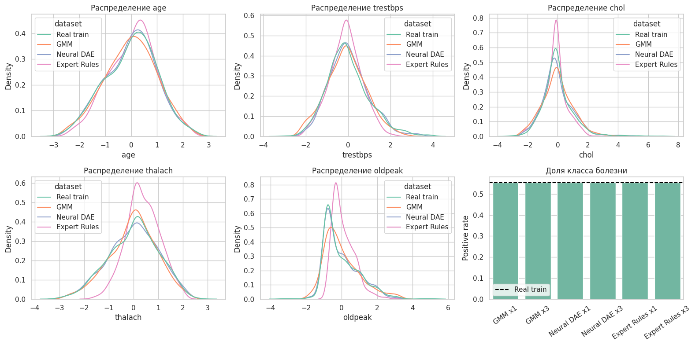
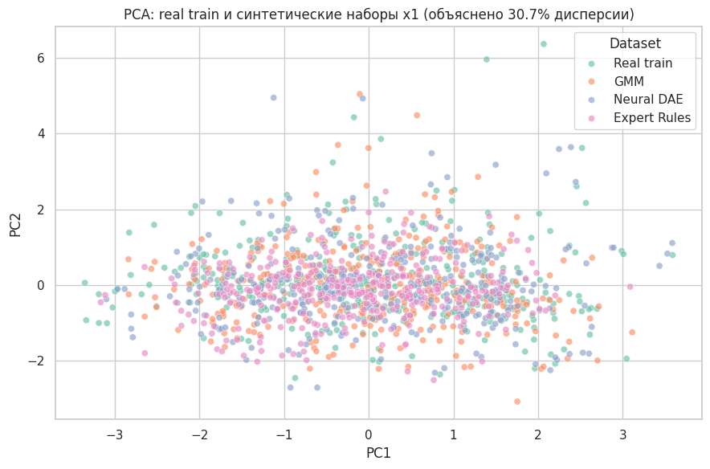
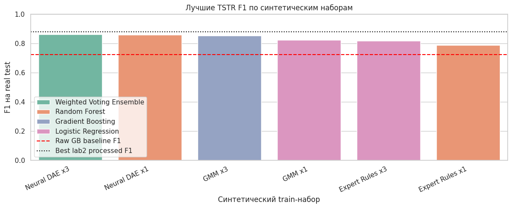

# Практическая работа №3

**Дисциплина:** Математика в программировании  
**Тема:** Генерация табличных данных  
**Предметная область:** медицинская диагностика сердечно-сосудистых заболеваний  
**Набор данных:** UCI Heart Disease  
**Авторы:** Ефремов А.И., Лазарев Г.С., Никитин А.В.  
**Преподаватель:** Холмогоров В. В.  
**Москва, 2026 г.**

## Содержание

Введение  
1. Теоретическая часть  
1.1. Постановка задачи генерации табличных данных  
1.2. Проверка TSTR  
1.3. Gaussian Mixture Model  
1.4. Нейронный denoising-autoencoder  
1.5. Экспертная база правил  
1.6. Метрики качества синтетических данных  
2. Практическая часть  
2.1. Используемые данные и протокол эксперимента  
2.2. Реализованные генераторы  
2.3. Статистическая проверка синтетических данных  
2.4. Визуальный анализ синтетических данных  
2.5. TSTR-сравнение моделей  
Заключение  
Список использованных источников  
Приложение А

## Введение

Цель работы - реализовать генерацию синтетических табличных данных и проверить, можно ли на этих данных обучить дискриминативные модели для бинарной классификации наличия сердечно-сосудистого заболевания у пациента.

В качестве предметной области используется медицинская диагностика сердечно-сосудистых заболеваний. Набор данных остается тем же, что и в первых двух практических работах: UCI Heart Disease. В первой работе данные были очищены и предобработаны, во второй работе на них сравнивались дискриминативные модели. В третьей работе основное внимание уделяется генеративным алгоритмам, то есть методам, которые создают новые синтетические строки таблицы.

Задание практической работы требует сгенерировать набор данных, на котором возможно обучить дискриминативные модели для задачи из предыдущих работ. В работе дополнительно учитывается ориентир из практической работы №2: необходимо проверить, могут ли модели, обученные на синтетике, превысить F1 модели Gradient Boosting на сырых данных. Этот порог равен 0.7213. Для более строгого сравнения также используется лучший результат второй работы на предобработанных данных: F1 = 0.8769.

Основная объективная проверка называется TSTR, Train on Synthetic, Test on Real. Модель обучается на синтетическом train-наборе, а проверяется на реальной test-части. Такой подход показывает не только внешнюю похожесть данных, но и их практическую полезность для обучения классификатора.

В работе реализованы три типа генераторов: классическая модель Gaussian Mixture Model, нейронный denoising-autoencoder на базе MLPRegressor и экспертный генератор правил. Для каждого генератора создаются два варианта синтетического набора: x1, равный размеру real train, и x3, увеличенный в три раза.

## 1. Теоретическая часть

### 1.1. Постановка задачи генерации табличных данных

Генерация табличных данных - это задача создания новых строк таблицы, которые похожи на реальные наблюдения и сохраняют важные статистические свойства исходного набора. В отличие от обычной классификации, генеративная модель не только относит объект к классу, а пытается воспроизвести структуру данных.

В данной работе синтетическая строка описывает пациента. Она должна быть пригодна для той же задачи, что и реальные данные: классификации наличия сердечно-сосудистого заболевания. Поэтому синтетические признаки должны быть согласованы с целевым классом target.

Для задачи используются два пространства признаков. Первое пространство - processed-признаки из первой лабораторной: стандартизированные числовые признаки, one-hot признаки категорий и индикаторы пропусков. Второе пространство - исходные медицинские признаки, например возраст, давление, холестерин, тип боли в груди и максимальная частота сердечных сокращений. Классические и нейронные генераторы работают в processed-пространстве, а экспертный генератор сначала создает исходные медицинские строки, затем применяет к ним тот же препроцессор, что и в первой работе.

### 1.2. Проверка TSTR

TSTR расшифровывается как Train on Synthetic, Test on Real. Это один из наиболее понятных способов оценить полезность синтетического набора. Если модель, обученная только на синтетических данных, показывает хорошее качество на реальной test-выборке, значит синтетика сохранила признаки, важные для реальной задачи.

В работе используется следующий протокол:

- реальный набор делится на real train и real test;
- генераторы обучаются только на real train;
- создаются синтетические train-наборы;
- дискриминативные модели обучаются на синтетике;
- качество считается на real test.

Real test не используется при генерации. Это важно для честной проверки: генератор не должен видеть данные, на которых потом оценивается классификатор.

Для сравнения используются Accuracy, Precision, Recall, F1 и ROC-AUC. Основная метрика в работе - F1, потому что она одновременно учитывает точность положительных предсказаний и полноту нахождения класса болезни.

### 1.3. Gaussian Mixture Model

Gaussian Mixture Model, или GMM, относится к классическим генеративным моделям. Она описывает распределение данных как смесь нескольких нормальных распределений. Если один класс пациентов состоит из нескольких групп, GMM может выделить эти группы как отдельные компоненты смеси.

В работе GMM обучается отдельно для каждого класса. Это сделано потому, что пациенты без болезни и пациенты с болезнью имеют разные распределения признаков. Отдельное обучение по классам помогает сохранить соответствие между признаками и target.

Число компонент ограничивается сверху значением 6. Такое ограничение выбрано для устойчивости. Если компонент слишком много, модель может начать слишком точно подстраиваться под train-выборку. Если компонент слишком мало, модель будет чрезмерно усреднять данные.

После сэмплирования GMM выполняется постобработка. Числовые признаки ограничиваются наблюдаемыми квантилями, one-hot группы приводятся к одному активному значению, бинарные признаки округляются к 0 или 1.

### 1.4. Нейронный denoising-autoencoder

Второй генератор реализован на базе MLPRegressor как denoising-autoencoder. Autoencoder - это нейронная сеть, которая учится восстанавливать входные данные. Denoising-autoencoder получает на вход зашумленную строку и учится возвращать ее к исходному виду.

В работе генерация выполняется так:

- берутся реальные train-строки своего класса;
- к ним добавляется небольшой шум;
- нейросеть обучается восстанавливать исходные строки;
- для генерации новые зашумленные строки проходят через обученную сеть;
- результат проходит постобработку processed-признаков.

Архитектура скрытых слоев равна 64, 24, 64. Узкий средний слой заставляет модель сжимать информацию и выделять основные закономерности. Такой подход помогает не просто копировать строки, а создавать близкие варианты наблюдений, лежащие около выученной структуры данных.

### 1.5. Экспертная база правил

Экспертный генератор отличается от GMM и нейронного генератора. Он создает строки не в processed-пространстве, а в исходных медицинских признаках. Такой подход более интерпретируемый: можно объяснить, почему у синтетического пациента появились именно такие значения.

В генератор заложены правила, основанные на анализе предметной области и распределений train-набора:

- возраст сэмплируется из распределения своего класса;
- при наличии болезни чаще выбираются асимптоматическая боль в груди, стенокардия при нагрузке, повышенный oldpeak и патологический thal;
- максимальная частота сердечных сокращений уменьшается с возрастом и дополнительно снижается при болезни и стенокардии при нагрузке;
- давление и холестерин зависят от возраста, пола и целевого класса;
- пропуски добавляются с частотами, наблюдаемыми в real train.

Сильная сторона экспертного генератора - контролируемость. В отличие от нейронной модели, он не является черным ящиком: логика генерации задается явно. Поэтому такой генератор полезен не только для создания данных, но и для проверки предметной согласованности синтетики.

### 1.6. Метрики качества синтетических данных

Перед TSTR выполняется статистическая проверка синтетических наборов. Она нужна, чтобы понять, насколько синтетика похожа на real train до обучения моделей.

Используются следующие метрики:

- Positive rate - доля объектов класса 1;
- Class balance abs diff - отличие баланса классов от real train;
- Numeric mean MAE - средняя абсолютная ошибка средних значений числовых признаков;
- Numeric variance MAE - средняя абсолютная ошибка дисперсий числовых признаков;
- Binary frequency MAE - отличие частот one-hot и бинарных признаков;
- Correlation MAE - отличие корреляционных матриц;
- DCR - расстояние до ближайшей реальной train-строки;
- Invalid one-hot rows - количество строк с некорректными one-hot группами;
- NaN count - количество пропущенных значений.

DCR используется как sanity-check. Если расстояние до ближайшей реальной строки слишком часто равно нулю, генератор может просто копировать train-набор. В нашей работе DCR min больше нуля для всех генераторов, поэтому прямого копирования всех строк не наблюдается.

## 2. Практическая часть

### 2.1. Используемые данные и протокол эксперимента

В работе используется предобработанный файл из первой лабораторной. Восстановленный препроцессор совпал с файлом первой работы с максимальным отличием 0.0000000000, поэтому все генераторы и модели используют тот же формат признаков.

| Набор | Строк | Признаков | Класс 0 | Класс 1 |
|---|---:|---:|---:|---:|
| Полный processed-набор | 918 | 33 | 410 | 508 |
| Real train | 688 | 33 | 307 | 381 |
| Real test | 230 | 33 | 103 | 127 |

В качестве порогов сравнения используются результаты практической работы №2.

| Ориентир | Модель | F1 |
|---|---|---:|
| Порог из комментария преподавателя | Gradient Boosting на сырых данных | 0.7213 |
| Лучший результат практической работы №2 | Weighted Voting Ensemble на processed-данных | 0.8769 |

Таким образом, основной практический вопрос формулируется так: сможет ли модель, обученная на синтетических данных, на real test превысить F1 = 0.7213 и насколько близко она подойдет к F1 = 0.8769.

### 2.2. Реализованные генераторы

Для каждого генератора созданы два набора: x1 и x3. Набор x1 содержит столько же строк, сколько real train. Набор x3 содержит в три раза больше строк.

| Генератор | Размер | Строк | Класс 0 | Класс 1 | Positive rate |
|---|---|---:|---:|---:|---:|
| GMM | x1 | 688 | 307 | 381 | 0.5538 |
| GMM | x3 | 2064 | 921 | 1143 | 0.5538 |
| Neural DAE | x1 | 688 | 307 | 381 | 0.5538 |
| Neural DAE | x3 | 2064 | 921 | 1143 | 0.5538 |
| Expert Rules | x1 | 688 | 307 | 381 | 0.5538 |
| Expert Rules | x3 | 2064 | 921 | 1143 | 0.5538 |

Баланс классов у всех синтетических наборов совпадает с real train. Это важно, потому что при изменении баланса модель могла бы получить искусственное смещение в сторону одного класса.

### 2.3. Статистическая проверка синтетических данных

Сводные метрики качества синтетических данных приведены в таблице.

| Генератор | Размер | Mean MAE | Variance MAE | Binary MAE | Correlation MAE | DCR min | DCR median |
|---|---|---:|---:|---:|---:|---:|---:|
| Expert Rules | x1 | 0.1717 | 0.4554 | 0.0211 | 0.0933 | 0.5655 | 1.9549 |
| Expert Rules | x3 | 0.1677 | 0.4202 | 0.0198 | 0.0859 | 0.2934 | 1.9575 |
| GMM | x1 | 0.0307 | 0.0481 | 0.0180 | 0.0477 | 0.1794 | 1.8420 |
| GMM | x3 | 0.0230 | 0.0311 | 0.0115 | 0.0448 | 0.2380 | 1.9384 |
| Neural DAE | x1 | 0.0249 | 0.0710 | 0.0119 | 0.0233 | 0.0653 | 0.3605 |
| Neural DAE | x3 | 0.0123 | 0.0331 | 0.0039 | 0.0152 | 0.0626 | 0.3601 |

Во всех наборах количество некорректных one-hot строк равно 0, количество пропущенных значений равно 0. Это означает, что постобработка сработала корректно.

Neural DAE x3 лучше всего сохранил средние значения, частоты бинарных признаков и корреляционную структуру. GMM x3 также показал сильный результат по дисперсиям и средним, что ожидаемо для модели, основанной на гауссовых распределениях. Expert Rules имеет более крупные отличия по средним и дисперсиям, но при этом показывает высокий DCR median. Это означает, что экспертный генератор создает строки, которые дальше от реального train-набора и меньше похожи на простое копирование наблюдений.

### 2.4. Визуальный анализ синтетических данных

На рисунке 2.1 показаны распределения основных числовых признаков и баланс классов.



График показывает, что Neural DAE и GMM достаточно близко повторяют форму распределений real train в processed-пространстве. Neural DAE особенно близок по частотам и корреляциям, что согласуется с численными метриками. GMM дает более сглаженные распределения, потому что его основа - смесь нормальных распределений. Expert Rules формирует медицински логичные строки, но распределения отдельных processed-признаков отличаются сильнее, так как генерация идет через явные правила в исходном пространстве.

Баланс классов на графике совпадает для всех синтетических наборов. Это подтверждает, что различия в TSTR связаны не с перекосом target, а с качеством воспроизведения признаковой структуры.

На рисунке 2.2 приведена PCA-визуализация real train и синтетических наборов x1.



PCA показывает, что синтетические данные в целом располагаются в области real train, то есть генераторы не создают полностью отдельное облако объектов. Neural DAE и GMM ближе к real train в processed-пространстве, потому что они обучаются непосредственно на этих признаках. Expert Rules может занимать немного другую область, поскольку сначала создает исходные медицинские значения, а затем пропускает их через препроцессор.

Важно, что PCA не является финальной метрикой качества. Он показывает только двумерную проекцию многомерных данных. Поэтому итоговый вывод делается по TSTR.

### 2.5. TSTR-сравнение моделей

Для TSTR использовались те же типы дискриминативных моделей, что и во второй практической работе: логистическая регрессия, случайный лес, градиентный бустинг, обычный voting-ансамбль и взвешенный voting-ансамбль.

Лучшие результаты по каждому источнику train приведены в таблице.

| Train source | Лучшая модель | Accuracy | Precision | Recall | F1 | ROC-AUC |
|---|---|---:|---:|---:|---:|---:|
| Real train | Weighted Voting Ensemble | 0.8609 | 0.8571 | 0.8976 | 0.8769 | 0.9166 |
| Synthetic Neural DAE x3 | Weighted Voting Ensemble | 0.8435 | 0.8527 | 0.8661 | 0.8594 | 0.9151 |
| Synthetic Neural DAE x1 | Random Forest | 0.8391 | 0.8409 | 0.8740 | 0.8571 | 0.8905 |
| Synthetic GMM x3 | Gradient Boosting | 0.8304 | 0.8188 | 0.8898 | 0.8528 | 0.8907 |
| Synthetic GMM x1 | Logistic Regression | 0.8043 | 0.8254 | 0.8189 | 0.8221 | 0.8879 |
| Synthetic Expert Rules x3 | Logistic Regression | 0.7913 | 0.7926 | 0.8425 | 0.8168 | 0.8871 |
| Synthetic Expert Rules x1 | Random Forest | 0.7652 | 0.7920 | 0.7795 | 0.7857 | 0.8360 |

На рисунке 2.3 показано сравнение лучших TSTR F1 по синтетическим наборам.



Красная линия соответствует порогу F1 = 0.7213, то есть результату Gradient Boosting на сырых данных из второй лабораторной. Все лучшие синтетические наборы находятся выше этого порога. Это означает, что поставленная практическая цель выполнена.

Черная линия соответствует F1 = 0.8769, то есть лучшему результату второй лабораторной на real train processed-данных. Лучший синтетический результат равен 0.8594. Он не превосходит обучение на реальных processed-данных, но находится близко к нему: разница составляет 0.0175.

Лучший результат получен на наборе Neural DAE x3 с моделью Weighted Voting Ensemble:

```text
F1 = 0.8594
Accuracy = 0.8435
ROC-AUC = 0.9151
```

Такой результат объясняется тем, что Neural DAE x3 лучше всего сохранил корреляции и частоты признаков. Для классификатора важны не только отдельные значения признаков, но и связи между ними.

Expert Rules x3 также показывает высокий F1 = 0.8168 и уверенно проходит порог 0.7213. Его результат важен тем, что он получен не черным ящиком, а интерпретируемой системой правил. Такой генератор дает контролируемые строки и высокий DCR median, поэтому он полезен как объяснимый способ генерации и как проверка предметной логики синтетики.

## Заключение

В практической работе были реализованы три подхода к генерации табличных данных для задачи диагностики сердечно-сосудистых заболеваний: Gaussian Mixture Model, нейронный denoising-autoencoder и экспертная база правил. Для каждого генератора были созданы синтетические train-наборы x1 и x3.

Синтетические наборы прошли базовую проверку качества: в них отсутствуют пропуски и некорректные one-hot строки, а баланс классов полностью совпадает с real train. Статистические метрики показали, что Neural DAE x3 лучше всего сохраняет средние значения, частоты бинарных признаков и корреляционную структуру. GMM x3 показал устойчивую статистическую похожесть и хорошо сохранил дисперсии. Expert Rules создал интерпретируемые и более отличающиеся от train-набора строки, что видно по высокому DCR median.

Главная проверка TSTR показала, что синтетические данные пригодны для обучения дискриминативных моделей. Лучший синтетический результат получен для Neural DAE x3 и Weighted Voting Ensemble: F1 = 0.8594, Accuracy = 0.8435, ROC-AUC = 0.9151. Этот результат выше порога Gradient Boosting на сырых данных из второй лабораторной, равного 0.7213.

При этом лучший синтетический результат немного уступает лучшему результату второй лабораторной на real train processed-данных, где F1 = 0.8769. Это ожидаемо, потому что синтетические данные сохраняют основные закономерности, но не полностью заменяют реальные наблюдения. Разница небольшая и составляет 0.0175, что показывает высокую практическую полезность синтетики.

Итоговый вывод: задача генерации табличных данных выполнена. Синтетические наборы позволяют обучать модели, которые успешно работают на реальном test-наборе. Нейронный генератор оказался лучшим по TSTR, GMM дал сильный классический baseline, а экспертные правила дали объяснимую и контролируемую синтетику с высоким качеством и хорошей предметной интерпретируемостью.

## Список использованных источников

1. Задание к практической работе №3 «Генерация табличных данных» по дисциплине «Математика в программировании».
2. UCI Machine Learning Repository. Heart Disease Dataset.
3. Pedregosa F. et al. Scikit-learn: Machine Learning in Python. Journal of Machine Learning Research, 2011.
4. Документация scikit-learn. GaussianMixture.
5. Документация scikit-learn. MLPRegressor.
6. Документация scikit-learn. Ensemble methods: RandomForestClassifier, GradientBoostingClassifier, VotingClassifier.
7. Документация scikit-learn. Metrics and scoring: F1-score, ROC-AUC, precision, recall.
8. Документация scikit-learn. Principal Component Analysis.

## Приложение А

```python
from pathlib import Path
import os
import warnings

import numpy as np
import pandas as pd
import matplotlib.pyplot as plt
import seaborn as sns

from sklearn.base import clone
from sklearn.ensemble import GradientBoostingClassifier, RandomForestClassifier, VotingClassifier
from sklearn.linear_model import LogisticRegression
from sklearn.metrics import accuracy_score, f1_score, precision_score, recall_score, roc_auc_score
from sklearn.mixture import GaussianMixture
from sklearn.model_selection import train_test_split
from sklearn.neighbors import NearestNeighbors
from sklearn.neural_network import MLPRegressor
from sklearn.decomposition import PCA

warnings.filterwarnings("ignore")
sns.set_theme(style="whitegrid", palette="Set2")

PROJECT_ROOT = Path.cwd()
while PROJECT_ROOT != PROJECT_ROOT.parent and not (PROJECT_ROOT / "labs" / "lab1").exists():
    PROJECT_ROOT = PROJECT_ROOT.parent

LAB1_DIR = PROJECT_ROOT / "labs" / "lab1"
LAB2_DIR = PROJECT_ROOT / "labs" / "lab2"
LAB3_DIR = PROJECT_ROOT / "labs" / "lab3"
os.environ["MPLCONFIGDIR"] = str(PROJECT_ROOT / ".cache" / "mathprog_lab3" / "matplotlib")
Path(os.environ["MPLCONFIGDIR"]).mkdir(parents=True, exist_ok=True)

RANDOM_STATE = 42
RAW_GRADIENT_BOOSTING_F1_BASELINE = 0.721311
BEST_LAB2_PROCESSED_F1 = 0.876923

processed = pd.read_csv(LAB1_DIR / "heart_disease_preprocessed.csv")
feature_cols = [col for col in processed.columns if col != "target"]
X = processed[feature_cols]
y = processed["target"].astype(int)

X_train, X_test, y_train, y_test = train_test_split(
    X,
    y,
    test_size=0.25,
    stratify=y,
    random_state=RANDOM_STATE,
)

processed_numeric_cols = ["age", "trestbps", "chol", "thalach", "oldpeak"]
onehot_groups = {
    "sex": ["sex_0.0", "sex_1.0"],
    "cp": ["cp_1.0", "cp_2.0", "cp_3.0", "cp_4.0"],
    "fbs": ["fbs_0.0", "fbs_1.0"],
    "restecg": ["restecg_0.0", "restecg_1.0", "restecg_2.0"],
    "exang": ["exang_0.0", "exang_1.0"],
    "slope": ["slope_1.0", "slope_2.0", "slope_3.0"],
    "thal": ["thal_3.0", "thal_6.0", "thal_7.0"],
}
onehot_cols = [col for cols in onehot_groups.values() for col in cols]
missing_indicator_cols = [col for col in feature_cols if col.endswith("_was_missing")]
binary_cols = onehot_cols + missing_indicator_cols
numeric_clip_bounds = X_train[processed_numeric_cols].quantile([0.005, 0.995])


def allocate_class_counts(y_reference, n_rows):
    proportions = y_reference.value_counts(normalize=True).sort_index()
    raw_counts = proportions * n_rows
    counts = np.floor(raw_counts).astype(int)
    remainder = int(n_rows - counts.sum())
    if remainder > 0:
        fractional = (raw_counts - counts).sort_values(ascending=False)
        for cls in fractional.index[:remainder]:
            counts.loc[cls] += 1
    return counts.astype(int).to_dict()


def postprocess_processed_features(values):
    frame = pd.DataFrame(values, columns=feature_cols)
    frame[processed_numeric_cols] = frame[processed_numeric_cols].clip(
        lower=numeric_clip_bounds.loc[0.005],
        upper=numeric_clip_bounds.loc[0.995],
        axis=1,
    )

    for cols in onehot_groups.values():
        max_col = frame[cols].to_numpy().argmax(axis=1)
        frame[cols] = 0
        for row_index, col_index in enumerate(max_col):
            frame.loc[frame.index[row_index], cols[col_index]] = 1

    frame[missing_indicator_cols] = (frame[missing_indicator_cols] >= 0.5).astype(int)
    return frame[feature_cols]


def attach_target_and_shuffle(parts, random_state):
    synthetic = pd.concat(parts, ignore_index=True)
    return synthetic.sample(frac=1, random_state=random_state).reset_index(drop=True)


def generate_gmm(X_reference, y_reference, n_rows, random_state=RANDOM_STATE):
    counts = allocate_class_counts(y_reference, n_rows)
    parts = []
    for cls, count in counts.items():
        X_cls = X_reference.loc[y_reference[y_reference == cls].index]
        n_components = min(6, max(1, len(X_cls) // 60))
        model = GaussianMixture(
            n_components=n_components,
            covariance_type="diag",
            reg_covar=1e-4,
            max_iter=500,
            random_state=random_state + int(cls),
        )
        model.fit(X_cls)
        sampled_values, _ = model.sample(count)
        sampled = postprocess_processed_features(sampled_values)
        sampled["target"] = int(cls)
        parts.append(sampled)
    return attach_target_and_shuffle(parts, random_state=random_state + 10)


def generate_neural_autoencoder(X_reference, y_reference, n_rows, random_state=RANDOM_STATE):
    rng = np.random.default_rng(random_state)
    counts = allocate_class_counts(y_reference, n_rows)
    parts = []

    for cls, count in counts.items():
        X_cls = X_reference.loc[y_reference[y_reference == cls].index].reset_index(drop=True)
        X_cls_values = X_cls.to_numpy(dtype=float)
        feature_std = X_cls.std(axis=0).replace(0, 1e-3).to_numpy(dtype=float)

        repeated = np.repeat(X_cls_values, repeats=4, axis=0)
        train_noise = rng.normal(0, feature_std * 0.08, size=repeated.shape)
        noisy_train = repeated + train_noise

        model = MLPRegressor(
            hidden_layer_sizes=(64, 24, 64),
            activation="relu",
            solver="adam",
            alpha=0.001,
            batch_size=64,
            learning_rate_init=0.001,
            max_iter=900,
            random_state=random_state + int(cls),
        )
        model.fit(noisy_train, repeated)

        base_indices = rng.integers(0, len(X_cls_values), size=count)
        base = X_cls_values[base_indices]
        generation_noise = rng.normal(0, feature_std * 0.12, size=base.shape)
        generated_values = model.predict(base + generation_noise)

        sampled = postprocess_processed_features(generated_values)
        sampled["target"] = int(cls)
        parts.append(sampled)

    return attach_target_and_shuffle(parts, random_state=random_state + 20)


def generate_expert_rules(raw_train, n_rows, random_state=RANDOM_STATE):
    rng = np.random.default_rng(random_state)
    counts = allocate_class_counts(raw_train["target"], n_rows)
    parts = []

    for cls, count in counts.items():
        part = pd.DataFrame()
        train_cls = raw_train[raw_train["target"] == cls]
        part["age"] = rng.choice(train_cls["age"].dropna(), size=count, replace=True)
        part["sex"] = rng.choice([0.0, 1.0], size=count, p=[0.32, 0.68])
        part["cp"] = rng.choice([1.0, 2.0, 3.0, 4.0], size=count, p=[0.04, 0.12, 0.24, 0.60] if cls == 1 else [0.08, 0.18, 0.38, 0.36])
        part["exang"] = rng.choice([0.0, 1.0], size=count, p=[0.45, 0.55] if cls == 1 else [0.78, 0.22])
        part["oldpeak"] = np.clip(rng.normal(1.45 if cls == 1 else 0.55, 0.85, size=count), 0, 6)
        part["thalach"] = np.clip(205 - part["age"] - 12 * cls - 10 * part["exang"] + rng.normal(0, 14, size=count), 70, 205)
        part["trestbps"] = np.clip(108 + 0.35 * part["age"] + 4 * cls + rng.normal(0, 12, size=count), 85, 210)
        part["chol"] = np.clip(165 + 1.05 * part["age"] + 8 * part["sex"] + rng.normal(0, 38, size=count), 100, 570)
        part["fbs"] = rng.choice([0.0, 1.0], size=count, p=[0.83, 0.17])
        part["restecg"] = rng.choice([0.0, 1.0, 2.0], size=count, p=[0.50, 0.02, 0.48])
        part["slope"] = rng.choice([1.0, 2.0, 3.0], size=count, p=[0.30, 0.55, 0.15] if cls == 1 else [0.18, 0.70, 0.12])
        part["thal"] = rng.choice([3.0, 6.0, 7.0], size=count, p=[0.36, 0.08, 0.56] if cls == 1 else [0.66, 0.08, 0.26])
        part["ca"] = np.nan
        part["num"] = cls
        part["target"] = cls
        parts.append(part)

    raw_synthetic = attach_target_and_shuffle(parts, random_state=random_state + 30)
    X_raw = raw_synthetic.drop(columns=["target", "num", "ca"])
    X_processed = preprocess_pipeline.transform(X_raw)
    synthetic = pd.DataFrame(X_processed, columns=feature_cols)
    synthetic["target"] = raw_synthetic["target"].to_numpy()
    return synthetic


def quality_metrics_for_dataset(generator_id, multiplier, synthetic):
    real_X = X_train[feature_cols]
    syn_X = synthetic[feature_cols]

    real_corr = real_X.corr(numeric_only=True).fillna(0)
    syn_corr = syn_X.corr(numeric_only=True).fillna(0)
    nearest = NearestNeighbors(n_neighbors=1, metric="euclidean")
    nearest.fit(real_X)
    distances = nearest.kneighbors(syn_X, return_distance=True)[0].ravel()

    return {
        "Generator": generator_id,
        "Size multiplier": f"x{multiplier}",
        "Rows": len(synthetic),
        "Positive rate": synthetic["target"].mean(),
        "Numeric mean MAE": (real_X[processed_numeric_cols].mean() - syn_X[processed_numeric_cols].mean()).abs().mean(),
        "Numeric variance MAE": (real_X[processed_numeric_cols].var() - syn_X[processed_numeric_cols].var()).abs().mean(),
        "Binary frequency MAE": (real_X[binary_cols].mean() - syn_X[binary_cols].mean()).abs().mean(),
        "Correlation MAE": (real_corr - syn_corr).abs().to_numpy().mean(),
        "DCR min": distances.min(),
        "DCR median": np.median(distances),
    }


def make_base_models():
    return {
        "Logistic Regression": LogisticRegression(max_iter=5000, class_weight="balanced", random_state=RANDOM_STATE),
        "Random Forest": RandomForestClassifier(n_estimators=300, min_samples_leaf=2, class_weight="balanced", random_state=RANDOM_STATE, n_jobs=1),
        "Gradient Boosting": GradientBoostingClassifier(n_estimators=150, learning_rate=0.05, max_depth=3, random_state=RANDOM_STATE),
    }


def evaluate_tstr(train_frame, train_source, generator, multiplier):
    X_syn = train_frame[feature_cols]
    y_syn = train_frame["target"].astype(int)
    rows = []
    base_models = make_base_models()

    voting = VotingClassifier(
        estimators=[("logreg", clone(base_models["Logistic Regression"])), ("rf", clone(base_models["Random Forest"])), ("gb", clone(base_models["Gradient Boosting"]))],
        voting="soft",
    )
    weighted_voting = VotingClassifier(
        estimators=[("logreg", clone(base_models["Logistic Regression"])), ("rf", clone(base_models["Random Forest"])), ("gb", clone(base_models["Gradient Boosting"]))],
        voting="soft",
        weights=[5, 1, 1],
    )
    models = {**base_models, "Voting Ensemble": voting, "Weighted Voting Ensemble": weighted_voting}

    for model_name, model in models.items():
        fitted = clone(model)
        fitted.fit(X_syn, y_syn)
        pred = fitted.predict(X_test)
        proba = fitted.predict_proba(X_test)[:, 1]
        rows.append({
            "Train source": train_source,
            "Generator": generator,
            "Size multiplier": multiplier,
            "Model": model_name,
            "Accuracy": accuracy_score(y_test, pred),
            "Precision": precision_score(y_test, pred),
            "Recall": recall_score(y_test, pred),
            "F1": f1_score(y_test, pred),
            "ROC-AUC": roc_auc_score(y_test, proba),
        })
    return rows
```
