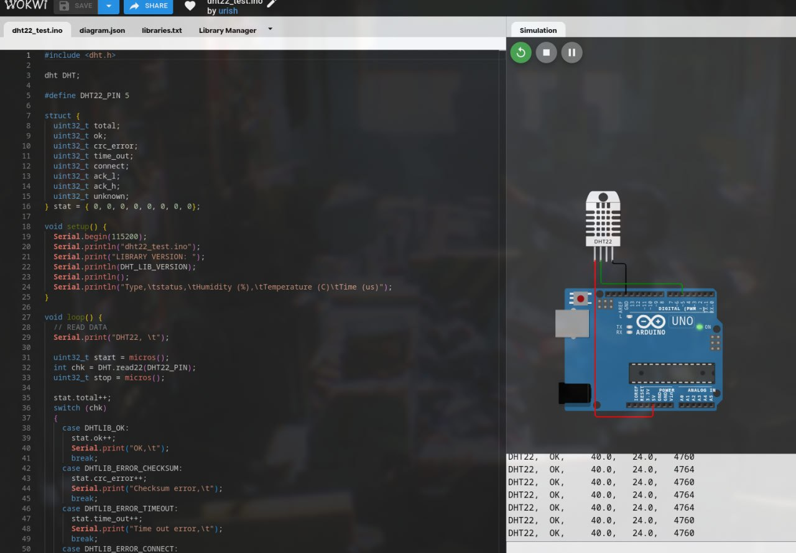
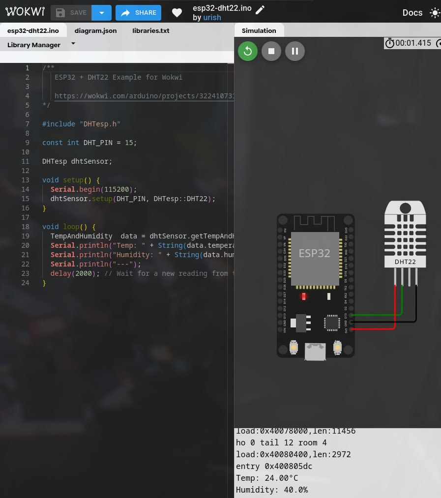
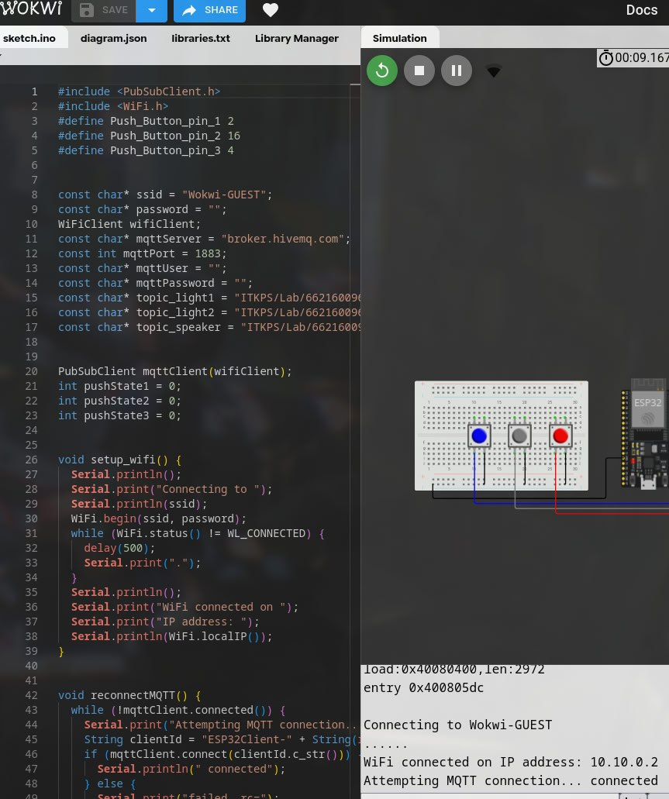
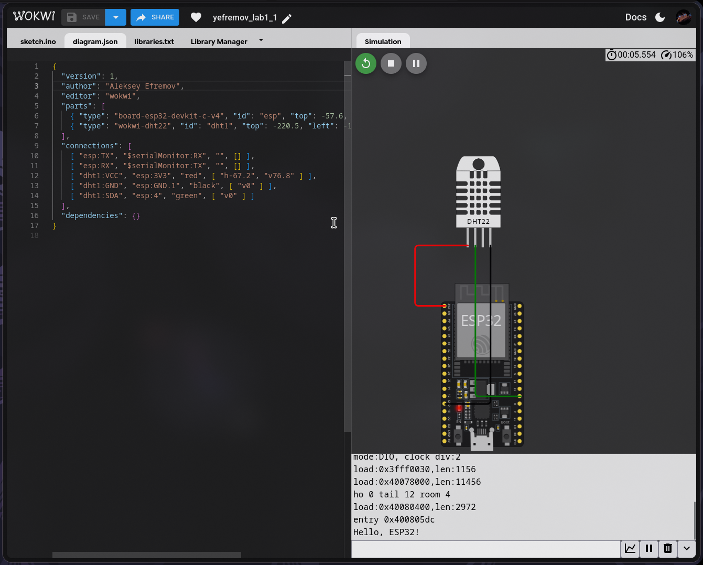
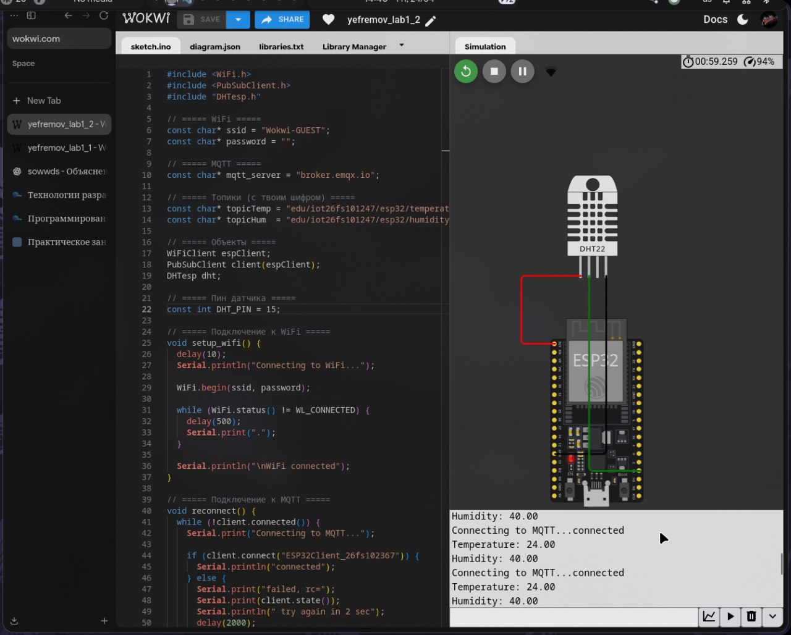
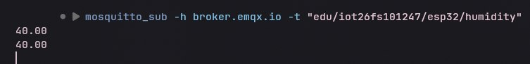
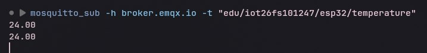
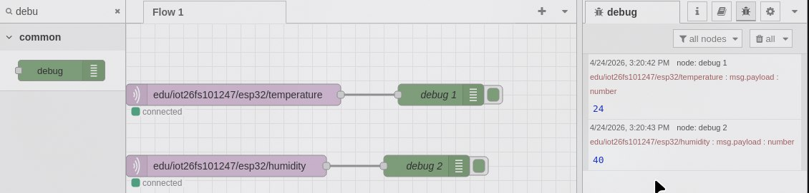
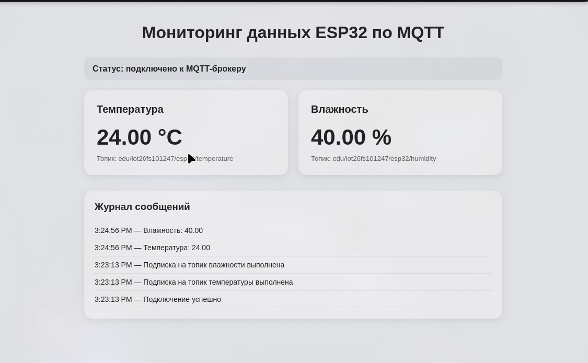

# Практическая работа №1 Ефремов Алексей ЭФБО-10-23

## Тема

**Передача данных от виртуального электронного устройства во внешние системы
мониторинга по протоколу MQTT**

---

## Цель работы

Разработать виртуальное IoT-устройство на базе микроконтроллера ESP32, реализовать передачу измеряемых данных по протоколу MQTT и обеспечить их приём и отображение во внешней системе мониторинга.

---

## Используемые технологии и средства

В ходе выполнения практической работы использовались:

- онлайн-эмулятор **Wokwi**;

- виртуальный микроконтроллер **ESP32**;

- виртуальный датчик температуры и влажности **DHT22**;

- протокол обмена данными **MQTT**;

- публичный MQTT-брокер **broker.emqx.io**;

- MQTT-клиент **mosquitto_sub**;

- среда визуального программирования **Node-RED**;

- браузерный клиент на **HTML + CSS + JavaScript**.


---

# Ход работы

---
## 1. Ознакомление с примерами реализации проекта в Wokwi
1. Ознакомиться с примерами реализации проекта в Wokwi
а) Перейдите на сайт https://wokwi.com, при необходимости ознакомьтесь с особенностями
работы в системе с помощью имеющихся справочных средств на сайте и в интернете.
б) Последовательно в отдельных окнах откройте проекты и ознакомьтесь с их работой,
схемой и структурой кода.
работа с датчиком DHT22 :
https://wokwi.com/projects/344892337559700051
или
https://wokwi.com/projects/322410731508073042
и
работа с MQTT брокером:
https://wokwi.com/projects/408156447864796161
в)



---

## 2. Подготовка виртуального устройства в Wokwi

На втором этапе был создан новый проект в среде **Wokwi** на базе микроконтроллера **ESP32**. В проект был добавлен виртуальный датчик температуры и влажности **DHT22**.

Схема устройства была собрана следующим образом:

|Компонент DHT22|Подключение к ESP32|
|---|---|
|VCC|3V3|
|GND|GND|
|SDA|GPIO 4|

Датчик DHT22 был подключён к микроконтроллеру ESP32 для считывания температуры и влажности. Согласно методическим указаниям, вывод SDA датчика необходимо подключить к цифровому пину GPIO 4 микроконтроллера.

После сборки схемы была запущена симуляция. Схема была проверена на отсутствие ошибок подключения. Проект был сохранён под именем, отражающим назначение работы и автора.

**Результат выполнения пункта:**
Виртуальное устройство ESP32 + DHT22 было собрано в Wokwi. Датчик подключён к питанию, земле и пину GPIO 4.


---

## 3. Программирование микроконтроллера ESP32 + MQTT

На третьем этапе был написан программный код для микроконтроллера ESP32. Код выполняет следующие функции:

- подключение к WiFi-сети Wokwi;

- подключение к публичному MQTT-брокеру `broker.emqx.io`;

- считывание температуры и влажности с датчика DHT22;

- отправку температуры и влажности в отдельные MQTT-топики;

- обработку ошибок чтения датчика;

- повторное подключение к MQTT-брокеру при разрыве связи;

- вывод подробного лога работы программы в Serial Monitor.


В работе использовался шифр:

```text
26fs101247
```

На основе этого шифра были сформированы MQTT-топики:

```text
edu/iot26fs101247/esp32/temperature
edu/iot26fs101237/esp32/humidity
```

---

### Код программы микроконтроллера

```cpp
#include <WiFi.h>
#include <PubSubClient.h>
#include "DHTesp.h"

// ===== WiFi =====
const char* ssid = "Wokwi-GUEST";
const char* password = "";

// ===== MQTT =====
const char* mqtt_server = "broker.emqx.io";

// ===== Топики (с твоим шифром) =====
const char* topicTemp = "edu/iot26fs101247/esp32/temperature";
const char* topicHum  = "edu/iot26fs101247/esp32/humidity";

// ===== Объекты =====
WiFiClient espClient;
PubSubClient client(espClient);
DHTesp dht;

// ===== Пин датчика =====
const int DHT_PIN = 15;

// ===== Подключение к WiFi =====
void setup_wifi() {
  delay(10);
  Serial.println("Connecting to WiFi...");

  WiFi.begin(ssid, password);

  while (WiFi.status() != WL_CONNECTED) {
    delay(500);
    Serial.print(".");
  }

  Serial.println("\nWiFi connected");
}

// ===== Подключение к MQTT =====
void reconnect() {
  while (!client.connected()) {
    Serial.print("Connecting to MQTT...");

    if (client.connect("ESP32Client_26fs101247")) {
      Serial.println("connected");
    } else {
      Serial.print("failed, rc=");
      Serial.print(client.state());
      Serial.println(" try again in 2 sec");
      delay(2000);
    }
  }
}

// ===== setup =====
void setup() {
  Serial.begin(115200);

  dht.setup(DHT_PIN, DHTesp::DHT22);

  setup_wifi();

  client.setServer(mqtt_server, 1883);
}

// ===== loop =====
void loop() {

  if (!client.connected()) {
    reconnect();
  }

  client.loop();

  TempAndHumidity data = dht.getTempAndHumidity();

  float temp = data.temperature;
  float hum = data.humidity;

  // ===== Логи =====
  Serial.print("Temperature: ");
  Serial.println(temp);

  Serial.print("Humidity: ");
  Serial.println(hum);

  // ===== Отправка =====
  client.publish(topicTemp, String(temp).c_str());
  client.publish(topicHum, String(hum).c_str());

  delay(5000); // интервал (важно по методичке)
}

```

---

### Файл libraries.txt

Для подключения необходимых библиотек был создан файл `libraries.txt`.

```text
# Wokwi Library List
# See https://docs.wokwi.com/guides/libraries

WiFi
PubSubClient
DHT sensor library for ESPx
```

---


---

## 4. Приём данных во внешней системе мониторинга

Для проверки работы виртуального IoT-устройства был организован приём публикуемых MQTT-сообщений во внешних системах мониторинга. Были реализованы все три варианта:

1. приём данных с использованием MQTT-клиента;

2. приём данных в среде Node-RED;

3. приём данных в браузере.


Во всех вариантах использовался один и тот же MQTT-брокер:

```text
broker.emqx.io
```

И одни и те же топики:

```text
edu/iot26fs101247/esp32/temperature
edu/iot26fs101247/esp32/humidity
```

Методические указания допускают использование минимум одного варианта приёма данных, но рекомендуют максимально опробовать все варианты.

---

# 4.1. Вариант 1. Приём данных с использованием MQTT-клиента

Для простого варианта приёма данных был использован консольный MQTT-клиент `mosquitto_sub`. Он позволяет подписаться на MQTT-топик и получать сообщения, публикуемые устройством.

Для подписки на топик температуры была использована команда:

```bash
mosquitto_sub -h broker.emqx.io -t "edu/iot26fs101247/esp32/temperature"
```

Для подписки на топик влажности была использована команда:

```bash
mosquitto_sub -h broker.emqx.io -t "edu/iot26fs101247/esp32/humidity"
```

После запуска симуляции в Wokwi в терминале начали отображаться значения температуры и влажности, поступающие от виртуального устройства. Затем были изменены показания датчика DHT22 в Wokwi, после чего в терминале появились обновлённые значения.

Методические указания приводят пример использования `mosquitto_sub` для подписки на MQTT-топики и требуют зафиксировать поток данных и его динамику при изменении показаний датчика.

**Результат выполнения варианта 1:**
MQTT-клиент успешно подключился к брокеру `broker.emqx.io` и получил данные из топиков температуры и влажности. Изменение параметров датчика в Wokwi приводило к изменению принимаемых значений.



---

# 4.2. Вариант 2. Приём данных в среде Node-RED

В качестве основного варианта приёма данных была использована среда **Node-RED**. Node-RED позволяет создавать визуальные потоки обработки данных из готовых узлов.

Среда Node-RED была запущена локально, после чего веб-интерфейс был открыт в браузере по адресу:

```text
http://localhost:1880
```

В рабочей области Node-RED были созданы два узла **MQTT in**:

1. узел для приёма температуры;

2. узел для приёма влажности.


Для каждого узла был настроен MQTT-брокер:

```text
broker.emqx.io
```

Порт подключения:

```text
1883
```

Для узла температуры был указан топик:

```text
edu/iot26fs101247/esp32/temperature
```

Для узла влажности был указан топик:

```text
edu/iot26fs101247/esp32/humidity
```

К каждому узлу MQTT in был подключён узел **Debug**, предназначенный для вывода полученных сообщений в отладочную панель Node-RED.

Схема потока имела следующий вид:

```text
MQTT in temperature -> Debug
MQTT in humidity    -> Debug
```

После нажатия кнопки **Deploy** поток был развёрнут. В панели Debug начали отображаться сообщения, получаемые из MQTT-топиков. При изменении показаний датчика DHT22 в Wokwi значения в Node-RED также изменялись.

Методические указания требуют добавить два узла MQTT-in, настроить подключение к брокеру, указать топики температуры и влажности, подключить Debug и убедиться в поступлении данных.

**Результат выполнения варианта 2:**
В Node-RED был создан поток для приёма температуры и влажности от виртуального устройства. Полученные данные отображались в панели Debug. При изменении параметров датчика в Wokwi в Node-RED поступали обновлённые MQTT-сообщения.


---

# 4.3. Вариант 3. Приём данных в браузере

Для продвинутого варианта был реализован браузерный MQTT-клиент. Он выполнен в виде HTML-страницы с использованием HTML, CSS и JavaScript. Клиент подключается к MQTT-брокеру через WebSocket, подписывается на топики температуры и влажности, а затем отображает полученные значения в браузере.

Для подключения использовался WebSocket-адрес брокера EMQX:

```text
wss://broker.emqx.io:8084/mqtt
```

Браузерный клиент подписывался на следующие топики:

```text
edu/iot26fs101247/esp32/temperature
edu/iot26fs101247/esp32/humidity
```

Страница содержит:

- блок статуса подключения;

- карточку температуры;

- карточку влажности;

- журнал входящих сообщений;

- обработку ошибок подключения;

- обработку переподключения.


Методические указания требуют реализовать браузерный приём MQTT-сообщений с отображением данных, обработкой типовых ошибок и достаточным интерфейсом пользователя.

---

### Код браузерного клиента

```html
<!DOCTYPE html>
<html lang="ru">
<head>
  <meta charset="UTF-8" />
  <meta name="viewport" content="width=device-width, initial-scale=1.0" />
  <title>MQTT Monitor</title>
  <style>
    body {
      font-family: Arial, sans-serif;
      margin: 0;
      padding: 30px;
      background: #f4f6f8;
      color: #222;
    }

    .container {
      max-width: 800px;
      margin: 0 auto;
    }

    h1 {
      text-align: center;
      margin-bottom: 30px;
    }

    .status {
      padding: 12px 16px;
      border-radius: 10px;
      margin-bottom: 20px;
      background: #e9ecef;
      font-weight: bold;
    }

    .cards {
      display: grid;
      grid-template-columns: 1fr 1fr;
      gap: 20px;
    }

    .card {
      background: white;
      border-radius: 16px;
      padding: 24px;
      box-shadow: 0 4px 14px rgba(0,0,0,0.08);
    }

    .value {
      font-size: 42px;
      font-weight: bold;
      margin: 10px 0;
    }

    .topic {
      color: #666;
      font-size: 13px;
      word-break: break-all;
    }

    .log {
      margin-top: 30px;
      background: white;
      border-radius: 16px;
      padding: 20px;
      box-shadow: 0 4px 14px rgba(0,0,0,0.08);
    }

    .log-entry {
      padding: 8px 0;
      border-bottom: 1px solid #eee;
      font-size: 14px;
    }

    .error {
      color: #b00020;
      font-weight: bold;
    }
  </style>
</head>
<body>
  <div class="container">
    <h1>Мониторинг данных ESP32 по MQTT</h1>

    <div class="status" id="status">Статус: подключение...</div>

    <div class="cards">
      <div class="card">
        <h2>Температура</h2>
        <div class="value" id="tempValue">-- °C</div>
        <div class="topic">edu/iot26fs101247/esp32/temperature</div>
      </div>

      <div class="card">
        <h2>Влажность</h2>
        <div class="value" id="humValue">-- %</div>
        <div class="topic">edu/iot26fs101247/esp32/humidity</div>
      </div>
    </div>

    <div class="log">
      <h3>Журнал сообщений</h3>
      <div id="logEntries"></div>
    </div>
  </div>

  <script src="https://unpkg.com/mqtt/dist/mqtt.min.js"></script>
  <script>
    const brokerUrl = "wss://broker.emqx.io:8084/mqtt";

    const tempTopic = "edu/iot26fs101247/esp32/temperature";
    const humTopic = "edu/iot26fs101247/esp32/humidity";

    const statusEl = document.getElementById("status");
    const tempValueEl = document.getElementById("tempValue");
    const humValueEl = document.getElementById("humValue");
    const logEntriesEl = document.getElementById("logEntries");

    function addLog(message) {
      const entry = document.createElement("div");
      entry.className = "log-entry";
      entry.textContent = new Date().toLocaleTimeString() + " — " + message;
      logEntriesEl.prepend(entry);
    }

    const client = mqtt.connect(brokerUrl);

    client.on("connect", () => {
      statusEl.textContent = "Статус: подключено к MQTT-брокеру";
      addLog("Подключение успешно");

      client.subscribe(tempTopic, (err) => {
        if (err) {
          addLog("Ошибка подписки на температуру");
        } else {
          addLog("Подписка на температуру выполнена");
        }
      });

      client.subscribe(humTopic, (err) => {
        if (err) {
          addLog("Ошибка подписки на влажность");
        } else {
          addLog("Подписка на влажность выполнена");
        }
      });
    });

    client.on("message", (topic, message) => {
      const value = message.toString();

      if (topic === tempTopic) {
        tempValueEl.textContent = value + " °C";
        addLog("Температура: " + value);
      }

      if (topic === humTopic) {
        humValueEl.textContent = value + " %";
        addLog("Влажность: " + value);
      }
    });

    client.on("error", (err) => {
      statusEl.innerHTML = '<span class="error">Статус: ошибка подключения</span>';
      addLog("Ошибка: " + err.message);
    });

    client.on("reconnect", () => {
      statusEl.textContent = "Статус: переподключение...";
      addLog("Попытка переподключения");
    });

    client.on("close", () => {
      statusEl.innerHTML = '<span class="error">Статус: соединение закрыто</span>';
      addLog("Соединение закрыто");
    });
  </script>
</body>
</html>
```

---

### Результат работы браузерного клиента

После открытия HTML-страницы в браузере клиент подключился к MQTT-брокеру и подписался на топики температуры и влажности. На странице отображались текущие значения, поступающие от ESP32. При изменении показаний DHT22 в Wokwi значения на странице обновлялись.

**Результат выполнения варианта 3:**
Был реализован браузерный MQTT-клиент, который отображает температуру, влажность, статус подключения и журнал сообщений.

---
# Контрольные вопросы

## 1. Какую роль выполняет MQTT-брокер в IoT-системе?

MQTT-брокер является посредником между устройствами, которые публикуют данные, и клиентами, которые эти данные получают. В данной работе ESP32 публикует температуру и влажность в MQTT-топики, а MQTT-клиенты, Node-RED и браузерный клиент подписываются на эти топики и получают сообщения.

---

## 2. Чем отличается модель publish/subscribe от клиент–серверной?

В модели клиент–сервер клиент напрямую отправляет запрос серверу и получает ответ. В модели publish/subscribe отправитель и получатель не взаимодействуют напрямую. Устройство публикует сообщение в топик, а брокер передаёт его всем подписчикам этого топика. Это делает систему более гибкой и удобной для IoT.

---

## 3. Почему MQTT подходит для распределённых систем?

MQTT подходит для распределённых систем, потому что он лёгкий, работает по модели публикации и подписки, позволяет подключать много устройств и не требует прямой связи между отправителем и получателем. Это особенно удобно для IoT-систем, где множество датчиков передают данные в разные системы мониторинга.

---

## 4. Какие преимущества даёт иерархическая структура топиков?

Иерархическая структура топиков позволяет удобно группировать данные. Например:

```text
edu/iot26fs101247/esp32/temperature
```

Из такого топика понятно, что данные относятся к учебному проекту, индивидуальному шифру, устройству ESP32 и температуре. Такая структура упрощает фильтрацию, подписку и масштабирование системы.

---

## 5. Какие альтернативы Node-RED возможны для приёма данных?

В качестве альтернатив Node-RED можно использовать:

- MQTT Explorer;

- mosquitto_sub;

- собственный браузерный клиент;

- Python-скрипт с MQTT-библиотекой;

- Grafana вместе с системой хранения данных;

- IoT-платформы и облачные сервисы мониторинга.


---

# Вывод

В ходе выполнения практической работы было создано виртуальное IoT-устройство на базе микроконтроллера ESP32 и датчика DHT22. Устройство считывало температуру и влажность, подключалось к WiFi и передавало данные на публичный MQTT-брокер `broker.emqx.io`.

Для проверки передачи данных были реализованы три варианта приёма:

1. консольный MQTT-клиент `mosquitto_sub`;

2. визуальная среда Node-RED;

3. браузерный клиент на HTML, CSS и JavaScript.


Во всех вариантах удалось принять MQTT-сообщения из топиков температуры и влажности. При изменении показаний датчика DHT22 в Wokwi значения обновлялись во внешних системах мониторинга. Это подтверждает корректную работу передачи и приёма данных по протоколу MQTT.

Практическая работа выполнена в соответствии с методическими указаниями: реализована передача данных от виртуального устройства, организован приём сообщений во внешних системах, добавлены комментарии к коду, зафиксированы результаты и обоснована периодичность передачи данных.
