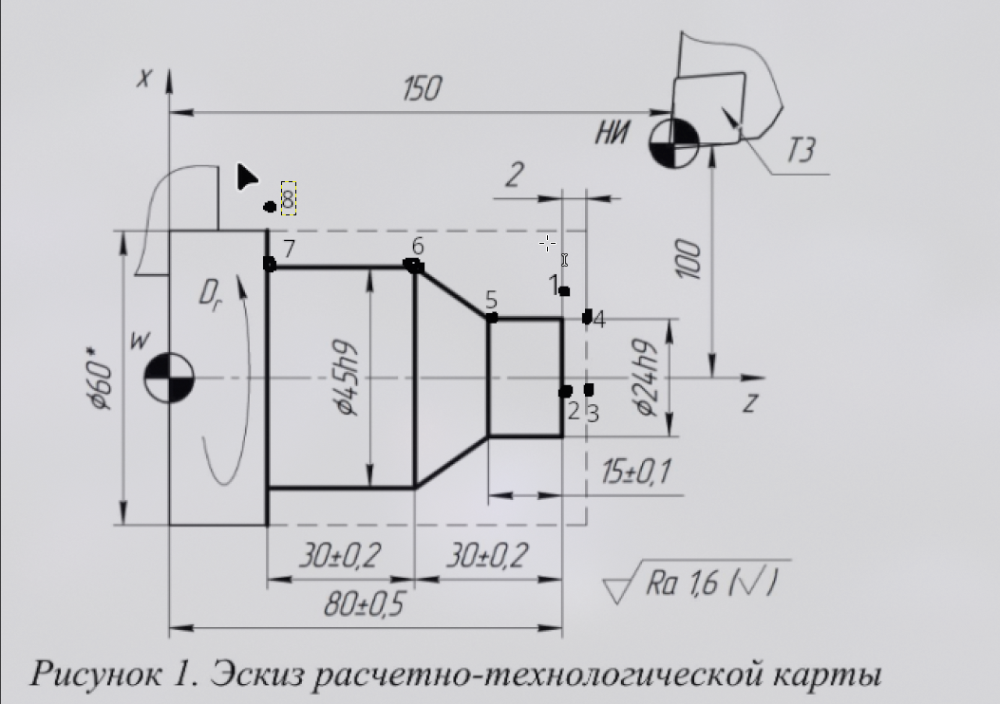

# Лабораторная 4 — задание 2

| Кадры УП | Комментарий |
|---|---|
| `%05` | Начало программы |
| `T3` | Вызов инструмента в 3м гнезде|
| `G90` |  рабочая система координат детали - абсолютная |
| `G97 M4 S400` | Включаем вращение шпинделя |
| `G0 X30 Z80` | Подвод к точке 1 перед правым торцом (x24 + 3мм выше)|
| `G96 S200` | Постоянная скорость резания 200|
| `G1 G95 X-4 F0.1 M8` | Переход в точку 2 |
| `G0 Z82 M9` | точка 3 |
| `X24` | точка 4 |
| `G96 S350` | Режим резания для 4-8 |
| `G1 G95 Z65 F0.15 M8` | Переход в точку 5 |
| `X45 Z50` | точка 6 |
| `Z20` | точка 7 |
| `X64 M9` | точка 8(+2 мм) |
| `G97 S400` | Холостое вращение шпинделя |
| `G0 X100 Z150` | Уход в безопасную точку |
| `M5` | Остановка шпинделя |
| `M2` | Конец программы |

