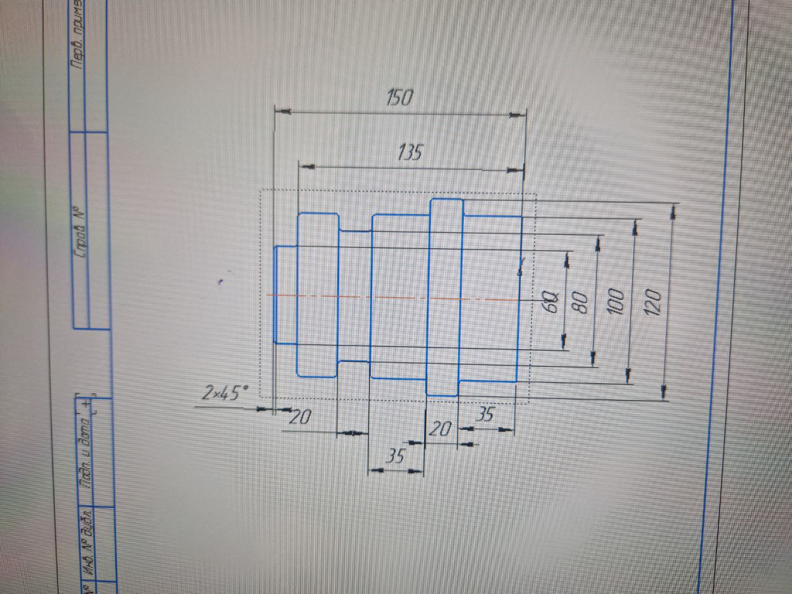
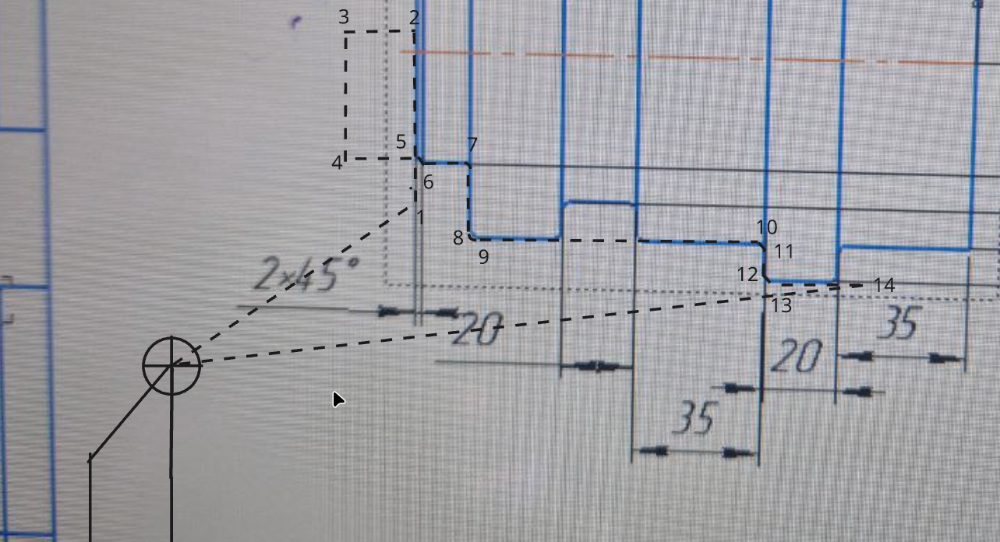
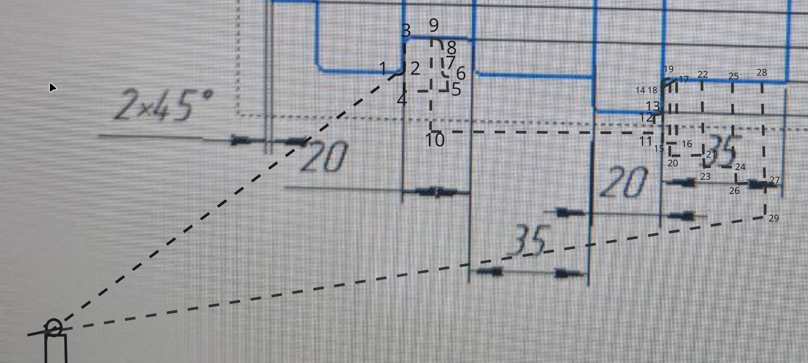
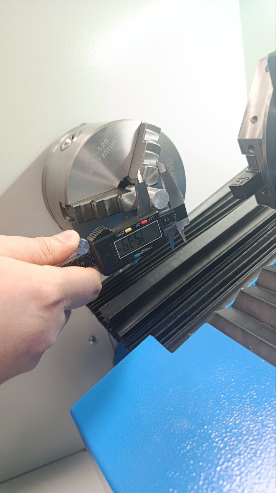
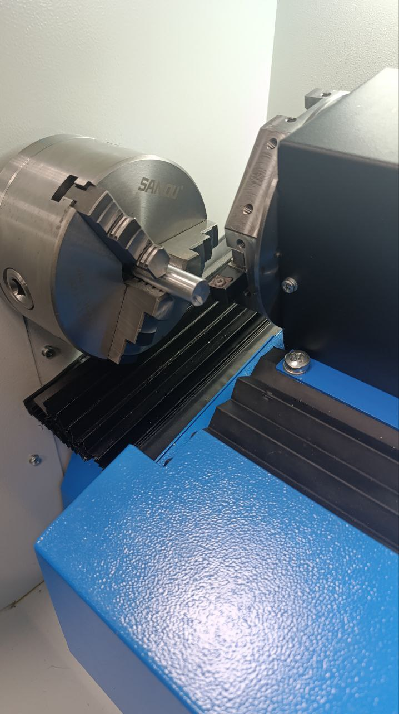
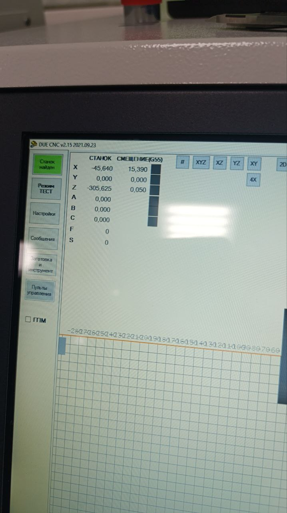
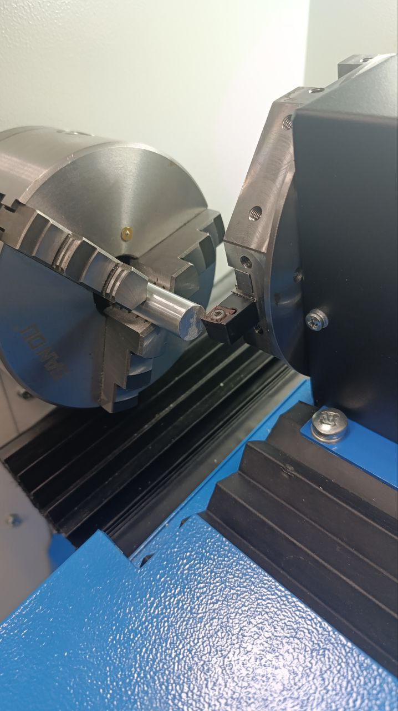
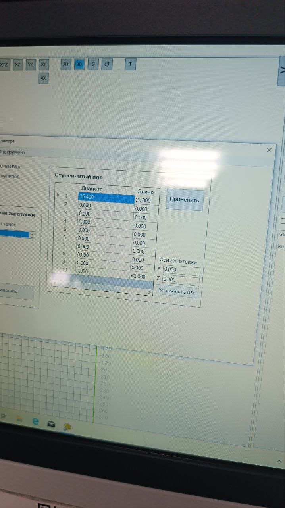
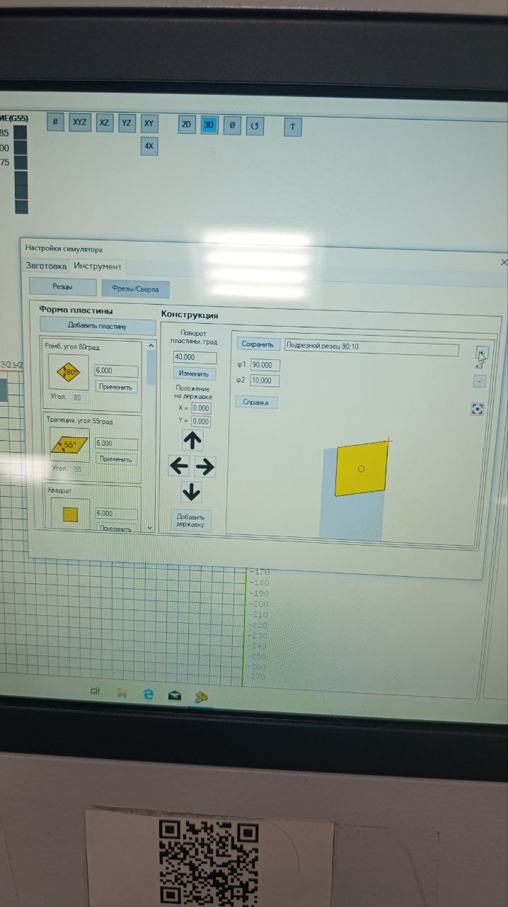

# Отчет по лабораторной работе 2

## 1. Ответы на контрольные вопросы

**1. Какие предварительные проверки необходимо выполнить перед первым запуском станка с ЧПУ?**
Проверить исправность станка, надежность крепления узлов, правильность подключения, минимальные обороты шпинделя и отсутствие повреждений. После включения выполнить пробный запуск и прогреть станок 5-7 минут.

**2. В чём разница между машинной системой координат (Machine Coordinate System) и рабочей системой координат (Work Coordinate System)?**
Машинная система координат связана со станком и его нулем. Рабочая система координат связана с заготовкой и задается смещением нуля детали, например `G54-G59`.

**3. Как производится привязка токарного инструмента?**
Инструмент подводят к базовым поверхностям заготовки и фиксируют координаты. Для токарного резца сначала выполняют касание по оси `X`, затем по оси `Z`, после чего вводят значения в таблицу коррекций.

**4. Какие существуют способы определения нулевой точки детали (WCS) на станке с ЧПУ?**
Нулевую точку детали определяют по касанию инструмента, с помощью щупа или измерительного инструмента, а также расчетом. В данной работе она задается через смещение нуля детали в `G54-G59`.

**5. Какие основные этапы проверки управляющей программы (УП) перед её запуском на станке?**
Проверяют систему координат, ноль детали, инструмент, режимы резания и отсутствие опасных перемещений. Затем выполняют пробную отработку программы.

**6. Опишите пошаговый алгоритм наладки станка для выполнения новой операции: от установки оснастки до запуска первой детали.**
Устанавливают заготовку и оснастку, монтируют инструмент, создают его в таблице ЧПУ, задают заготовку, выполняют привязку по `X` и `Z`, вводят ноль детали, загружают и проверяют УП, затем запускают первую деталь.

**7. Какие ключевые правила техники безопасности должен соблюдать наладчик станков с ЧПУ во время выполнения своих обязанностей?**
Работать только на исправном станке, проверять крепление заготовки и инструмента, не подносить руки к движущимся частям, не оставлять ключ в патроне, выполнять наладку после остановки опасных движений.

**8. Какие виды оснастки чаще всего используются на токарных станках с ЧПУ?**
Используются трехкулачковые патроны, кулачки, револьверные головки, инструментальные блоки, державки, оправки, втулки и переходники.

**9. Какие основные параметры режимов резания необходимо задать для токарной обработки? Как они влияют на стойкость инструмента и качество поверхности?**
Основные параметры: скорость резания, частота вращения, подача и глубина резания. Их увеличение повышает производительность, но при завышении ускоряет износ инструмента и ухудшает качество поверхности.

**10. По каким критериям выбирается режущий инструмент для обработки конкретной детали из стали, алюминия или титана?**
Инструмент выбирают по материалу детали, типу операции, требуемой точности, геометрии режущей части и материалу пластины. Для стали важна износостойкость, для алюминия острая геометрия, для титана теплостойкость и жесткость.

**11. Какие признаки указывают на неправильно выбранные режимы резания?**
Признаки: перегрев инструмента, быстрый износ, вибрации, плохая шероховатость, нестабильная стружка, отклонения размеров и перегрузка шпинделя.

## 2. Описание привязки инструмента по осям X и Z

Привязка инструмента нужна для определения его положения относительно заготовки. После привязки система ЧПУ корректно учитывает смещения по осям `X` и `Z`.

Перед привязкой необходимо:

1. Установить и закрепить заготовку в трехкулачковом патроне.
2. Подготовить и установить инструмент в револьверную головку.
3. Создать используемый инструмент в таблице ЧПУ.
4. Задать параметры заготовки, включая ее диаметр.
5. Перейти в режим ручного управления.

**Привязка по оси `X`:**
Резец подводят к наружной поверхности заготовки по оси `X` до легкого касания. После этого фиксируют текущее значение координаты по оси `X` в таблице смещений. Для токарного станка по оси `X` учитывается диаметр.

**Привязка по оси `Z`:**
После этого резец подводят к торцу заготовки по оси `Z`. При касании торца фиксируют текущее значение координаты по оси `Z` в таблице смещений.

**Завершение привязки:**
После определения значений по `X` и `Z` выключают шпиндель и переходят в меню смещений нуля детали. Полученные координаты вводят в таблицу рабочей системы координат, например `G54`.

Привязка по `X` задает положение инструмента относительно диаметра заготовки, а по `Z` относительно торца.

## 3. Эскиз детали по вариантам

## 4. Список необходимого инструмента

Для обработки детали по данному эскизу необходим следующий инструмент:

1. Проходной упорный наружный токарный резец для обточки всех ступеней.
2. Отрезной резец для обработки уступов.

## 5. Расчетно-технологическая карта обработки детали

## 6. Выводы по лабораторной работе

В ходе лабораторной работы были изучены подготовка токарного станка с ЧПУ к работе, различие машинной и рабочей систем координат, а также порядок привязки инструмента по осям `X` и `Z`.

Для данной детали достаточно наружной токарной обработки ступенчатого профиля, подрезки уступов и снятия фасок. Основным инструментом является проходной упорный резец, дополнительно используется отрезной резец.

В результате работы была освоена последовательность наладки станка, выбора инструмента и подготовки обработки детали по заданному эскизу.

## 7. Фотографии

