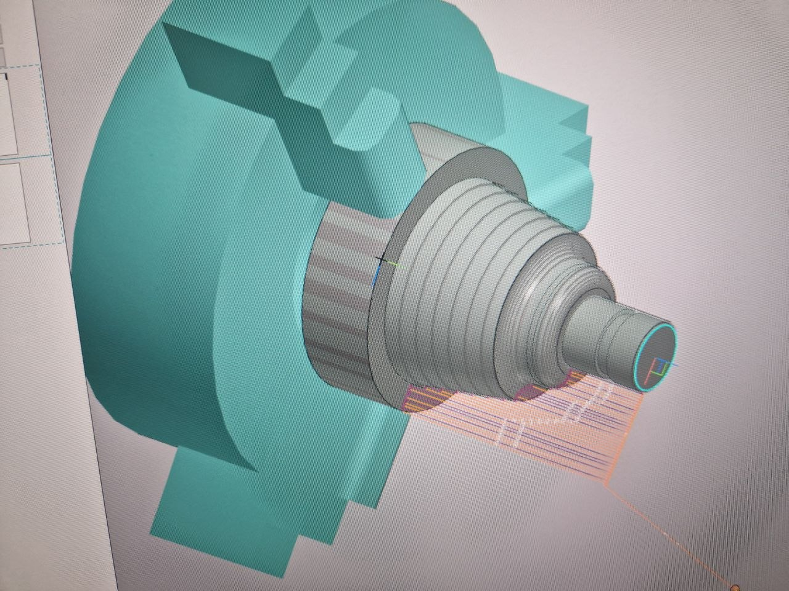

# Отчет по лабораторной работе 3 Eфремов Алексей Игоревич ЭФБО-10-23
Вариант 12

## Ответы на контрольные вопросы

**1. Для каких целей применяются трехмерные модели деталей при подготовке УП в CAM-системах?**
Трехмерная модель детали является источником геометрической информации.

**2. Каким образом в CAM-системах указывается область снятия материала при токарной обработке?**
При токарной обработке задаются контур заготовки и рабочий контур детали. Область снятия материала определяется как замкнутая область между исходным контуром и рабочим контуром.

**3. Какие основные параметры токарной обработки задаются при снятии припуска проходными резцами?**
Задают глубину резания, число проходов, длину подвода и перебега инструмента, скорость подачи, направление вращения шпинделя, частоту вращения шпинделя или постоянную скорость резания.

**4. Как величина припусков на черновых и получистовых проходах влияет на траекторию движения токарного инструмента?**
Величина припуска определяет положение черновой траектории относительно рабочего контура детали. Чем больше припуск, тем дальше траектория черновых проходов от окончательного контура; при уменьшении припуска траектория приближается к чистовому профилю.

**5. Для каких целей проводится симуляция обработки при токарной обработке?**
Визуализация обработки проводится для проверки корректности управляющей программы в целом: правильности назначения инструментов, приспособлений, визуального контроля движений инструмента и выявления столкновений инструмента с приспособлениями.

**6. Для каких целей в CAM-системах применяется постпроцессор?**
Постпроцессор применяется для конвертации сформированной управляющей программы в коды конкретной системы ЧПУ и выбора формата выходного файла под заданную стойку управления.

**7. Каким образом формируется управляющая программа для заданной УЧПУ?**
После задания ЛСК, заготовки, инструментов и плана обработки вызывается команда формирования управляющей программы. В этот момент программа создается и конвертируется в коды системы ЧПУ посредством постпроцессора.

**8. Приведите последовательность действий при выполнении наладки токарного станка с ЧПУ.**
После включения питания станка суппорт с револьверной головкой перемещают в опорные точки, затем устанавливают заготовку в патрон, собирают инструментальные блоки, устанавливают инструмент в гнезда револьверной головки, создают режущие инструменты в УЧПУ и выполняют их привязку по осям `X` и `Z` методом касания.

**9. Назовите последовательность действий при загрузке и запуске УП в УЧПУ токарного станка с ЧПУ.**
Загружают файл управляющей программы в УЧПУ, выбирают смещение нуля детали, открывают нужную программу, выполняют предварительную проверку и после этого запускают обработку.

**10. Назовите виды и причины отклонений полученных размеров детали после отработки УП на токарных станках и трехмерной моделью.**
Отклонения могут быть по размерам, форме и траектории обработки. Основные причины: ошибки в задании ЛСК и нуля детали, неверная привязка инструмента, ошибки в параметрах обработки и станочных циклах, неточная работа постпроцессора, износ инструмента, а также различие между визуализированной и действительной траекторией на станке.

## 1. Фотографии

## 2. Управляющая программа

%
O0001 ( DETAL )
(POSTPROCESSOR: FANUC SERIES 0I-TD)
(DATE: 08-04-2026, время: 18:52)
(ZAGOTOVKA D138 L168 STAL 10 GOST 1050-2013)
()
(MNOGOPROHODNAJA)
N1 ( REZEC GOST 24996-81 TIP 11 R0.8 )
G54 T0101
S500 M3
G0 X141. Z1.5
X135.
G1 G99 Z-128. F0.25
X138. Z-126.5
G0 Z1.5
X132.
G1 Z-128.
X135. Z-126.5
G0 Z1.5
X129.
G1 Z-128.
X132. Z-126.5
G0 Z1.5
X126.
G1 Z-128.
X129. Z-126.5
G0 Z1.5
X123.
G1 Z-128.
X126. Z-126.5
G0 Z1.5
X120.
G1 Z-128.
X123. Z-126.5
G0 Z1.5
X117.
G1 Z-128.
X120. Z-126.5
G0 Z1.5
X114.
G1 Z-128.
X117. Z-126.5
G0 Z1.5
X111.
G1 Z-128.
X114. Z-126.5
G0 Z1.5
X108.
G1 Z-128.
X111. Z-126.5
G0 Z1.5
X105.
G1 Z-119.734
X108. Z-118.234
G0 Z1.5
X102.
G1 Z-110.734
X105. Z-109.234
G0 Z1.5
X99.
G1 Z-101.734
X102. Z-100.234
G0 Z1.5
X96.
G1 Z-92.734
X99. Z-91.234
G0 Z1.5
X93.
G1 Z-83.734
X96. Z-82.234
G0 Z1.5
X90.
G1 Z-74.734
X93. Z-73.234
G0 Z1.5
X87.
G1 Z-67.998
X90. Z-66.498
G0 Z1.5
X84.
G1 Z-67.954
X87. Z-66.454
G0 Z1.5
X81.
G1 Z-67.712
X84. Z-66.212
G0 Z1.5
X78.
G1 Z-67.247
X81. Z-65.747
G0 Z1.5
X75.
G1 Z-66.526
X78. Z-65.026
G0 Z1.5
X72.
G1 Z-65.485
X75. Z-63.985
G0 Z1.5
X69.
G1 Z-63.982
X72. Z-62.482
G0 Z1.5
X66.
G1 Z-61.583
X69. Z-60.083
G0 Z1.5
X63.
G1 Z-50.542
X66. Z-49.042
G0 Z1.5
X60.
G1 Z-47.735
X63. Z-46.235
G0 Z1.5
X57.
G1 Z-46.187
X60. Z-44.687
G0 Z1.5
X54.
G1 Z-45.174
X57. Z-43.674
G0 Z1.5
X51.
G1 Z-44.514
X54. Z-43.014
G0 Z1.5
X48.
G1 Z-44.134
X51. Z-42.634
G0 Z1.5
X45.
G1 Z-44.001
X48. Z-42.501
G0 Z1.5
X42.
G1 Z-44.
X45. Z-42.5
G0 Z1.5
X39.
G1 Z-44.
X42. Z-42.5
G0 Z1.5
X36.
G1 Z-0.969
X39. Z0.531
G0 X141.
Z1.5
X200. Z100.
M1
M5
M30
%

