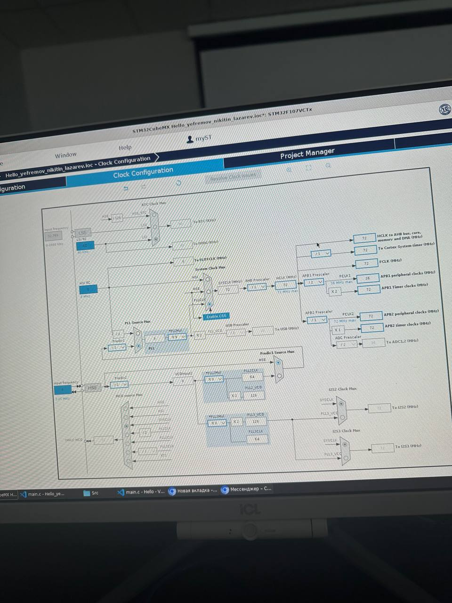
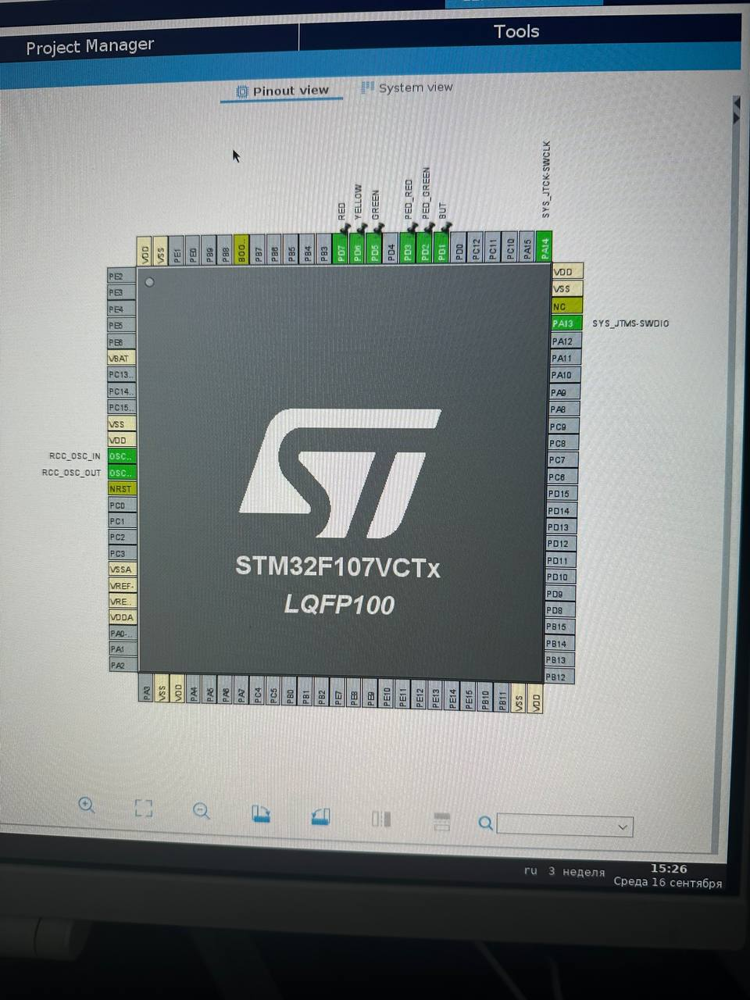

# Практическая работа №1

**Тема:** Архитектура микроконтроллера семейства Cortex-M. Конфигурирование микроконтроллера STM32

## Содержание

## Введение

Микроконтроллер представляет собой вычислительное устройство, в котором процессорное ядро, память и периферийные модули объединены в одном корпусе. Такие устройства применяются в системах управления, измерительной технике, промышленной автоматизации и устройствах Интернета вещей. Семейство STM32 компании STMicroelectronics построено на ядрах ARM Cortex-M и предназначено для создания встраиваемых систем [1].

Цель работы — изучить назначение основных узлов микроконтроллера с ядром Cortex-M и выполнить конфигурирование микроконтроллера STM32F107VCTx в среде STM32CubeMX.

Для достижения цели были поставлены следующие задачи:

- рассмотреть общую архитектуру ядра Cortex-M и состав периферии микроконтроллера STM32;
- изучить назначение системы тактирования и графического конфигуратора STM32CubeMX;
- выбрать микроконтроллер STM32F107VCTx, настроить тактирование на частоту 72 МГц и назначить выводы GPIO;
- зафиксировать выполненную конфигурацию скриншотами среды STM32CubeMX.

## 1 Теоретические сведения

### 1.1 Микроконтроллеры STM32 и ядро Cortex-M

Микроконтроллер отличается от обычного процессора тем, что содержит не только вычислительное ядро, но и память, контроллеры портов, таймеры, интерфейсы связи и другие периферийные устройства. За счёт этого он может непосредственно получать сигналы от датчиков и управлять исполнительными устройствами без внешнего набора специализированных микросхем.

STM32 — семейство 32-разрядных микроконтроллеров STMicroelectronics на базе архитектуры ARM Cortex-M. Разные серии STM32 используют ядра Cortex-M0, Cortex-M3, Cortex-M4, Cortex-M7 и другие, поэтому различаются производительностью, энергопотреблением и составом периферии [1]. В рассматриваемой работе используется STM32F107VCTx с ядром Cortex-M3.

Ключевыми узлами Cortex-M являются процессорное ядро, память программ Flash, оперативная память SRAM, система прерываний NVIC и системный таймер SysTick. NVIC принимает запросы прерываний от периферийных модулей, назначает им приоритеты и передаёт управление соответствующему обработчику. Это позволяет микроконтроллеру реагировать на внешние события без непрерывного опроса каждого устройства.

Периферийные модули подключаются к процессорному ядру через системные шины. К типичным модулям STM32 относятся порты GPIO, таймеры, аналого-цифровые преобразователи, интерфейсы UART, SPI и I2C. Конфигурация выводов и тактирования определяет, какие из этих модулей будут доступны проекту [2].

### 1.2 Особенности STM32F107VCTx

STM32F107VC относится к линейке connectivity line семейства STM32F1. Производитель указывает для него 32-разрядное ядро ARM Cortex-M3 с рабочей частотой до 72 МГц, до 256 Кбайт Flash-памяти и 64 Кбайт SRAM. Периферийные устройства подключены к двум шинам APB, а расширенный набор выводов ввода-вывода позволяет использовать несколько внешних устройств одновременно [3].

Выбор конкретного микроконтроллера в STM32CubeMX важен, поскольку от него зависят доступные выводы, предельные тактовые частоты, набор таймеров и интерфейсов. Неверно выбранная модель может привести к конфигурации, которую невозможно реализовать на имеющейся плате.

### 1.3 Система тактирования

Тактирование задаёт скорость выполнения инструкций процессорного ядра и работы периферийных модулей. В STM32 источниками тактового сигнала могут служить внутренний генератор HSI, внешний генератор или кварцевый резонатор HSE, низкочастотные источники LSI и LSE, а также PLL — блок фазовой автоподстройки частоты.

На основе выбранного источника и PLL формируется системная частота SYSCLK. Затем делители шин AHB, APB1 и APB2 формируют частоты для ядра, памяти и периферии. При настройке необходимо не превышать предельные частоты, приведённые в документации на конкретный микроконтроллер. Для STM32F107VCTx максимальная частота ядра равна 72 МГц [3].

STM32CubeMX отображает дерево тактирования, позволяет выбрать источники, делители и множители, а также проверяет допустимость конфигурации. После настройки выводов, периферии и тактирования программа может сгенерировать стартовый код проекта и инициализацию выбранных модулей [4].

### 1.4 Назначение выводов GPIO и STM32CubeMX

GPIO — это универсальные цифровые линии ввода-вывода. Каждый вывод может быть настроен, например, как цифровой вход, цифровой выход, альтернативная функция периферийного модуля или аналоговый вход. Для входов может потребоваться внутренняя подтяжка, а для выходов выбирается тип выходного каскада [5].

STM32CubeMX предоставляет карту выводов выбранного корпуса. В ней назначается режим каждого вывода, а пользовательское имя сигнала позволяет связать физическую линию с её назначением в проекте. После выбора конфигурации CubeMX генерирует инициализационный код для выбранной среды разработки [4].

## 2 Практическая реализация

### 2.1 Выбор микроконтроллера и настройка тактирования

В STM32CubeMX был выбран микроконтроллер STM32F107VCTx в корпусе LQFP100. Для отладки оставлены линии SWD: PA13 используется как SYS_JTMS-SWDIO, а PA14 — как SYS_JTCK-SWCLK. Это позволяет подключать отладчик ST-Link без переназначения этих линий под прикладные функции.

В конфигураторе RCC выбран внешний высокочастотный источник HSE и включена PLL. По результату настройки системная частота SYSCLK, частота шины AHB и частота ядра HCLK составляют 72 МГц. Для шины APB1 установлена частота 36 МГц, а для APB2 — 72 МГц. Такое распределение соответствует ограничениям микроконтроллера и показано на Рисунке 2.1.

### 2.2 Настройка выводов GPIO

На карте выводов были назначены пользовательские сигналы RED, YELLOW, GREEN, PED_RED, PED_GREEN и BUT. Первые пять сигналов подготовлены для управления светодиодными индикаторами, а сигнал BUT — для подключения кнопки. В данной работе выполнялось именно конфигурирование микроконтроллера; программная логика управления устройством в объём работы не входит.

## Заключение

В ходе практической работы изучена общая архитектура микроконтроллеров семейства Cortex-M и назначение основных компонентов STM32. Рассмотрены процессорное ядро, память, система прерываний, периферийные модули, GPIO и система тактирования.

В STM32CubeMX выполнено конфигурирование микроконтроллера STM32F107VCTx: выбраны частоты системных шин, настроена частота ядра 72 МГц, сохранён интерфейс SWD и назначены пользовательские сигналы GPIO. Полученная конфигурация является подготовленным аппаратно-программным основанием для дальнейшей разработки прикладных программ на языке C с использованием библиотеки HAL.

## Список использованных источников

1. STM32 микроконтроллеры: программирование первого проекта для начинающих [Электронный ресурс]. — Skypro Wiki. — URL: https://sky.pro/wiki/gamedev/programmirovanie-stm32-sozdanie-pervogo-proekta-na-c/ (дата обращения: 23.09.2026).
2. Программирование STM32: от основ к реальным проектам с примерами [Электронный ресурс]. — Skypro Wiki. — URL: https://sky.pro/wiki/javascript/programmirovanie-stm32-vvedenie-i-primery/ (дата обращения: 23.09.2026).
3. STM32F107VC: product page [Электронный ресурс]. — STMicroelectronics. — URL: https://www.st.com/en/microcontrollers-microprocessors/stm32f107vc.html (дата обращения: 23.09.2026).
4. STM32CubeMX for STM32 configuration and initialization C code generation. UM1718 [Электронный ресурс]. — STMicroelectronics. — URL: https://www.st.com/resource/en/user_manual/dm00104712-stm32cubemx-for-stm32-configuration-and-initialization-c-code-generation-stmicroelectronics.pdf (дата обращения: 23.09.2026).
5. Изучение C/C++ для программирования микроконтроллеров: основы [Электронный ресурс]. — Skypro Wiki. — URL: https://sky.pro/wiki/javascript/cc-dlya-mikrokontrollerov-osnovy-i-primery/ (дата обращения: 23.09.2026).
6. STM32CubeMX code generator [Электронный ресурс]. — STMicroelectronics. — URL: https://www.st.com/content/st_com/en/stm32cubemx.html (дата обращения: 23.09.2026).
7. Лабораторная работа 1. Знакомство и настройка STM32. Светофор [Электронный ресурс]. — Учебные материалы дисциплины «Программирование киберфизических систем». — `prac1/lab1.docx`.
