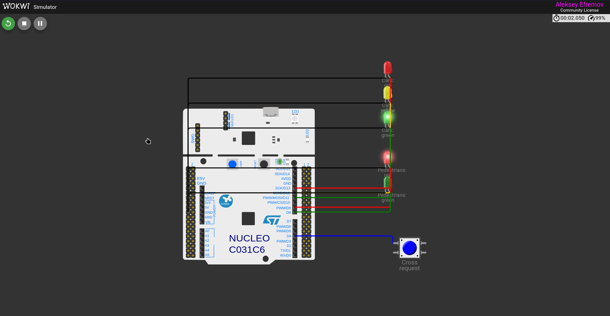
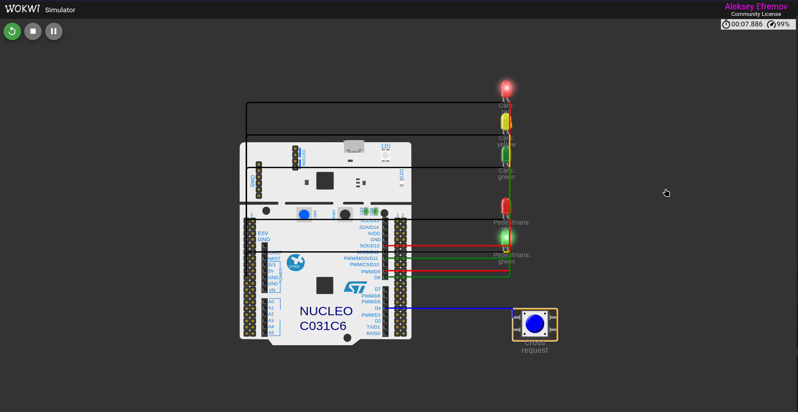

# Практическая работа №2

**Тема:** Принцип работы порта ввода-вывода микроконтроллера GPIO. Выполнение проекта "Светофор"

## Содержание

## Введение

Порты общего назначения GPIO обеспечивают физическое взаимодействие микроконтроллера с внешними устройствами. Через цифровые выходы можно управлять светодиодами, а через цифровые входы — получать состояние кнопок, датчиков и других источников дискретного сигнала. Для STM32 настройка GPIO выполняется до начала основной логики программы и определяет электрическое поведение каждого вывода [1].

Цель работы — изучить назначение и режимы работы портов GPIO микроконтроллера STM32, а также реализовать контроллер автомобильного и пешеходного светофора с кнопкой запроса перехода.

Для достижения цели были поставлены следующие задачи:

- изучить назначение цифровых входов и выходов GPIO;
- рассмотреть настройку входа с внутренней подтяжкой и выхода push-pull;
- освоить функции библиотеки HAL для чтения, записи и переключения состояния вывода;
- собрать схему в Wokwi и реализовать светофор на STM32 Nucleo-C031C6;
- проверить исходное автомобильное состояние и пешеходную фазу после нажатия кнопки.

## 1 Теоретические сведения

### 1.1 Назначение GPIO

GPIO — это универсальные цифровые линии ввода-вывода микроконтроллера. В STM32 выводы объединены в порты, например GPIOA, GPIOB и GPIOC. Каждый вывод может быть назначен цифровым входом, цифровым выходом, аналоговым входом или линией альтернативной функции периферийного модуля [1].

В режиме цифрового входа программа считывает логический уровень на выводе. Высокий уровень интерпретируется как логическая единица, низкий — как логический ноль. В режиме цифрового выхода программа задаёт уровень на выводе, что позволяет включать и выключать светодиод или передавать управляющий сигнал внешнему устройству.

STM32C031C6, используемый на плате Nucleo-C031C6, построен на 32-разрядном ядре Cortex-M0+ и работает на частоте до 48 МГц. Микроконтроллер содержит до 45 линий быстрого ввода-вывода, а также средства разработки через интерфейс SWD [2].

### 1.2 Режимы цифрового входа и выхода

Для управления светодиодами в работе применяется выход push-pull. Такой выход активно формирует как высокий, так и низкий уровень. В коде он задаётся значением `GPIO_MODE_OUTPUT_PP`. Подтяжка для светодиодных выходов не требуется, поэтому используется `GPIO_NOPULL`; низкая скорость переключения `GPIO_SPEED_FREQ_LOW` достаточна для индикации и уменьшает лишние помехи [3].

Кнопка подключена между выводом PB10 и источником питания 3,3 В. Чтобы ненажатая кнопка не оставляла вход в неопределённом состоянии, для PB10 включена внутренняя подтяжка к земле `GPIO_PULLDOWN`. Поэтому в обычном состоянии функция чтения возвращает `GPIO_PIN_RESET`, а при нажатии — `GPIO_PIN_SET`.

### 1.3 Библиотека HAL для GPIO

HAL — библиотека аппаратной абстракции STMicroelectronics. Она предоставляет единый набор функций для разных семейств STM32 и скрывает прямую работу с регистрами периферии [4]. Перед настройкой выводов необходимо включить тактирование соответствующих портов. В проекте это выполняют макросы `__HAL_RCC_GPIOA_CLK_ENABLE()`, `__HAL_RCC_GPIOB_CLK_ENABLE()` и `__HAL_RCC_GPIOC_CLK_ENABLE()`.

Для работы со светофором используются три основные функции HAL. `HAL_GPIO_WritePin` устанавливает высокий или низкий уровень на выходе. `HAL_GPIO_ReadPin` возвращает текущее состояние цифрового входа. `HAL_GPIO_TogglePin` инвертирует текущее состояние выхода; в проекте эта функция используется для мигания зелёного сигнала [1]. Задержка `HAL_Delay` задаёт длительность световых фаз в миллисекундах.

## 2 Практическая реализация

### 2.1 Схема подключения и назначение выводов

В Wokwi использована плата STM32 Nucleo-C031C6. К ней подключены пять светодиодов и кнопка запроса перехода. Автомобильный светофор подключён к D13, D12 и D11, что соответствует выводам PA5, PA6 и PA7. Красный и зелёный пешеходные светодиоды подключены к D9 и D8, то есть к PC7 и PA9. Кнопка подключена к D4, соответствующему PB10, и к линии 3,3 В.

Назначения выводов в исходном коде определены отдельными макросами. Это связывает понятные имена `RED`, `YELLOW`, `GREEN`, `PED_RED`, `PED_GREEN` и `BUT` с физическими линиями микроконтроллера и исключает необходимость использовать номера выводов внутри алгоритма.

Схема Wokwi хранится в файле `diagram.json`. В нём перечислены плата, пять светодиодов, кнопка и все электрические соединения. Листинг 2.1 подтверждает, что D13, D12, D11, D9 и D8 соединены с индикаторами, а D4 соединён с кнопкой, второй контакт которой подключён к 3,3 В.

```json
{
  "version": 1,
  "author": "Aleksey",
  "editor": "wokwi",
  "parts": [
    { "type": "board-st-nucleo-c031c6", "id": "nucleo", "top": 0, "left": 0, "attrs": {} },
    { "type": "wokwi-led", "id": "carRed", "top": -100, "left": 390, "attrs": { "color": "red", "label": "Cars: red" } },
    { "type": "wokwi-led", "id": "carYellow", "top": -50, "left": 390, "attrs": { "color": "yellow", "label": "Cars: yellow" } },
    { "type": "wokwi-led", "id": "carGreen", "top": 0, "left": 390, "attrs": { "color": "green", "label": "Cars: green" } },
    { "type": "wokwi-led", "id": "pedRed", "top": 80, "left": 390, "attrs": { "color": "red", "label": "Pedestrians: red" } },
    { "type": "wokwi-led", "id": "pedGreen", "top": 130, "left": 390, "attrs": { "color": "green", "label": "Pedestrians: green" } },
    { "type": "wokwi-pushbutton", "id": "button", "top": 260, "left": 420, "attrs": { "color": "blue", "label": "Cross request" } }
  ],
  "connections": [
    [ "nucleo:D13", "carRed:A", "red", [] ],
    [ "nucleo:D12", "carYellow:A", "gold", [] ],
    [ "nucleo:D11", "carGreen:A", "green", [] ],
    [ "nucleo:D9", "pedRed:A", "red", [] ],
    [ "nucleo:D8", "pedGreen:A", "green", [] ],
    [ "carRed:C", "nucleo:GND.1", "black", [] ],
    [ "carYellow:C", "nucleo:GND.1", "black", [] ],
    [ "carGreen:C", "nucleo:GND.1", "black", [] ],
    [ "pedRed:C", "nucleo:GND.1", "black", [] ],
    [ "pedGreen:C", "nucleo:GND.1", "black", [] ],
    [ "nucleo:D4", "button:1.l", "blue", [] ],
    [ "button:2.l", "nucleo:3V3", "red", [] ]
  ],
  "dependencies": {}
}
```

### 2.2 Алгоритм работы светофора

После инициализации в исходном состоянии автомобильному светофору включается зелёный сигнал, а пешеходному — красный. На Рисунке 2.1 показано это состояние работающей схемы.

При нажатии кнопки программа считывает высокий уровень на PB10. Далее зелёный автомобильный сигнал мигает шесть раз с интервалом 500 мс. После мигания на две секунды включается жёлтый сигнал для автомобилей. Затем автомобили получают красный, а пешеходы — зелёный на 10 секунд. В конце пешеходный зелёный сигнал мигает шесть раз, после чего пешеходам включается красный, а автомобилям на две секунды включается жёлтый сигнал. После отпускания кнопки контроллер возвращается в исходное состояние.

На Рисунке 2.2 зафиксирована пешеходная фаза: для автомобилей включён красный сигнал, для пешеходов — зелёный.





### 2.3 Программная реализация

Программа инициализирует тактирование системы и порты GPIO, затем выполняет алгоритм в бесконечном цикле. Все светодиоды настроены выходами push-pull, а кнопка — цифровым входом с подтяжкой к земле. Полный исходный код проекта приведён в Листинге 2.2.

```c
#include "stm32c0xx_hal.h"

#define RED_GPIO_Port       GPIOA
#define RED_Pin             GPIO_PIN_5   // D13
#define YELLOW_GPIO_Port    GPIOA
#define YELLOW_Pin          GPIO_PIN_6   // D12
#define GREEN_GPIO_Port     GPIOA
#define GREEN_Pin           GPIO_PIN_7   // D11
#define PED_RED_GPIO_Port   GPIOC
#define PED_RED_Pin         GPIO_PIN_7   // D9
#define PED_GREEN_GPIO_Port GPIOA
#define PED_GREEN_Pin       GPIO_PIN_9   // D8
#define BUT_GPIO_Port       GPIOB
#define BUT_Pin             GPIO_PIN_10  // D4

static void SystemClock_Config(void);
static void MX_GPIO_Init(void);

int main(void) {
  HAL_Init();
  SystemClock_Config();
  MX_GPIO_Init();

  while (1) {
    // едут машины
    HAL_GPIO_WritePin(RED_GPIO_Port, RED_Pin, GPIO_PIN_RESET);
    HAL_GPIO_WritePin(YELLOW_GPIO_Port, YELLOW_Pin, GPIO_PIN_RESET);
    HAL_GPIO_WritePin(GREEN_GPIO_Port, GREEN_Pin, GPIO_PIN_SET);
    HAL_GPIO_WritePin(PED_RED_GPIO_Port, PED_RED_Pin, GPIO_PIN_SET);
    HAL_GPIO_WritePin(PED_GREEN_GPIO_Port, PED_GREEN_Pin, GPIO_PIN_RESET);

    if (HAL_GPIO_ReadPin(BUT_GPIO_Port, BUT_Pin) == GPIO_PIN_SET) {
      // мигание для машин
      for (int i = 0; i < 6; i++) {
        HAL_GPIO_TogglePin(GREEN_GPIO_Port, GREEN_Pin);
        HAL_Delay(500);
      }

      // машины жёлтый, пеш красный
      HAL_GPIO_WritePin(GREEN_GPIO_Port, GREEN_Pin, GPIO_PIN_RESET);
      HAL_GPIO_WritePin(YELLOW_GPIO_Port, YELLOW_Pin, GPIO_PIN_SET);
      HAL_Delay(2000);

      // машины красный, пеш зелёный
      HAL_GPIO_WritePin(YELLOW_GPIO_Port, YELLOW_Pin, GPIO_PIN_RESET);
      HAL_GPIO_WritePin(RED_GPIO_Port, RED_Pin, GPIO_PIN_SET);
      HAL_GPIO_WritePin(PED_RED_GPIO_Port, PED_RED_Pin, GPIO_PIN_RESET);
      HAL_GPIO_WritePin(PED_GREEN_GPIO_Port, PED_GREEN_Pin, GPIO_PIN_SET);
      HAL_Delay(10000);

      // пеш мигает 3 сек
      for (int i = 0; i < 6; i++) {
        HAL_GPIO_TogglePin(PED_GREEN_GPIO_Port, PED_GREEN_Pin);
        HAL_Delay(500);
      }

      // пеш красный, машинам красный и жёлтый
      HAL_GPIO_WritePin(PED_GREEN_GPIO_Port, PED_GREEN_Pin, GPIO_PIN_RESET);
      HAL_GPIO_WritePin(PED_RED_GPIO_Port, PED_RED_Pin, GPIO_PIN_SET);
      HAL_GPIO_WritePin(YELLOW_GPIO_Port, YELLOW_Pin, GPIO_PIN_SET);
      HAL_Delay(2000);

      // повторный цикл
      while (HAL_GPIO_ReadPin(BUT_GPIO_Port, BUT_Pin) == GPIO_PIN_SET) {
        HAL_Delay(10);
      }
    }
  }
}

static void SystemClock_Config(void) {
  RCC_OscInitTypeDef osc = {0};
  RCC_ClkInitTypeDef clk = {0};

  osc.OscillatorType = RCC_OSCILLATORTYPE_HSI;
  osc.HSIState = RCC_HSI_ON;
  osc.HSIDiv = RCC_HSI_DIV1;
  osc.HSICalibrationValue = RCC_HSICALIBRATION_DEFAULT;
  if (HAL_RCC_OscConfig(&osc) != HAL_OK) {
    while (1) { }
  }

  clk.ClockType = RCC_CLOCKTYPE_HCLK | RCC_CLOCKTYPE_SYSCLK | RCC_CLOCKTYPE_PCLK1;
  clk.SYSCLKSource = RCC_SYSCLKSOURCE_HSI;
  clk.AHBCLKDivider = RCC_SYSCLK_DIV1;
  clk.APB1CLKDivider = RCC_HCLK_DIV1;
  if (HAL_RCC_ClockConfig(&clk, FLASH_LATENCY_1) != HAL_OK) {
    while (1) { }
  }
}

static void MX_GPIO_Init(void) {
  GPIO_InitTypeDef gpio = {0};

  __HAL_RCC_GPIOA_CLK_ENABLE();
  __HAL_RCC_GPIOB_CLK_ENABLE();
  __HAL_RCC_GPIOC_CLK_ENABLE();

  HAL_GPIO_WritePin(GPIOA, RED_Pin | YELLOW_Pin | GREEN_Pin | PED_GREEN_Pin, GPIO_PIN_RESET);
  HAL_GPIO_WritePin(GPIOC, PED_RED_Pin, GPIO_PIN_RESET);

  gpio.Mode = GPIO_MODE_OUTPUT_PP;
  gpio.Pull = GPIO_NOPULL;
  gpio.Speed = GPIO_SPEED_FREQ_LOW;
  gpio.Pin = RED_Pin | YELLOW_Pin | GREEN_Pin | PED_GREEN_Pin;
  HAL_GPIO_Init(GPIOA, &gpio);

  gpio.Pin = PED_RED_Pin;
  HAL_GPIO_Init(GPIOC, &gpio);

  gpio.Mode = GPIO_MODE_INPUT;
  gpio.Pull = GPIO_PULLDOWN;
  gpio.Pin = BUT_Pin;
  HAL_GPIO_Init(GPIOB, &gpio);
}
```

## Заключение

В ходе практической работы изучены цифровые входы и выходы GPIO микроконтроллера STM32, режимы push-pull и входа с внутренней подтяжкой, а также основные функции библиотеки HAL для управления выводами.

В Wokwi реализован контроллер светофора на плате Nucleo-C031C6. Светодиоды автомобильного и пешеходного светофоров управляются выходами GPIO, а кнопка запроса перехода считывается как вход PB10 с `GPIO_PULLDOWN`. Работоспособность алгоритма подтверждена скриншотами исходного и пешеходного состояний схемы.

## Список использованных источников

1. GPIO на STM32: полное руководство по управлению портами ввода-вывода [Электронный ресурс]. — Skypro Wiki. — URL: https://sky.pro/wiki/gamedev/rabota-s-gpio-na-stm32-poshagovoe-rukovodstvo/ (дата обращения: 23.09.2026).
2. STM32C031C6: product page [Электронный ресурс]. — STMicroelectronics. — URL: https://www.st.com/en/microcontrollers-microprocessors/stm32c031c6.html (дата обращения: 23.09.2026).
3. Программирование STM32: создаем проект мигающего светодиода [Электронный ресурс]. — Skypro Wiki. — URL: https://sky.pro/wiki/gadgets/primery-proektov-na-stm32-miganie-svetodiodom/ (дата обращения: 23.09.2026).
4. Getting started with STM32CubeC0 for STM32C0 series. UM2985 [Электронный ресурс]. — STMicroelectronics. — URL: https://www.st.com/resource/en/user_manual/um2985-getting-started-with-stm32cubec0-for-stm32c0-series-stmicroelectronics.pdf (дата обращения: 23.09.2026).
5. Программирование STM32 на C: освоение микроконтроллеров — путь к успеху [Электронный ресурс]. — Skypro Wiki. — URL: https://sky.pro/wiki/gamedev/osnovy-programmirovaniya-stm32-na-yazyke-c/ (дата обращения: 23.09.2026).
6. Программирование STM32: от основ к реальным проектам с примерами [Электронный ресурс]. — Skypro Wiki. — URL: https://sky.pro/wiki/javascript/programmirovanie-stm32-vvedenie-i-primery/ (дата обращения: 23.09.2026).
7. STM32CubeMX code generator [Электронный ресурс]. — STMicroelectronics. — URL: https://www.st.com/content/st_com/en/stm32cubemx.html (дата обращения: 23.09.2026).
