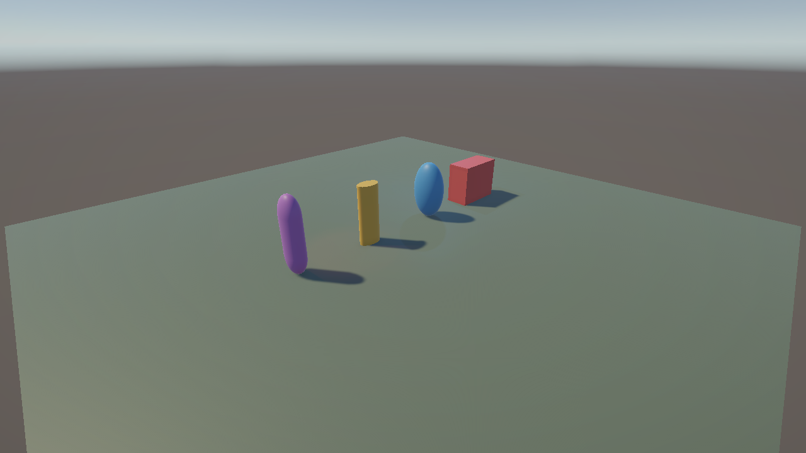
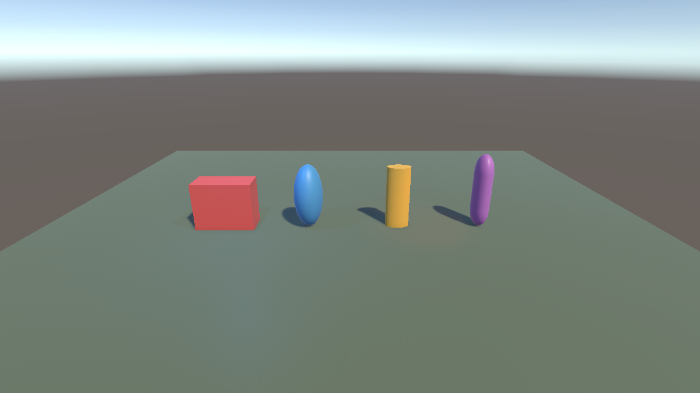
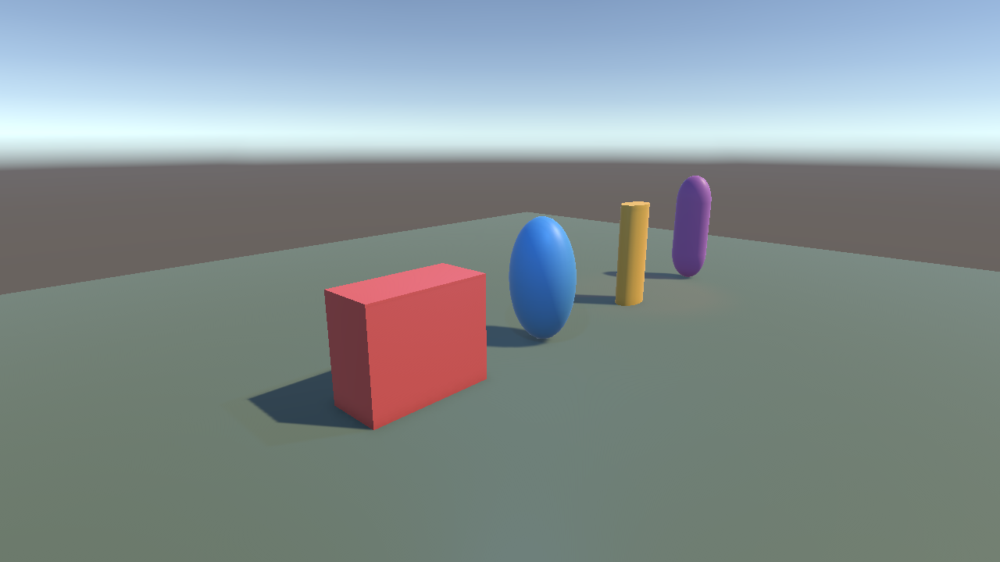
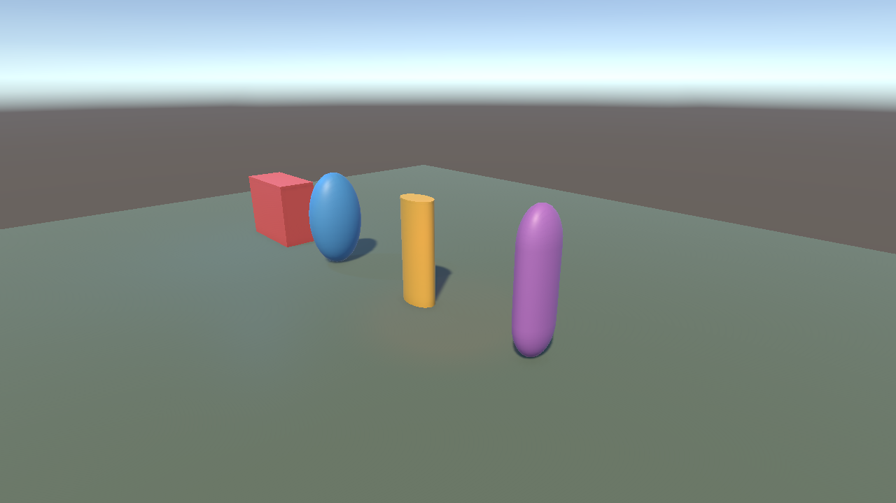

# ЭФБО-10-23 Ефремов Алексей Игоревич

# Практическая 2

## Задание:

Измените форму и размер куба на параллелепипед, растянув его по одной или нескольким осям.

Измените форму и размер сферы на эллипсоид, растянув ее по одной или нескольким осям.

Измените форму и размер цилиндра, растянув его по одной или нескольким осям.

Измените форму и размер капсулы, растянув ее по одной или нескольким осям.

Увеличьте размер и расположение площадки, чтобы на ней были видны тени вышеуказанных объектов.

Разместите объекты на сцене так, чтобы при обзоре сцены с камеры они не перекрывали друг друга.

Добавьте третий источник света типа «Spot». В результате у вас на сцене должны быть размещены источники света трех типов: «Directional», «Spot» и «Point».

Настройте цвет, интенсивность, угол и дальность действия всех источников света, чтобы был виден вклад каждого из них в освещение сцены.

Добавьте на сцену третью камеру и разместите все три камеры так, чтобы каждая из них демонстрировала действие одного из трех источников света. Каждая камера должна отображать сцену на отдельном дисплее. Если потребуется, можете добавить на сцену больше трех камер.

Скопируйте в отдельные файлы результаты вашей работы, сделав скриншот сцены (вкладка «Scene») и скриншот вида с каждой из камер (вкладка «Game»). Итого должно получиться 4 скриншота (их может быть и больше, если вы добавляли больше трех камер).

## Скриншоты выполненной сцены

### Общий вид сцены

### Камера Directional

### Камера Point

### Камера Spot

