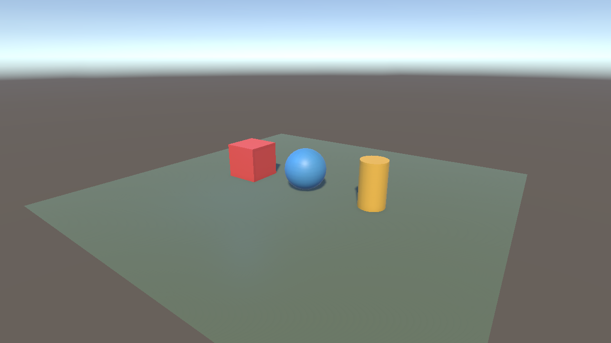
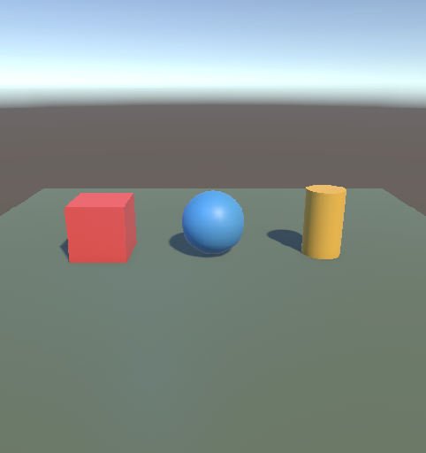

# ЭФБО-10-23 Ефремов Алексей Игоревич

# Практическая 3

## Задание:

1. Выберите клавиши и организуйте возможность перемещения куба по вертикали (вверх и вниз).

2. Выберите клавиши и организуйте возможность изменения масштаба цилиндра отдельно по каждой из трёх осей координат.

3. Попробуйте скомбинировать созданные три скрипта, привязав их к шару, и изменить его местоположение, форму и углы поворота, используя заданные в скриптах клавиши.

## Управление объектами

### Перемещение — `Move.cs`

- `←` / `A` — влево по оси X; `→` / `D` — вправо по оси X.
- `↑` / `W` — вперёд по оси Z; `↓` / `S` — назад по оси Z.
- `Space` / `Page Up` — вверх по оси Y; `Left Ctrl` / `Page Down` — вниз по оси Y.

Скрипт привязан к кубу и шару.

### Масштабирование — `Scale.cs`

- `U` / `J` — увеличить / уменьшить масштаб по X.
- `I` / `K` — увеличить / уменьшить масштаб по Y.
- `O` / `L` — увеличить / уменьшить масштаб по Z.

Скрипт привязан к цилиндру и шару.

### Поворот — `Rotate.cs`

- `X`, `Y`, `Z` — поворот шара вокруг соответствующих осей.

## Скриншоты выполненной сцены

### Общий вид сцены

### Вид с основной камеры

