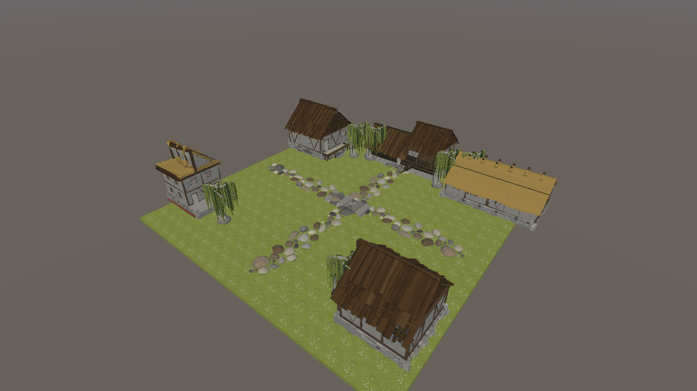
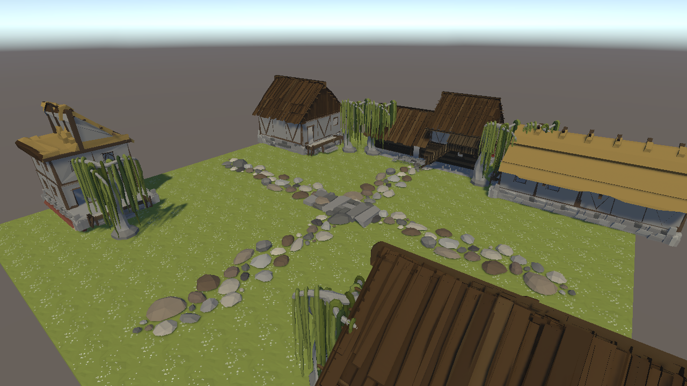

# ЭФБО-10-23 Ефремов Алексей Игоревич

# Практическая 4–5

## Задание

Создать сцену виртуального города с использованием бесплатных ассетов.

Для придания большей реалистичности виртуального города нужно настроить коллайдеры.

Использованный бесплатный ассет из Unity Asset Store: [FREE Slavic Medieval Environment Town Interior and exterior](https://assetstore.unity.com/packages/3d/environments/fantasy/free-slavic-medieval-environment-town-interior-and-exterior-167010).

## Скриншоты выполненной сцены

### Общий вид виртуального города

### Вид ассетов и каменных улиц

