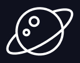

ЭФБО-10-23 Ефремов А.И. Лазарев Г.С. Никитин А.В
# Практическая работа 1
## Название стартапа
Serenity AI
## УТП
Для нуждающихся в психологической помощи людей, испытывающих проблемы с доверием и общением, мы создаём продукт, который помогает лучше проработать свои внутренние проблемы, в отличие от обычного психолога, в лице живого человека,
потому что дает возможность полностью раскрыться, не боясь осуждения.

## Визуальная айдентика

### Слоган

«Понимание себя начинается здесь».

### Цветовая палитра

#### Основные цвета интерфейса

| Цвет | Код | Где используется |
| --- | --- | --- |
| Тёмно-синий | `#0A0E21` | Основной фон сервиса. |
| Тёмно-синий | `#0B1029` | Цвет темы браузера (`theme-color`). |
| Тёмно-серый | `#313244` | Фон панелей, полей чата и универсальных кнопок с прозрачностью. |
| Белый | `#FFFFFF` | Основной текст, иконки, границы, свечение, звёзды и графический логотип. |
| Серо-голубые | `#A6ADC8` `#BAC2DE`  | Цвета приглушенных элементов/надписей |

#### Универсальные градиенты

Градиенты применяются к универсальным кнопкам в состояниях `hover` и `active`, а также к остальным интерактивным элементам.

- `#FF6B6B` → `#4ECDC4` — кораллово-красный переходит в бирюзовый;
- `#A8EDEA` → `#FED6E3` — светло-бирюзовый переходит в нежно-розовый;
- `#D4FC79` → `#96E6A1` — светло-салатовый переходит в пастельно-зелёный;
- `#A1C4FD` → `#C2E9FB` — светло-синий переходит в бледно-голубой;
- `#FBC2EB` → `#A6C1EE` — светло-розовый переходит в сиренево-голубой;
- `#3B82F6` → `#9333EA` — ярко-синий переходит в насыщенный фиолетовый.

#### Цвета эмоций

| Эмоция | Основной цвет | Где используется |
| --- | --- | --- |
| Радость | `#FFC800` | Фоны и прогресс-бары эмоции «Радость». |
| Грусть | `#288CDC` | Фоны и прогресс-бары эмоции «Грусть». |
| Гнев | `#E63C32` | Фоны и прогресс-бары эмоции «Гнев». |
| Страх | `#9650BE` | Фоны и прогресс-бары эмоции «Страх». |
| Удивление | `#508C96` | Фоны и конечная точка прогресс-бара; начальная точка — `#326478`. |
| Доверие | `#28C878` | Фоны и прогресс-бары эмоции «Доверие». |
| Ожидание | `#648CB4` | Фоны и конечная точка прогресс-бара; начальная точка — `#5078A0`. |
| Отвращение | `#6E5046` | Фоны и прогресс-бары эмоции «Отвращение». |

### Типографика

Набор шрифтов с основным семейством Inter, а также фоллбеками:

`Inter, -apple-system, BlinkMacSystemFont, "Segoe UI", Helvetica, Arial, sans-serif, "Apple Color Emoji", "Segoe UI Emoji", "Segoe UI Symbol"`.

| Семейство | Использование |
| --- | --- |
| **Inter** | Основной шрифт интерфейса для латиницы и кириллицы. |
| **-apple-system** | Системный шрифт Apple в браузерах WebKit. |
| **BlinkMacSystemFont** | Системный шрифт macOS в браузерах. |
| **Segoe UI** | Основной системный шрифт Windows. |
| **Helvetica** | Резервный шрифт для систем, где нет Inter и системного шрифта Apple. |
| **Arial** | Резервный шрифт с широкой поддержкой. |
| **sans-serif** | Системное семейство без засечек, если остальные шрифты недоступны. |
| **Apple Color Emoji** | Цветные эмодзи на устройствах Apple. |
| **Segoe UI Emoji** | Цветные эмодзи в Windows. |
| **Segoe UI Symbol** | Символы, отсутствующие в основном шрифте. |

Regular для основного текста, Medium и Semibold для элементов управления, Bold и ExtraBold для заголовков

### Логотип
Основной логотип:

В самом сервисе чаще используется вариант: надпись **Serenity**, шрфитом Inter, и иконка **SparklesIcon** из набора `@heroicons/react/24/solid`.
